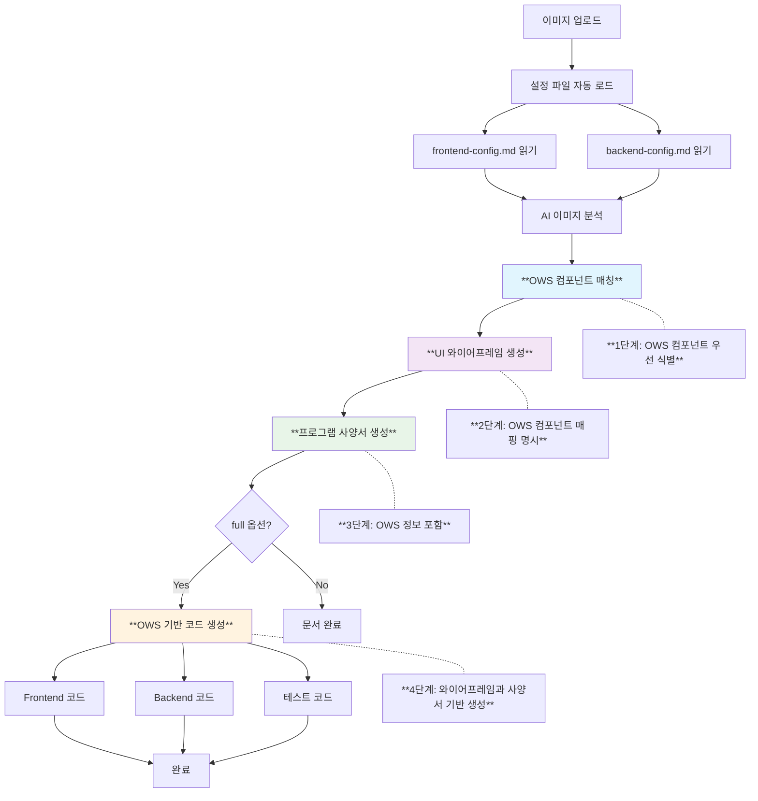

# ai-design v2.0 - 메타데이터 기반 AI 화면 설계 자동화

> **🚀 v2.0 주요 개선사항**
> - ✅ 마크다운 기반 설정 파일로 간편한 관리
> - ✅ 프런트엔드/백엔드 분리 프로젝트 지원
> - ✅ 설정 파일 재사용으로 일관된 코드 생성
> - ✅ Claude Code가 직접 읽고 처리 가능

## 📋 개요

UI 이미지나 와이어프레임을 분석하여 **프로젝트 설정 파일(frontend-config.md, backend-config.md)을 활용**해 맞춤형 엔터프라이즈 애플리케이션을 자동 생성하는 명령어입니다.

## 🎯 사용법

```
/ai-design [이미지 파일] [생성 옵션] [화면 타입] [메타데이터 옵션]
```

## 📥 파라미터

### 필수 파라미터
- **이미지 파일 경로**: 분석할 UI 이미지 파일 경로
  - 지원 형식: `.png`, `.jpg`, `.jpeg`, `.webp`
  - 복수 파일: 공백으로 구분하여 여러 파일 입력 가능

### 선택 파라미터
- **생성 옵션**: 생성할 문서 타입 (기본값: `both`)
  - `wireframe`: UI 와이어프레임만 생성
  - `spec`: 프로그램 사양서만 생성
  - `both`: 와이어프레임과 사양서 모두 생성
  - `full`: 와이어프레임, 사양서, Vue 컴포넌트 코드까지 생성

- **화면 타입**: 화면 유형 힌트 (기본값: `auto`)
  - `crud`: CRUD 목록/상세 화면
  - `dashboard`: 대시보드 화면
  - `form`: 입력/수정 폼 화면
  - `popup`: 팝업/모달 화면
  - `auto`: 자동 식별

- **설정 파일 옵션**: 프로젝트 설정 파일 소스 (기본값: `auto`)
  - `auto`: 자동 탐지 (현재 디렉토리의 `frontend-config.md`, `backend-config.md`)
  - `--config-dir=[디렉토리]`: 특정 디렉토리의 설정 파일 사용
  - `--no-config`: 설정 파일 없이 기본값으로 진행
  - `--generate-config`: `/ai-design-config` 실행 후 진행

## 🚀 사용 예시

### 기본 사용법 (설정 파일 자동 탐지)
```bash
# 가장 간단한 사용법 - 현재 디렉토리의 설정 파일 자동 사용
/ai-design ./screens/product-list.png

# 전체 코드 생성까지
/ai-design ./screens/dashboard.png full dashboard
```

### 설정 파일 위치 지정
```bash
# 특정 디렉토리의 설정 파일 사용
/ai-design ./ui-mockup.jpg both crud --config-dir=./project-configs

# 여러 이미지 분석 (./frontend-config.md, ./backend-config.md 자동 사용)
/ai-design ./login.png ./main.png full
```

### 설정 파일 없이 사용
```bash
# 설정 파일 없이 기본값으로 진행
/ai-design ./form-design.png full form --no-config

# Vue 3 + Spring Boot 기본 설정으로 사용
/ai-design ./dashboard.png full dashboard --no-config
```

### 설정 파일 생성 + 분석
```bash
# 설정 파일이 없는 경우 먼저 생성
/ai-design ./design.png full --generate-config
# → /ai-design-config 명령어를 먼저 실행하라고 안내

# 또는 사전에 설정 파일 생성
/ai-design-config
/ai-design ./design.png full
```

## 📁 프로젝트 설정 파일 관리

### 설정 파일 위치 및 구조
```
프로젝트_루트/
├── frontend-config.md    # 🎯 프런트엔드 프로젝트 설정
├── backend-config.md     # ⚙️ 백엔드 프로젝트 설정
├── your-design.png       # 🎨 분석할 UI 이미지
└── ...
```

### 최초 설정 파일 생성 방법

#### 프로젝트 정보 수집 (권장)
```bash
# 분리된 프런트엔드/백엔드 프로젝트 정보 수집
/ai-design-config

# 결과: frontend-config.md, backend-config.md 파일 생성
```

Claude Code가 실행하는 작업:
1. 현재 디렉토리에서 프런트엔드/백엔드 프로젝트 경로 탐색
2. 각 프로젝트의 package.json, pom.xml 등 주요 파일 분석
3. 기술스택, 프로젝트 구조, 주요 라이브러리 정보 추출
4. frontend-config.md와 backend-config.md 파일 생성

## 🔄 새로운 워크플로우 (v2.0)

### 1단계: 프로젝트 설정 파일 준비 (최초 1회)
```mermaid
graph LR
    A[새 프로젝트] --> B{설정 파일 존재?}
    B -->|있음| C[설정 파일 읽기]
    B -->|없음| D[/ai-design-config 실행]
    D --> E[프런트엔드 프로젝트 분석]
    D --> F[백엔드 프로젝트 분석]
    E --> G[frontend-config.md 생성]
    F --> H[backend-config.md 생성]
    G --> C
    H --> C
    C --> I[AI 분석 준비 완료]
```

### 2단계: AI 화면 분석 및 코드 생성 (반복 사용) - **올바른 실행 순서 필수**



#### ⚠️ **절대 준수해야 할 실행 순서**

```yaml
✅ 올바른_순서:
  1단계: "이미지 분석 → OWS 컴포넌트 매칭"
  2단계: "UI 와이어프레임 생성 (OWS 컴포넌트 명시)"
  3단계: "프로그램 사양서 생성 (OWS 정보 포함)"
  4단계: "OWS 기반 코드 생성 (와이어프레임과 사양서 참조)"

❌ 잘못된_순서 (절대_금지):
  - "코드 생성 → 와이어프레임 → 사양서" (현재 발생 중인 문제)
  - "OWS 컴포넌트 식별 없이 코드 생성"
  - "와이어프레임과 사양서 정보 무시하고 코드 생성"

강제_적용_규칙:
  - "조회기간/검색기간 → OwBizDatePicker 필수"
  - "상태 필터 → OwStateFilter 필수"
  - "담당자/조직 → OwFormOrg 필수"
  - "페이징 → OwPagination 필수"
```

## 📚 출력 결과

### 기본 출력 (both 옵션)
1. **UI 와이어프레임** 
   - 화면 레이아웃 구조 (ASCII 다이어그램)
   - 메타데이터 기반 컴포넌트 상세 매핑
   - 반응형 디자인 명세
   - 인터랙션 시나리오

2. **프로그램 사양서**
   - 메타데이터 적용 시스템 아키텍처
   - API 명세 설계
   - 데이터 모델 설계
   - 화면 플로우

### 확장 출력 (full 옵션)
3. **메타데이터 기반 프로덕션 코드**
   - **Frontend**: 컴포넌트, 상태관리, 라우터 (프레임워크별 맞춤 생성)
   - **Backend**: Controller, Service, DAO (아키텍처별 맞춤 생성)
   - **테스트 코드**: Unit/Integration/E2E Tests
   - **설정 파일**: Docker, CI/CD, 환경설정

4. **도메인 특화 비즈니스 로직**
   - 일반 CRUD: 표준 검증, 상태 관리
   - 전자상거래: 재고관리, 주문처리, 결제연동
   - 금융: 거래처리, 보안인증, 규제준수
   - 의료: 환자관리, 개인정보보호, 의료법규

## 🗂️ Pilot 폴더 생성 및 관리

### Pilot 폴더란?
기존 프로젝트에 영향을 주지 않고 독립적으로 테스트할 수 있는 **안전한 샌드박스 환경**입니다.

### Pilot 폴더 자동 생성
`full` 옵션 사용 시 현재 프로젝트 루트에 자동으로 `pilot` 폴더가 생성됩니다.

```bash
# 현재 위치: /your-project/
/ai-design ./design.png full

# 생성 결과
/your-project/pilot/
├── README.md                    # 프로젝트 설명 및 실행 방법
├── docs/                        # 📚 설계 문서
│   ├── analysis/               # AI 이미지 분석 결과
│   ├── wireframe/              # UI 와이어프레임
│   └── specification/          # 프로그램 사양서
├── frontend/                   # 🎨 완전한 Frontend 애플리케이션
│   └── src/
│       ├── views/             # 페이지 컴포넌트
│       ├── stores/            # 상태 관리 (Pinia/Redux)
│       ├── api/               # API 통신 모듈
│       ├── types/             # TypeScript 타입
│       └── utils/             # 유틸리티 함수
├── backend/                    # ⚙️ 완전한 Backend 애플리케이션
│   └── src/main/java/com/example/
│       ├── controller/        # REST API
│       ├── service/           # 비즈니스 로직
│       ├── repository/        # 데이터 접근
│       ├── entity/            # 도메인 모델
│       └── dto/               # 데이터 전송 객체
└── tests/                      # 🧪 테스트 코드
    ├── frontend/
    └── backend/
```

### Pilot 폴더 활용 방법

#### 1. 즉시 실행 가능한 완전한 애플리케이션
```bash
# Frontend 실행 (기존 프로젝트에서)
cd /your-project/
cp pilot/frontend/src/* apps/web/src/    # 기존 구조에 통합
npm run dev

# Backend 실행 (별도 실행)
cd pilot/backend
mvn spring-boot:run
```

#### 2. 독립적인 검증 환경
```bash
# Pilot 환경에서 독립 실행
cd pilot/frontend
npm install
npm run dev    # localhost:3000

cd pilot/backend  
mvn spring-boot:run    # localhost:8080
```

#### 3. 선택적 통합
```bash
# 검증된 파일만 기존 프로젝트로 이동
cp pilot/frontend/src/views/prohibited-word/* src/views/system/
cp pilot/backend/src/main/java/com/example/prohibited-word/* src/main/java/com/company/system/
```

### 실제 예시: OWS 프로젝트

#### 생성 명령어
```bash
# 현재 위치: /mnt/c/bj-project/ows-master/
/ai-design design.png full

# ✅ 완료 메시지
🎉 Pilot 프로젝트가 생성되었습니다!

📁 생성 위치: /mnt/c/bj-project/ows-master/pilot/
📝 README 파일: pilot/README.md (실행 방법 포함)
🎨 Frontend: pilot/frontend/src/ (Vue 3 + OWS 컴포넌트)
⚙️ Backend: pilot/backend/src/ (Spring Boot + JPA)
📚 문서: pilot/docs/ (분석결과, 와이어프레임, 사양서)
```

#### 생성된 파일 예시
```bash
pilot/
├── README.md                   # ✅ 생성됨
├── docs/
│   ├── analysis/prohibited-word-analysis.md     # ✅ 생성됨
│   ├── wireframe/prohibited-word-wireframe.md   # ✅ 생성됨
│   └── specification/prohibited-word-spec.md    # ✅ 생성됨
├── frontend/src/
│   ├── views/system/prohibitedword/
│   │   └── ProhibitedWordManagement.vue         # ✅ 650+ 라인
│   ├── stores/prohibitedWordStore.ts             # ✅ Pinia 스토어
│   ├── api/prohibitedWordApi.ts                  # ✅ API 클라이언트
│   └── types/prohibitedWord.ts                   # ✅ TypeScript 타입
└── backend/src/main/java/com/example/prohibitedword/
    ├── controller/ProhibitedWordController.java  # ✅ REST API
    ├── service/ProhibitedWordService.java        # ✅ 비즈니스 로직
    ├── repository/ProhibitedWordRepository.java  # ✅ JPA Repository
    ├── entity/ProhibitedWord.java                # ✅ JPA 엔티티
    └── dto/ProhibitedWordRequest.java            # ✅ DTO 클래스
```

### Pilot 폴더 옵션

#### 위치 지정 옵션
```bash
# 기본: 현재 디렉토리에 pilot 폴더 생성
/ai-design image.png full

# 특정 위치에 생성
/ai-design image.png full --pilot-dir=/custom/path/

# 기존 프로젝트 구조에 직접 통합 (pilot 폴더 없이)
/ai-design image.png full --direct-integration
```

#### 생성 범위 옵션
```bash
# Frontend만 생성
/ai-design image.png full --frontend-only

# Backend만 생성  
/ai-design image.png full --backend-only

# 문서만 생성 (코드 없이)
/ai-design image.png full --docs-only
```

### 화면에 결과 표시

#### 생성 완료 시 출력 예시
```bash
🚀 AI Design 분석 완료!

📊 분석 결과:
  - 화면 유형: CRUD 목록 관리 (95.2% 신뢰도)
  - 감지된 컴포넌트: 8개
  - 생성된 코드: 2,340 라인

📁 Pilot 프로젝트 위치:
  /mnt/c/bj-project/ows-master/pilot/

📚 생성된 문서:
  ✅ AI 분석 결과: pilot/docs/analysis/prohibited-word-analysis.md
  ✅ UI 와이어프레임: pilot/docs/wireframe/prohibited-word-wireframe.md  
  ✅ 프로그램 사양서: pilot/docs/specification/prohibited-word-spec.md

💻 생성된 Frontend (Vue 3):
  ✅ 메인 컴포넌트: pilot/frontend/src/views/system/prohibitedword/ProhibitedWordManagement.vue (658 라인)
  ✅ Pinia 스토어: pilot/frontend/src/stores/prohibitedWordStore.ts (312 라인)
  ✅ API 클라이언트: pilot/frontend/src/api/prohibitedWordApi.ts (289 라인)
  ✅ TypeScript 타입: pilot/frontend/src/types/prohibitedWord.ts (187 라인)

⚙️ 생성된 Backend (Spring Boot):
  ✅ REST Controller: pilot/backend/src/main/java/com/example/prohibitedword/controller/ProhibitedWordController.java
  ✅ 비즈니스 서비스: pilot/backend/src/main/java/com/example/prohibitedword/service/ProhibitedWordService.java
  ✅ JPA Repository: pilot/backend/src/main/java/com/example/prohibitedword/repository/ProhibitedWordRepository.java
  ✅ 도메인 엔티티: pilot/backend/src/main/java/com/example/prohibitedword/entity/ProhibitedWord.java

🎯 다음 단계:
  1. README 확인: cat pilot/README.md
  2. Frontend 실행: npm run dev (기존 프로젝트에 통합 후)
  3. Backend 실행: cd pilot/backend && mvn spring-boot:run
  4. 문서 검토: 생성된 설계 문서 3종 확인

💡 팁: pilot 폴더에서 먼저 테스트한 후 기존 프로젝트에 통합하세요!
```

## 🎛️ 고급 옵션

### 메타데이터 옵션 상세
```bash
# 메타데이터 검증 후 사용
/ai-design image.png --validate-metadata

# 메타데이터 업데이트 후 사용  
/ai-design image.png --update-metadata

# 특정 도메인 규칙 적용
/ai-design image.png --domain=ecommerce

# 컴포넌트 라이브러리 지정
/ai-design image.png --ui-lib=material-ui
```

### 출력 커스터마이징
```bash
# 특정 언어로 출력
/ai-design image.png --lang=ko

# 출력 디렉토리 지정
/ai-design image.png --output=./generated

# 기존 파일 덮어쓰기 방지
/ai-design image.png --no-overwrite
```

### 성능 최적화 옵션
```bash
# 빠른 분석 (기본 컴포넌트만)
/ai-design image.png --fast

# 캐시 사용 안 함
/ai-design image.png --no-cache

# 병렬 처리 비활성화
/ai-design image.png --sequential
```

## 🛠️ 메타데이터 관리 명령어

### 메타데이터 생성 및 관리
```bash
# 메타데이터 생성
/ai-metadata-generate [프로젝트_경로] [스캔_깊이]
/ai-metadata-wizard                    # 대화형 생성
/ai-metadata-copy [템플릿명]           # 템플릿 복사

# 메타데이터 검증 및 업데이트
/ai-metadata-validate                  # 메타데이터 검증
/ai-metadata-update                    # 메타데이터 업데이트
/ai-metadata-sync                      # 프로젝트와 동기화

# 메타데이터 정보 조회
/ai-metadata-info                      # 현재 메타데이터 정보
/ai-metadata-diff [다른_메타데이터]     # 메타데이터 비교
/ai-metadata-templates                 # 사용 가능한 템플릿 목록
```

### 메타데이터 백업 및 복원
```bash
# 메타데이터 백업
/ai-metadata-backup [백업명]

# 메타데이터 복원
/ai-metadata-restore [백업명]

# 메타데이터 내보내기/가져오기
/ai-metadata-export [파일경로]
/ai-metadata-import [파일경로]
```

## 📊 사용 통계 및 모니터링

### 성능 지표 확인
```bash
# AI 분석 성능 통계
/ai-design-stats

# 메타데이터 활용 통계  
/ai-metadata-stats

# 코드 생성 품질 지표
/ai-code-quality-report
```

## 🚨 문제 해결

### 일반적인 문제
1. **메타데이터를 찾을 수 없음**
   ```bash
   # 메타데이터 생성
   /ai-metadata-generate . standard
   
   # 또는 템플릿 사용
   /ai-design image.png --template=vue3-springboot
   ```

2. **메타데이터 버전 불일치**
   ```bash
   # 메타데이터 업데이트
   /ai-metadata-update
   
   # 강제 업데이트
   /ai-metadata-update --force
   ```

3. **컴포넌트 매핑 실패**
   ```bash
   # 컴포넌트 매핑 갱신
   /ai-metadata-sync --components
   
   # 수동 매핑 확인
   /ai-component-mappings
   ```

### 디버그 모드
```bash
# 상세 로그 출력
/ai-design image.png --debug

# 단계별 실행
/ai-design image.png --step-by-step

# 중간 결과 저장
/ai-design image.png --save-intermediate
```

## 🔧 설정 및 커스터마이징

### 글로벌 설정
```bash
# 기본 템플릿 설정
/ai-config set default-template vue3-springboot

# 기본 출력 옵션 설정
/ai-config set default-output full

# 언어 설정
/ai-config set language ko
```

### 프로젝트별 설정
```json
// .ai-metadata/config.json
{
  "defaultTemplate": "vue3-springboot",
  "defaultOutput": "full", 
  "autoValidate": true,
  "cacheEnabled": true,
  "customMappings": "./custom-mappings.json"
}
```

---

## 🎯 빠른 시작 가이드 (v2.0)

### 새 프로젝트
```bash
# 1단계: 메타데이터 생성 (최초 1회)
/ai-metadata-wizard

# 2단계: AI 화면 설계 (반복 사용)
/ai-design your-design.png full
```

### 기존 프로젝트
```bash
# 메타데이터 존재 확인
/ai-metadata-info

# 바로 AI 화면 설계 사용
/ai-design your-design.png full
```

이제 **한 번 설정으로 무제한 사용**이 가능합니다! 🚀