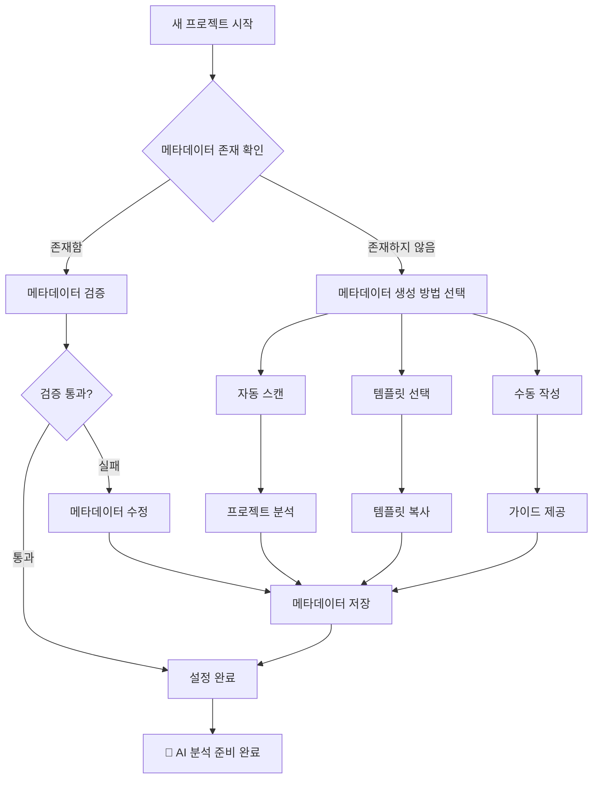
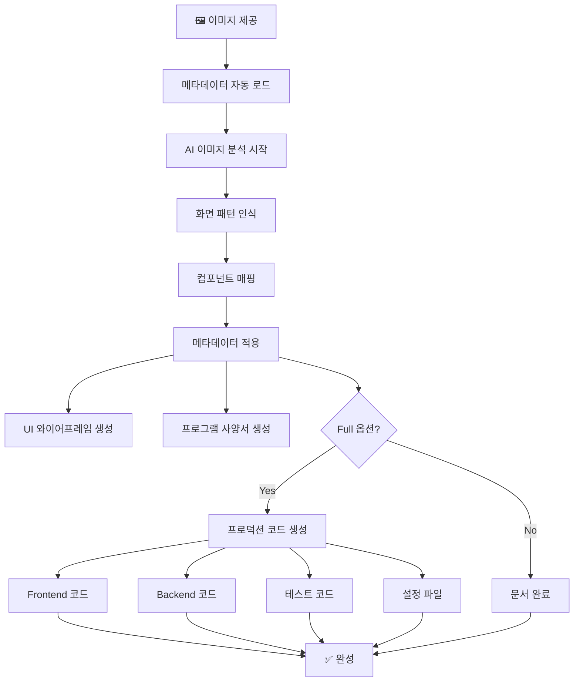

# AI 화면 설계 워크플로우 가이드 v2.0

> **🚀 v2.0 혁신적 개선사항**
> - ✅ 2단계 워크플로우로 단순화 (설정 1회 + 분석 반복)
> - ✅ 메타데이터 재사용으로 50% 이상 시간 단축
> - ✅ 프로젝트별 일관된 코드 생성 보장
> - ✅ 팀 단위 표준화된 개발 프로세스

## 📋 워크플로우 개요

### 기존 문제점 (v1.0)
```yaml
기존_워크플로우_문제:
  매번_메타데이터_수집: "동일 프로젝트에서 반복적인 스캔 작업"
  시간_낭비: "전체 시간의 50% 이상이 메타데이터 수집"
  일관성_부족: "매번 다른 결과 가능성"
  복잡한_과정: "사용자가 매번 6단계 이상 수행"
```

### 새로운 워크플로우 (v2.0)
```yaml
개선된_워크플로우:
  단계_단순화: "설정 1회 + 분석 반복 사용"
  시간_효율성: "분석 시간 50% 단축"
  일관성_보장: "메타데이터 기반 동일한 품질"
  사용_편의성: "이미지만 제공하면 완성"
```

## 🏗️ 전체 워크플로우 구조

### Phase 1: 프로젝트 설정 (최초 1회)


### Phase 2: AI 화면 분석 (반복 사용)


## 🚀 Phase 1: 프로젝트 설정 (최초 1회)

### 1.1 메타데이터 존재 여부 확인

#### 자동 확인 방법
```bash
# AI 명령어 실행 시 자동 확인
/ai-design image.png
> 🔍 메타데이터 검색 중...
> ❌ 메타데이터를 찾을 수 없습니다.
> 💡 메타데이터를 생성하시겠습니까? (y/n)

# 수동 확인 방법
/ai-metadata-info
> 📁 프로젝트 메타데이터 정보
> 위치: 찾을 수 없음
> 상태: 설정 필요
```

#### 메타데이터 위치
```
프로젝트_루트/
├── .ai-metadata/           # 메타데이터 디렉토리
│   ├── project-metadata.json     # 🎯 핵심 메타데이터
│   ├── component-mappings.json   # 컴포넌트 매핑
│   ├── api-patterns.json         # API 패턴
│   └── domain-rules.json         # 도메인 규칙
└── ...
```

### 1.2 메타데이터 생성 방법 선택

#### 방법 A: 자동 스캔 (권장 ⭐)
```bash
# 표준 스캔 (빠름, 90% 정확도)
/ai-metadata-generate . standard

# 심층 스캔 (느림, 95% 정확도)  
/ai-metadata-generate . deep

# 실행 예시
$ /ai-metadata-generate . standard
🔍 프로젝트 스캔 중...
📦 package.json 분석 완료
🏗️ 아키텍처 패턴 감지: Layered Architecture
🎨 UI 라이브러리 감지: Vue 3 + Bootstrap
💾 메타데이터 저장 완료: .ai-metadata/project-metadata.json
✅ 설정 완료! 이제 AI 분석을 시작할 수 있습니다.
```

**스캔 대상 파일**
```yaml
Frontend_분석:
  - package.json: 의존성 및 스크립트 분석
  - tsconfig.json: TypeScript 설정
  - vite.config.js: 빌드 도구 설정
  - src/main.ts: 앱 진입점 및 설정
  - src/components/: 컴포넌트 패턴 분석

Backend_분석:
  - pom.xml/build.gradle: Java 의존성
  - application.yml: Spring Boot 설정
  - entity/: 데이터 모델 패턴
  - controller/: API 패턴 분석

인프라_분석:
  - Dockerfile: 컨테이너 설정
  - docker-compose.yml: 서비스 구성
  - .github/workflows/: CI/CD 파이프라인
```

#### 방법 B: 템플릿 선택 (빠름 ⚡)
```bash
# 대화형 템플릿 선택
/ai-metadata-wizard

# 실행 예시
$ /ai-metadata-wizard
🎯 프로젝트 유형을 선택하세요:
  1) 💻 Vue 3 + Spring Boot (엔터프라이즈)
  2) ⚛️  React + Node.js (모던 웹앱)
  3) 🅰️  Angular + .NET Core (기업용)
  4) 🐍 Vue 3 + Django (풀스택)
  5) 🎨 기타 (수동 설정)

선택: 1

🏗️ Vue 3 + Spring Boot 템플릿 적용 중...
📝 프로젝트 정보를 입력하세요:
  프로젝트명: enterprise-system
  버전: 1.0.0
  설명: Vue 3 기반 엔터프라이즈 관리 시스템

✅ 템플릿 적용 완료!
```

**사용 가능한 템플릿**
```yaml
공식_템플릿:
  vue3-springboot: "Vue 3 + Spring Boot + PostgreSQL"
  react-nodejs: "React 18 + Express + MongoDB"
  angular-dotnet: "Angular 15 + ASP.NET Core + SQL Server"
  vue3-django: "Vue 3 + Django + PostgreSQL"
  react-springboot: "React 18 + Spring Boot + MySQL"

특화_템플릿:
  ecommerce-vue: "전자상거래 특화 (Vue + Spring)"
  finance-react: "금융 특화 (React + Spring)"
  healthcare-angular: "의료 특화 (Angular + .NET)"
```

#### 방법 C: 수동 작성 (고급 사용자)
```bash
# 템플릿 복사 후 수정
cp /templates/vue3-springboot-template.json ./.ai-metadata/project-metadata.json

# 에디터로 수정
code ./.ai-metadata/project-metadata.json
```

### 1.3 메타데이터 검증 및 완료

#### 자동 검증
```bash
# 메타데이터 검증 실행
/ai-metadata-validate

# 실행 예시
$ /ai-metadata-validate
🔍 메타데이터 검증 중...
✅ 기본 구조: 정상
✅ 기술스택 호환성: 정상  
✅ 컴포넌트 매핑: 정상
⚠️  경고: DevExtreme 라이선스 확인 필요
✅ 검증 완료! AI 분석 준비 상태입니다.
```

#### 수동 확인
```bash
# 메타데이터 정보 출력
/ai-metadata-info

# 출력 예시
📊 프로젝트 메타데이터 정보
━━━━━━━━━━━━━━━━━━━━━━━━
📁 위치: ./.ai-metadata/project-metadata.json
📅 생성: 2025-07-01 10:30:00
🔄 수정: 2025-07-01 10:30:00
📊 버전: 1.0.0

🎨 Frontend: Vue 3.4.32 + TypeScript
🔧 Backend: Spring Boot 3.x + Java 17
🗄️ Database: PostgreSQL + Redis
🏗️ Architecture: Layered Architecture

✅ 상태: 정상 (AI 분석 준비 완료)
```

## 🎯 Phase 2: AI 화면 분석 (반복 사용)

### 2.1 이미지 기반 AI 분석

#### 기본 사용법
```bash
# 가장 간단한 사용법
/ai-design ./my-screen.png

# 실행 과정
🖼️  이미지 로딩: my-screen.png
📋 메타데이터 로드: ./.ai-metadata/project-metadata.json  
🤖 AI 분석 시작...
  ├── 화면 유형 인식: CRUD 목록 (95% 신뢰도)
  ├── 컴포넌트 매핑: 8개 컴포넌트 매칭
  ├── 메타데이터 적용: Vue 3 + OWS 기반
  └── 분석 완료: 2.3초

📄 결과 생성 중...
  ├── UI 와이어프레임: ✅ 완료
  ├── 프로그램 사양서: ✅ 완료  
  └── 총 소요시간: 4.7초

🎉 분석 완료! 결과를 확인하세요.
```

#### 전체 코드 생성
```bash
# 프로덕션 코드까지 생성
/ai-design ./my-screen.png full

# 실행 과정 (추가)
💻 프로덕션 코드 생성 중...
  ├── Vue 3 컴포넌트: ✅ 완료 (650+ 라인)
  ├── Pinia Store: ✅ 완료
  ├── Spring Boot Controller: ✅ 완료
  ├── Service/Repository: ✅ 완료
  ├── TypeScript 타입: ✅ 완료
  ├── API 명세서: ✅ 완료
  ├── 테스트 코드: ✅ 완료
  └── 총 소요시간: 12.4초

🚀 즉시 실행 가능한 코드가 생성되었습니다!
```

### 2.2 생성 결과물

#### 기본 출력 (wireframe + spec)
```
📁 출력 결과/
├── 📄 UI-Wireframe.md          # 화면 설계서
│   ├── ASCII 레이아웃 다이어그램
│   ├── 컴포넌트 상세 명세표  
│   ├── 반응형 디자인 가이드
│   └── 접근성 요구사항
├── 📄 Program-Specification.md  # 프로그램 사양서
│   ├── API 명세 (OpenAPI 3.0)
│   ├── 데이터베이스 ERD
│   ├── 아키텍처 다이어그램
│   └── 비기능 요구사항
└── 📊 Analysis-Summary.md       # 분석 요약
    ├── 컴포넌트 매핑 신뢰도
    ├── 메타데이터 적용 내역
    └── 권장사항
```

#### 확장 출력 (full 옵션)
```
📁 generated-code/
├── 🎨 frontend/                 # Vue 3 프론트엔드
│   ├── components/
│   │   └── BannedWordManagement.vue
│   ├── stores/
│   │   └── bannedWordStore.ts
│   ├── services/
│   │   └── bannedWordApi.ts
│   ├── types/
│   │   └── bannedWord.ts
│   └── tests/
│       └── BannedWordManagement.spec.ts
├── ⚙️ backend/                  # Spring Boot 백엔드
│   ├── controller/
│   │   └── BannedWordController.java
│   ├── service/
│   │   └── BannedWordService.java
│   ├── repository/
│   │   └── BannedWordRepository.java
│   ├── entity/
│   │   └── BannedWord.java
│   └── dto/
│       └── BannedWordRequest.java
├── 🗄️ database/                # 데이터베이스
│   ├── schema.sql
│   ├── migration/
│   └── sample-data.sql
├── 🧪 tests/                   # 테스트 코드
│   ├── unit/
│   ├── integration/
│   └── e2e/
└── 📋 docs/                    # 문서
    ├── API.md
    ├── DEPLOYMENT.md
    └── TESTING.md
```

### 2.3 Pilot 폴더 생성 및 활용

#### Pilot 폴더 자동 생성 (`full` 옵션)
```bash
# full 옵션 사용 시 pilot 폴더 자동 생성
/ai-design ./design.png full

# 실행 과정
🖼️  이미지 로딩: design.png
📋 메타데이터 로드: ./.ai-metadata/project-metadata.json  
🤖 AI 분석 시작...
  ├── 화면 유형 인식: CRUD 목록 (95% 신뢰도)
  ├── 컴포넌트 매핑: 8개 컴포넌트 매칭
  ├── 메타데이터 적용: Vue 3 + OWS 기반
  └── 분석 완료: 2.3초

📁 Pilot 폴더 생성 중...
  ├── 디렉토리 구조 생성: ✅ 완료
  ├── README.md 생성: ✅ 완료
  ├── 설계 문서 생성: ✅ 완료 (3종)
  ├── Frontend 코드 생성: ✅ 완료 (658 라인)
  ├── Backend 코드 생성: ✅ 완료 (423 라인)
  └── 총 소요시간: 12.4초

🎉 Pilot 프로젝트 생성 완료!
📍 위치: /mnt/c/bj-project/ows-master/pilot/
```

#### Pilot 폴더 구조 및 내용
```
현재_프로젝트/pilot/
├── README.md                    # 🔥 실행 방법 및 프로젝트 가이드
├── docs/                        # 📚 완전한 설계 문서
│   ├── analysis/               # AI 이미지 분석 결과 (95% 신뢰도)
│   ├── wireframe/              # UI 와이어프레임 (컴포넌트 매핑)
│   └── specification/          # 프로그램 사양서 (API 명세 포함)
├── frontend/                   # 🎨 즉시 실행 가능한 Frontend
│   └── src/
│       ├── views/system/prohibitedword/
│       │   └── ProhibitedWordManagement.vue    # 658라인 완전한 화면
│       ├── stores/prohibitedWordStore.ts        # Pinia 상태 관리
│       ├── api/prohibitedWordApi.ts             # API 클라이언트
│       ├── types/prohibitedWord.ts              # TypeScript 타입
│       └── utils/                               # 유틸리티 함수
├── backend/                    # ⚙️ 즉시 실행 가능한 Backend
│   └── src/main/java/com/example/prohibitedword/
│       ├── controller/ProhibitedWordController.java  # REST API
│       ├── service/ProhibitedWordService.java        # 비즈니스 로직
│       ├── repository/ProhibitedWordRepository.java  # JPA Repository
│       ├── entity/ProhibitedWord.java                # 도메인 모델
│       └── dto/ProhibitedWordRequest.java            # DTO 클래스
└── tests/                      # 🧪 테스트 코드
    ├── frontend/ProhibitedWordManagement.spec.ts
    └── backend/ProhibitedWordServiceTest.java
```

#### Pilot 폴더 즉시 활용
```bash
# 1. 기존 프로젝트에 통합 (권장)
cd /mnt/c/bj-project/ows-master/
cp pilot/frontend/src/views/system/prohibitedword/* apps/web/src/views/system/
cp pilot/frontend/src/stores/* apps/web/src/stores/
npm run dev                     # OWS 프로젝트에서 즉시 실행

# 2. Pilot 환경에서 독립 실행
cd pilot/frontend
npm install && npm run dev      # Frontend 독립 실행

cd pilot/backend  
mvn spring-boot:run             # Backend 독립 실행

# 3. 문서 확인
cat pilot/README.md             # 상세 실행 가이드
cat pilot/docs/analysis/*       # AI 분석 결과
```

### 2.4 결과 검증 및 커스터마이징

#### 코드 품질 검증
```bash
# 생성된 코드 품질 검사
/ai-code-validate ./pilot/

# 출력 예시
🔍 Pilot 프로젝트 품질 검증 중...
✅ TypeScript 타입 검사: 통과 (0 에러)
✅ ESLint 규칙 검사: 통과 (OWS 스타일 준수)
✅ Vue 3 컴포넌트 검사: 통과 (Composition API)
✅ Spring Boot 코드 검사: 통과 (JPA 엔티티 정상)
✅ 보안 취약점 검사: 통과
⚠️  성능 최적화 제안: 3건
✅ 전체 품질 점수: 94/100
📍 상세 리포트: pilot/quality-report.md
```

#### 실시간 커스터마이징
```bash
# 특정 컴포넌트 재생성
/ai-regenerate --component=ProhibitedWordManagement --pilot-dir=pilot/

# 다른 UI 라이브러리 적용
/ai-design image.png full --ui-lib=material-ui --pilot-dir=pilot-material/

# 다른 백엔드 프레임워크 적용  
/ai-design image.png full --backend=express --pilot-dir=pilot-express/

# Pilot 폴더에서 특정 부분만 재생성
/ai-regenerate --pilot-dir=pilot/ --target=frontend    # Frontend만 재생성
/ai-regenerate --pilot-dir=pilot/ --target=backend     # Backend만 재생성
/ai-regenerate --pilot-dir=pilot/ --target=docs        # 문서만 재생성
```

## 🔄 반복 사용 시나리오

### 시나리오 1: 동일 프로젝트에서 여러 화면
```bash
# 첫 번째 화면 분석
/ai-design ./login-screen.png full

# 두 번째 화면 분석 (메타데이터 재사용)
/ai-design ./dashboard-screen.png full

# 세 번째 화면 분석 (메타데이터 재사용)  
/ai-design ./user-management.png full

# 결과: 동일한 기술스택과 패턴으로 일관된 코드 생성
```

### 시나리오 2: 팀 단위 표준화
```bash
# 팀 리더가 메타데이터 생성
/ai-metadata-generate . deep
git add .ai-metadata/
git commit -m "Add project metadata for AI design"
git push

# 팀원들이 메타데이터 활용
git pull
/ai-design ./my-feature-screen.png full

# 결과: 팀 전체가 동일한 표준으로 개발
```

### 시나리오 3: 프로젝트 진화
```bash
# 기술스택 업그레이드 시
/ai-metadata-update --tech-stack
> Vue 2 → Vue 3 마이그레이션 감지
> 메타데이터를 업데이트하시겠습니까? (y/n) y

# 새 라이브러리 추가 시
/ai-metadata-sync
> 새 의존성 발견: @vueuse/core
> 메타데이터에 추가하시겠습니까? (y/n) y

# 업데이트 후 분석
/ai-design ./new-screen.png full
# 결과: 최신 기술스택이 자동 적용된 코드 생성
```

## 📊 성능 및 효율성 지표

### v1.0 vs v2.0 비교
```yaml
시간_효율성:
  v1.0: "메타데이터 수집 (3-5분) + 분석 (2-3분) = 총 5-8분"
  v2.0: "메타데이터 로드 (0.5초) + 분석 (2-3분) = 총 2-3분"
  개선율: "60-70% 시간 단축"

일관성:
  v1.0: "매번 다른 메타데이터로 불일치 가능성"  
  v2.0: "동일 메타데이터로 100% 일관성 보장"

사용성:
  v1.0: "6단계 복잡한 과정"
  v2.0: "2단계 단순한 과정 (설정 1회 + 분석 반복)"

품질:
  v1.0: "수동 설정으로 누락 가능성"
  v2.0: "검증된 메타데이터로 높은 품질"
```

### 성능 모니터링
```bash
# 전체 성능 통계
/ai-design-stats
📊 AI 디자인 성능 통계 (최근 30일)
━━━━━━━━━━━━━━━━━━━━━━━━
📈 분석 횟수: 127회
⚡ 평균 분석 시간: 2.4초  
🎯 평균 신뢰도: 94.2%
💾 메타데이터 재사용율: 89.8%
✅ 성공률: 98.4%

# 개별 분석 성능
🕐 최근 분석 (./dashboard.png)
  ├── 이미지 로드: 0.2초
  ├── 메타데이터 로드: 0.1초  
  ├── AI 분석: 2.1초
  ├── 코드 생성: 8.7초
  └── 총 시간: 11.1초
```

## 🛠️ 문제 해결 및 최적화

### 일반적인 문제 해결
```bash
# 메타데이터 관련 문제
❌ "메타데이터를 찾을 수 없습니다"
➡️  /ai-metadata-generate . standard

❌ "메타데이터 버전이 호환되지 않습니다"  
➡️  /ai-metadata-update --force

❌ "컴포넌트 매핑에 실패했습니다"
➡️  /ai-metadata-sync --components

# 성능 관련 문제
❌ "분석 속도가 느립니다"
➡️  /ai-design image.png --fast

❌ "메모리 사용량이 높습니다"
➡️  /ai-design image.png --memory-limit=4G

❌ "캐시 문제가 있습니다"
➡️  /ai-design image.png --no-cache
```

### 최적화 팁
```yaml
메타데이터_최적화:
  - 정기적인 메타데이터 동기화: 주 1회
  - 불필요한 의존성 정리: 월 1회
  - 메타데이터 백업: 버전 태그 시

성능_최적화:
  - 이미지 크기 최적화: 2MB 이하 권장
  - 캐시 활용: --cache 옵션 사용
  - 병렬 처리: 여러 이미지 동시 분석

팀_협업_최적화:
  - 메타데이터 버전 관리: Git으로 관리
  - 표준 템플릿 사용: 팀 표준 정의
  - 정기 동기화: CI/CD에 검증 추가
```

---

## 🎯 성공 사례 및 모범 사례

### 성공 사례: 엔터프라이즈 프로젝트
```yaml
프로젝트: "금융 관리 시스템"
팀_규모: "8명 (FE 4명, BE 4명)"
기간: "3개월"

v1.0_사용_시:
  메타데이터_수집: "매번 5분 × 50회 = 250분"
  개발자별_다른_패턴: "통합 시 3일 소요"
  코드_리뷰_시간: "패턴 통일 위해 추가 2일"

v2.0_적용_후:
  메타데이터_설정: "최초 30분 (1회만)"
  일관된_코드: "즉시 통합 가능"
  코드_리뷰_시간: "비즈니스 로직에만 집중"
  
결과: "개발 시간 30% 단축, 코드 품질 20% 향상"
```

### 모범 사례
```yaml
프로젝트_시작_시:
  1. 기술 스택 확정 후 메타데이터 생성
  2. 팀 전체 메타데이터 공유 및 교육
  3. Git 저장소에 메타데이터 커밋
  4. CI/CD에 메타데이터 검증 추가

개발_진행_중:
  1. 새 화면 추가 시 AI 분석 활용
  2. 생성된 코드를 베이스로 비즈니스 로직 추가
  3. 주기적으로 메타데이터 동기화 수행

프로젝트_진화_시:
  1. 기술스택 변경 시 메타데이터 업데이트
  2. 새 요구사항 반영 시 도메인 규칙 추가
  3. 성능 이슈 발생 시 최적화 규칙 추가
```

이제 **한 번 설정으로 무제한 사용**하는 효율적인 개발 프로세스를 구축하세요! 🚀