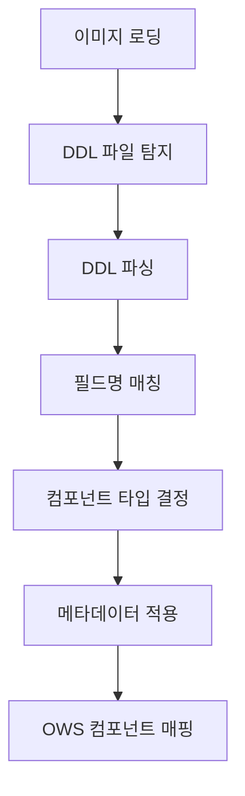

# AI DDL 분석 가이드
> Claude Code `/ai-design` 명령어에서 DDL 파일과 화면 이미지를 동시에 분석하는 핵심 가이드

## 🎯 목적

이 가이드는 Claude Code의 `/ai-design` 명령어 Step 2에서 다음 작업을 수행할 때 사용합니다:
1. **DDL 파일 자동 탐지** → database/ 폴더에서 *.sql 파일 검색
2. **DDL 파싱** → 테이블 구조, 컬럼 정보, 제약조건 추출
3. **이미지+DDL 매칭** → 필드명 매칭 및 정확한 컴포넌트 선택
4. **통합 분석** → 메타데이터 + 이미지 + DDL 기반 완전한 코드 생성

---

## 📊 DDL 파싱 규칙

### 1. 테이블 기본 정보 추출

```sql
CREATE TABLE TB_USER (
    -- 테이블명: TB_USER → 화면명: "사용자 관리"
    ...
) ENGINE=InnoDB COMMENT='사용자';
-- 코멘트: '사용자' → 화면 제목에 활용
```

**추출 패턴**:
```regex
CREATE\s+TABLE\s+(\w+)\s*\((.*?)\)\s*(?:ENGINE=\w+)?\s*(?:COMMENT='([^']*)')?
```

### 2. 컬럼 정보 추출

```sql
USER_ID BIGINT NOT NULL AUTO_INCREMENT COMMENT '사용자ID',
USERNAME VARCHAR(50) NOT NULL COMMENT '사용자명',
EMAIL VARCHAR(100) UNIQUE COMMENT '이메일',
BIRTH_DATE DATE COMMENT '생년월일',
STATUS_CD VARCHAR(10) NOT NULL DEFAULT 'ACTIVE' COMMENT '상태',
CREATED_AT DATETIME(6) DEFAULT CURRENT_TIMESTAMP(6) COMMENT '등록일시'
```

**추출 정보**:
- **컬럼명**: USER_ID, USERNAME, EMAIL...
- **데이터 타입**: BIGINT, VARCHAR(50), DATE...
- **제약조건**: NOT NULL, UNIQUE, AUTO_INCREMENT...
- **기본값**: DEFAULT 'ACTIVE'
- **코멘트**: '사용자명', '이메일'...

### 3. 제약조건 추출

```sql
PRIMARY KEY (USER_ID),
UNIQUE KEY UK_USER_EMAIL (EMAIL),
FOREIGN KEY (DEPT_ID) REFERENCES TB_DEPT(DEPT_ID),
INDEX IDX_STATUS_CREATED (STATUS_CD, CREATED_AT)
```

**추출 패턴**:
```regex
PRIMARY\s+KEY\s*\(([^)]+)\)                    # PK
UNIQUE\s+KEY\s+\w+\s*\(([^)]+)\)              # 유니크
FOREIGN\s+KEY\s*\(([^)]+)\)\s+REFERENCES\s+(\w+)\s*\(([^)]+)\)  # FK
```

---

## 🔗 DDL → 화면 컴포넌트 매핑 규칙

### 1. 데이터 타입 → 컴포넌트 매핑

| DDL 데이터 타입 | OWS 컴포넌트 | 추가 속성 |
|----------------|-------------|----------|
| `VARCHAR(n)` | `OwInput` | maxLength: n |
| `TEXT/LONGTEXT` | `OwTinyEditor` | - |
| `DATE` | `OwFormDate` | - |
| `DATETIME/TIMESTAMP` | `OwFormDate` | showTime: true |
| `DECIMAL/NUMERIC` | `OwInput` | type: "number" |
| `ENUM/VARCHAR(10)` | `OwFormSelect` | 코드성 데이터 |
| `TINYINT(1)/BOOLEAN` | `OwFormCheckbox` | - |

### 2. 제약조건 → 컴포넌트 속성 매핑

| DDL 제약조건 | 컴포넌트 속성 | 화면 동작 |
|-------------|-------------|----------|
| `NOT NULL` | `required: true` | 필수 입력 표시 |
| `UNIQUE` | `중복체크 버튼` | 중복 검증 기능 |
| `AUTO_INCREMENT` | `숨겨진 필드` | 화면에 표시 안함 |
| `DEFAULT` | `기본값 설정` | 초기값 자동 입력 |
| `FOREIGN KEY` | `팝업 조회 버튼` | 연관 데이터 선택 |

### 3. 컬럼명 → 화면 라벨 매핑

```sql
USERNAME → "사용자명"
EMAIL → "이메일"
PHONE_NUMBER → "전화번호"
CREATED_AT → "등록일시"
UPDATED_AT → "수정일시"
```

**자동 변환 규칙**:
- `_ID` 접미사 → "ID" 또는 숨겨진 필드
- `_CD` 접미사 → "코드" → OwFormSelect
- `_YN` 접미사 → "여부" → OwFormCheckbox
- `_AT` 접미사 → "일시" → OwFormDate

---

## 🤖 Claude Code Step 2에서 이미지 + DDL 동시 분석 로직

### 1. DDL 파일 자동 탐지 (Step 2-2)

```bash
# 탐지 순서
1. 프로젝트_루트/database/*.sql
2. 프로젝트_루트/src/main/resources/database/*.sql  
3. 프로젝트_루트/sql/*.sql
4. 프로젝트_루트/db/*.sql

# 발견 시 모든 DDL 파일을 파싱하여 통합 스키마 구성
```

### 2. 분석 단계 (Step 2-5)



### 2. 필드명 매칭 알고리즘

#### **직접 매칭 (최우선)**
```javascript
이미지: "username" → DDL: "USERNAME" (100% 매칭)
이미지: "email" → DDL: "EMAIL" (100% 매칭)
```

#### **의미적 매칭**
```javascript
이미지: "사용자명" → DDL: "USERNAME" (90% 매칭)
이미지: "이메일" → DDL: "EMAIL" (90% 매칭)
이미지: "생일" → DDL: "BIRTH_DATE" (85% 매칭)
```

#### **타입 기반 매칭**
```javascript
이미지: "날짜 선택 필드" → DDL: "DATE 타입 컬럼들" (70% 매칭)
이미지: "드롭다운" → DDL: "VARCHAR(10) 또는 ENUM" (70% 매칭)
```

### 3. 충돌 해결 우선순위

1. **DDL 정보 우선**: 데이터 타입, 제약조건, 관계
2. **이미지 정보 우선**: 레이아웃, 컴포넌트 배치, 그룹핑
3. **보완 관계**: 
   - 이미지에 없는 필드 → DDL에서 자동 추가
   - DDL에 없는 필드 → 화면 전용 필드로 처리

---

## 📋 화면 패턴별 생성 규칙

### 1. 목록 조회 화면

**DDL 조건**: `PRIMARY KEY` 존재하는 테이블
```sql
CREATE TABLE TB_USER (
    USER_ID BIGINT PRIMARY KEY,  -- PK 존재 → 목록 화면 생성 가능
    ...
)
```

**생성되는 컴포넌트**:
```javascript
// 필터 영역
const filters = reactive({
    username: '',      // VARCHAR → OwInput
    statusCd: '',      // VARCHAR(10) → OwFormSelect  
    createdAt: []      // DATETIME → OwBizDatePicker
});

// 그리드 영역
<DxDataGrid :dataSource="users">
    <DxColumn dataField="userId" caption="사용자ID" :visible="false"/>
    <DxColumn dataField="username" caption="사용자명"/>
    <DxColumn dataField="email" caption="이메일"/>
</DxDataGrid>
```

### 2. 등록/수정 화면

**DDL 조건**: `AUTO_INCREMENT PK` + 비즈니스 컬럼들
```sql
CREATE TABLE TB_USER (
    USER_ID BIGINT AUTO_INCREMENT PRIMARY KEY,  -- 자동생성 → 숨김
    USERNAME VARCHAR(50) NOT NULL,              -- 필수 입력
    EMAIL VARCHAR(100) UNIQUE,                  -- 중복체크
    ...
)
```

**생성되는 폼**:
```javascript
// 등록/수정 폼
<OwInput v-model="form.username" label="사용자명" required/>
<OwInput v-model="form.email" label="이메일" @blur="checkDuplicate"/>
```

### 3. 마스터-디테일 화면

**DDL 조건**: `FOREIGN KEY` 관계 존재
```sql
CREATE TABLE TB_ORDER (
    ORDER_ID BIGINT PRIMARY KEY,
    USER_ID BIGINT,
    FOREIGN KEY (USER_ID) REFERENCES TB_USER(USER_ID)
);

CREATE TABLE TB_ORDER_ITEM (
    ITEM_ID BIGINT PRIMARY KEY,
    ORDER_ID BIGINT,
    FOREIGN KEY (ORDER_ID) REFERENCES TB_ORDER(ORDER_ID)
);
```

**생성되는 화면 구조**:
```javascript
// 마스터 영역 (주문)
<DxDataGrid :dataSource="orders" @selectionChanged="onOrderSelected">

// 디테일 영역 (주문상품)  
<DxDataGrid :dataSource="orderItems" :visible="selectedOrder != null">
```

---

## 🔧 컴포넌트 선택 알고리즘

### 1. 우선순위 결정 로직

```javascript
function selectComponent(column, imageInfo) {
    // 1. DDL 제약조건 기반 판단
    if (column.foreignKey) return 'OwFormOrg'; // 조직도 컴포넌트
    if (column.dataType.includes('DATE')) return 'OwFormDate';
    if (column.dataType === 'TEXT') return 'OwTinyEditor';
    
    // 2. 이미지 정보 기반 보정
    if (imageInfo.componentType === 'dropdown') return 'OwFormSelect';
    if (imageInfo.componentType === 'checkbox') return 'OwFormCheckbox';
    
    // 3. 컬럼명 패턴 기반 판단
    if (column.name.endsWith('_CD')) return 'OwFormSelect';
    if (column.name.endsWith('_YN')) return 'OwFormCheckbox';
    
    // 4. 기본값
    return 'OwInput';
}
```

### 2. 특수 컴포넌트 선택 규칙

| 조건 | 선택 컴포넌트 | 이유 |
|------|-------------|------|
| `컬럼명 LIKE '%_ORG%'` | `OwFormOrg` | 조직 관련 필드 |
| `컬럼명 LIKE '%STATUS%'` | `OwStateFilter` | 상태 필터 |
| `FOREIGN KEY + 이미지 "필터"` | `OwStateFilter` | 상태별 필터링 |
| `DATE + 이미지 "기간"` | `OwBizDatePicker` | 기간 조회 |

---

## 📝 실제 분석 예시

### 입력: DDL + 화면 이미지

**DDL**:
```sql
CREATE TABLE TB_USER (
    USER_ID BIGINT NOT NULL AUTO_INCREMENT COMMENT '사용자ID',
    USERNAME VARCHAR(50) NOT NULL COMMENT '사용자명',
    EMAIL VARCHAR(100) NOT NULL UNIQUE COMMENT '이메일',
    DEPT_ID BIGINT COMMENT '부서ID',
    STATUS_CD VARCHAR(10) NOT NULL DEFAULT 'ACTIVE' COMMENT '상태',
    CREATED_AT DATETIME(6) DEFAULT CURRENT_TIMESTAMP(6) COMMENT '등록일시',
    PRIMARY KEY (USER_ID),
    FOREIGN KEY (DEPT_ID) REFERENCES TB_DEPT(DEPT_ID)
) COMMENT='사용자';
```

**이미지**: 사용자 관리 화면 (필터 + 그리드)

### 출력: 분석 결과

```javascript
{
    screenInfo: {
        title: "사용자 관리",
        type: "list",
        tableName: "TB_USER"
    },
    filters: [
        { field: "username", component: "OwInput", label: "사용자명" },
        { field: "deptId", component: "OwFormOrg", label: "부서" },
        { field: "statusCd", component: "OwStateFilter", label: "상태" },
        { field: "createdAt", component: "OwBizDatePicker", label: "등록일시" }
    ],
    gridColumns: [
        { field: "userId", caption: "사용자ID", visible: false },
        { field: "username", caption: "사용자명", width: 150 },
        { field: "email", caption: "이메일", width: 200 },
        { field: "deptName", caption: "부서명", width: 120 },
        { field: "statusCd", caption: "상태", width: 80 },
        { field: "createdAt", caption: "등록일시", width: 150 }
    ],
    operations: ["조회", "등록", "수정", "삭제", "엑셀다운로드"]
}
```

---

## ⚠️ 주의사항 및 제한사항

### 1. DDL 파싱 제한사항
- **지원 DB**: MySQL/MariaDB DDL 구문만 지원
- **복합 제약조건**: 복잡한 CHECK 제약조건은 부분 지원
- **사용자 정의 타입**: ENUM 외 사용자 정의 타입은 VARCHAR로 처리

### 2. 매칭 정확도
- **매칭률 70% 이상**: 신뢰도 높음
- **매칭률 50-69%**: 수동 검토 필요
- **매칭률 50% 미만**: 이미지 정보만 사용

### 3. 특수 처리 규칙
- **Audit 컬럼**: `CREATED_AT`, `UPDATED_AT` 등은 자동으로 읽기전용 처리
- **암호 필드**: `PASSWORD` 포함 컬럼은 자동으로 password 타입
- **파일 업로드**: `FILE_PATH`, `ATTACHMENT` 등은 파일 업로드 컴포넌트

---

## 🚀 Quick Reference

### 자주 사용되는 DDL 패턴
```sql
-- 1. 기본 마스터 테이블
CREATE TABLE TB_XXX (
    XXX_ID BIGINT PRIMARY KEY AUTO_INCREMENT,
    XXX_NAME VARCHAR(100) NOT NULL,
    STATUS_CD VARCHAR(10) DEFAULT 'ACTIVE',
    -- OWS 표준 Audit 컬럼
    PROC_PRGM_ID VARCHAR(50) NOT NULL,
    RGST_PROCR_ID VARCHAR(50) NOT NULL,
    RGST_PROC_DTM DATETIME(6) DEFAULT CURRENT_TIMESTAMP(6),
    UPDT_PROCR_ID VARCHAR(50),
    UPDT_PROC_DTM DATETIME(6)
);

-- 2. 코드 테이블
CREATE TABLE TB_XXX_CODE (
    CODE_ID VARCHAR(10) PRIMARY KEY,
    CODE_NAME VARCHAR(50) NOT NULL,
    SORT_ORDER INT DEFAULT 0,
    USE_YN CHAR(1) DEFAULT 'Y'
);

-- 3. 매핑 테이블 (M:N)
CREATE TABLE TB_XXX_YYY_MAP (
    XXX_ID BIGINT,
    YYY_ID BIGINT,
    PRIMARY KEY (XXX_ID, YYY_ID),
    FOREIGN KEY (XXX_ID) REFERENCES TB_XXX(XXX_ID),
    FOREIGN KEY (YYY_ID) REFERENCES TB_YYY(YYY_ID)
);
```

### Claude Code 명령어에서 DDL 사용
```bash
# 기본 사용법: 이미지 + 자동 DDL 탐지
/ai-design "screen.png" full

# DDL 파일이 database/ 폴더에 있으면 자동으로 탐지하여 분석에 활용
# 1. 프로젝트 루트/database/ 폴더에서 *.sql 파일 자동 검색
# 2. DDL 파싱 → 테이블 구조 추출
# 3. 이미지 분석과 DDL 정보를 매칭하여 정확한 컴포넌트 선택
# 4. 완전한 CRUD 화면 및 백엔드 API 자동 생성
```

---

이 가이드를 통해 AI는 DDL 파일과 화면 이미지를 정확하게 분석하여 실용적인 OWS 기반 애플리케이션을 자동 생성할 수 있습니다.