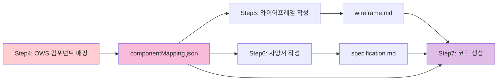

# AI 이미지 분석 워크플로우 가이드 v2.0
> UI 이미지를 OWS 컴포넌트 기반 Vue 애플리케이션으로 변환하는 실전 가이드

## ⚠️ **필수 준수 실행 순서 (v2.0)**

### **절대 변경 금지 - 실행 순서**
```yaml
✅ 올바른_순서 (필수):
  Step1: "이미지 분석 → 화면 유형 식별"
  Step2: "영역 분석 → UI 요소 감지"
  Step3: "⭐ OWS 컴포넌트 매핑 (필수 - 최우선)"
  Step4: "UI 와이어프레임 생성 (OWS 컴포넌트 명시)"
  Step5: "프로그램 사양서 생성 (OWS 정보 포함)"
  Step6: "코드 생성 (와이어프레임과 사양서 기반)"

❌ 금지된_순서:
  - "코드 생성 → 와이어프레임 → 사양서"
  - "OWS 컴포넌트 식별 없이 코드 생성"
  - "와이어프레임 정보 무시하고 코드 생성"
```

## 📌 전체 워크플로우

```mermaid
graph TD
    A[Step1: UI 이미지 입력] --> B[Step2: 화면 유형 식별]
    B --> C[Step3: 영역 분석]
    C --> D[⭐ Step4: OWS 컴포넌트 매핑]
    D --> E[Step5: UI 와이어프레임 작성]
    E --> F[Step6: 프로그램 사양서 작성]
    F --> G{full 옵션?}
    G -->|Yes| H[Step7: OWS 기반 코드 생성]
    G -->|No| I[문서 완료]
    H --> J[검증 및 최적화]
    I --> J
    
    style D fill:#ffebee
    style E fill:#f3e5f5
    style F fill:#e8f5e8
    style H fill:#fff3e0
    
    note1[🎯 OWS 컴포넌트 우선 식별 (최우선)]
    note2[📋 OWS 컴포넌트 매핑 명시]
    note3[📄 OWS 컴포넌트 정보 포함]
    note4[💻 와이어프레임과 사양서 기반 생성]
    
    D -.- note1
    E -.- note2
    F -.- note3
    H -.- note4
```

### **OWS 컴포넌트 정보 전달 체인 (v2.0)**


---

## 🔍 Step 1: 이미지 로딩 및 화면 유형 식별

### 1.1 화면 유형 판별 기준
```yaml
화면_유형_식별:
  CRUD_화면:
    특징:
      - 상단 필터 영역
      - 중앙 데이터 그리드
      - 액션 버튼 (추가/수정/삭제)
    키워드: ["목록", "관리", "조회", "List", "Management"]
    
  대시보드:
    특징:
      - KPI 카드 배치
      - 차트/그래프 존재
      - 요약 정보 표시
    키워드: ["대시보드", "현황", "통계", "Dashboard"]
    
  입력_폼:
    특징:
      - 레이블-입력필드 쌍
      - 저장/취소 버튼
      - 섹션별 그룹화
    키워드: ["등록", "입력", "신청", "Form", "Register"]
    
  상세_화면:
    특징:
      - 읽기 전용 정보
      - 탭 구성
      - 수정/삭제 버튼
    키워드: ["상세", "정보", "Detail", "Info"]
```

### 1.2 실제 판별 예시
```javascript
// AI 분석 결과
const screenAnalysis = {
  type: "CRUD",
  confidence: 0.92,
  evidence: [
    "상단에 날짜 필터 존재",
    "중앙에 테이블 형태의 데이터",
    "우상단에 '추가' 버튼",
    "체크박스 컬럼 존재"
  ]
};
```

---

## 📐 Step 2: 영역 분석 및 UI 요소 감지

### 2.1 표준 영역 구분
```
┌─────────────────────────────────────────────┐
│  Header (제목, 주요 액션)                    │
├─────────────────────────────────────────────┤
│  Filter Section (검색/필터 조건)             │
├─────────────────────────────────────────────┤
│  Content Section (메인 데이터/폼)            │
├─────────────────────────────────────────────┤
│  Footer Section (페이징, 요약 정보)          │
└─────────────────────────────────────────────┘
```

### 2.2 UI 요소 식별 및 분류
```javascript
// Step 2에서는 UI 요소 식별만 수행 (컴포넌트 매핑은 Step 3에서)
const uiElementDetection = {
  header: {
    elements: ["제목 텍스트", "액션 버튼들", "브레드크럼"]
  },
  
  filter: {
    elements: [
      "날짜 선택 영역 (2개 필드)",
      "드롭다운 선택 영역", 
      "체크박스 그룹",
      "조직도 선택 영역",
      "텍스트 입력 필드"
    ]
  },
  
  content: {
    elements: [
      "데이터 테이블/그리드",
      "페이징 영역",
      "모달/팝업 영역",
      "차트/그래프",
      "폼 입력 영역"
    ]
  },
  
  footer: {
    elements: ["요약 정보", "추가 액션 버튼"]
  }
};

// ⚠️ 중요: 실제 OWS 컴포넌트 매핑은 Step 3에서 수행
```

---

## ⭐ Step 3: OWS 컴포넌트 매핑 (최우선 단계)

### ⚠️ **필수 실행 조건**
```yaml
실행_조건:
  - "Step 1, 2 완료 후에만 실행"
  - "화면 유형과 UI 요소 정보 필수 확보"
  - "OWS 컴포넌트 우선순위 규칙 엄격 적용"

출력_요구사항:
  - "componentMapping.json 파일 생성 필수"
  - "Step 4, 5, 6에서 사용할 컴포넌트 정보 완전 정의"
  - "일반 HTML/Bootstrap 컴포넌트 사용 금지"
```

### 3.1 OWS 컴포넌트 우선순위 규칙 (v2.0)
```yaml
필수_사용_컴포넌트 (변경_금지):
  조회기간: "OwBizDatePicker (DatePicker 대신 필수)"
  상태필터: "OwStateFilter (CheckboxGroup 대신 필수)"
  담당자: "OwFormOrg (Select 대신 필수)"
  드롭다운: "OwFormSelect (HTML select 대신)"
  텍스트입력: "OwInput (HTML input 대신)"
  페이징: "OwPagination (Bootstrap Pagination 대신)"
  팝업: "OwPopup (Bootstrap Modal 대신)"
  
허용_컴포넌트:
  데이터그리드: "DxDataGrid (DevExtreme)"
  차트: "DxChart (DevExtreme)"
  기본레이아웃: "BContainer, BRow, BCol (Bootstrap)"
  기본버튼: "BButton (Bootstrap)"
```

### 3.2 시각적 패턴 → OWS 컴포넌트 매핑
```javascript
const visualPatternToComponent = {
  // 🔥 필수 OWS 컴포넌트 (우선순위 1)
  "달력아이콘_날짜필드_2개": {
    component: "OwBizDatePicker",
    confidence: 0.98,
    props: { rangeUnit: "day" },
    reason: "조회기간 필터 - OWS 표준 필수"
  },
  
  "체크박스_숫자표시": {
    component: "OwStateFilter",
    confidence: 0.93,
    props: { options: [] },
    reason: "상태 필터 - OWS 표준 필수"
  },
  
  "조직도_트리_선택": {
    component: "OwFormOrg",
    confidence: 0.95,
    props: { multiple: false },
    reason: "담당자/조직 선택 - OWS 표준 필수"
  },
  
  // 허용 OWS 컴포넌트 (우선순위 2)
  "텍스트박스": {
    component: "OwInput",
    confidence: 0.95,
    props: { placeholder: "입력하세요" },
    reason: "통합 스타일 적용"
  },
  
  "드롭다운_화살표": {
    component: "OwFormSelect",
    confidence: 0.90,
    props: { placeholder: "선택" },
    reason: "폼 검증 내장"
  },
  
  "하단_페이지번호": {
    component: "OwPagination",
    confidence: 0.94,
    props: { showSizeChanger: true },
    reason: "OWS 표준 페이징"
  },
  
  "중앙_팝업창": {
    component: "OwPopup",
    confidence: 0.92,
    props: { size: "lg" },
    reason: "OWS 표준 모달"
  },
  
  // DevExtreme 컴포넌트 (우선순위 3)
  "테이블_헤더_정렬아이콘": {
    component: "DxDataGrid",
    confidence: 0.97,
    features: ["sorting", "filtering", "paging"],
    reason: "고성능 데이터 그리드"
  }
};
```

### 3.3 componentMapping.json 생성 (필수)
```json
{
  "mappingVersion": "v2.0",
  "generatedAt": "2024-01-15T10:30:00Z",
  "screenType": "CRUD",
  "componentMappings": {
    "filter": {
      "dateRange": {
        "component": "OwBizDatePicker",
        "props": { "rangeUnit": "day" },
        "position": "top-left",
        "required": true,
        "reason": "조회기간 필터 - OWS 표준 필수"
      },
      "status": {
        "component": "OwStateFilter",
        "props": { "options": ["active", "inactive"] },
        "position": "top-center",
        "required": true,
        "reason": "상태 필터 - OWS 표준 필수"
      },
      "assignee": {
        "component": "OwFormOrg",
        "props": { "multiple": false },
        "position": "top-right",
        "required": true,
        "reason": "담당자 선택 - OWS 표준 필수"
      }
    },
    "content": {
      "dataGrid": {
        "component": "DxDataGrid",
        "props": { "allowSorting": true, "allowPaging": true },
        "position": "center",
        "reason": "고성능 데이터 표시"
      },
      "pagination": {
        "component": "OwPagination",
        "props": { "showSizeChanger": true },
        "position": "bottom",
        "required": true,
        "reason": "OWS 표준 페이징"
      }
    },
    "modal": {
      "detailPopup": {
        "component": "OwPopup",
        "props": { "size": "lg", "centered": true },
        "reason": "OWS 표준 모달"
      }
    }
  },
  "importStatements": {
    "ows": "import { OwBizDatePicker, OwStateFilter, OwFormOrg, OwPagination, OwPopup } from '@ows/ui'",
    "devextreme": "import { DxDataGrid } from 'devextreme-vue/data-grid'",
    "bootstrap": "import { BButton, BCard } from 'bootstrap-vue-next'"
  }
}
```

⚠️ **이 JSON 파일은 Step 4, 5, 6에서 필수로 참조됩니다**

---

## 📐 Step 4: UI 와이어프레임 작성 (OWS 컴포넌트 매핑 명시)

### ⚠️ **필수 실행 조건**
```yaml
실행_조건:
  - "Step 3에서 생성된 componentMapping.json 필수 로드"
  - "OWS 컴포넌트 정보 완전 반영"
  - "일반 HTML/Bootstrap 컴포넌트 사용 금지"

출력_요구사항:
  - "ASCII 와이어프레임에 OWS 컴포넌트명 명시"
  - "컴포넌트 매핑 테이블 포함"
  - "Step 5(사양서)에서 사용할 정보 완전 전달"
```

### 4.1 와이어프레임 템플릿 (OWS 컴포넌트 명시)

```
┌─────────────────────────────────────────────────────────────┐
│  📋 [제목] 관리                    [BButton] 추가  [BButton] 엑셀 │
├─────────────────────────────────────────────────────────────┤
│  🔍 필터 영역                                                 │
│  [OwBizDatePicker] 2024-01-01~01-31  [OwFormSelect] 전체 카테고리 │
│  [OwStateFilter] ☑활성 ☐비활성  [OwInput] 검색어 입력         │
│                                      [BButton] 조회         │
├─────────────────────────────────────────────────────────────┤
│  📊 데이터 영역                                               │
│  [DxDataGrid]                                               │
│  ┌───────┬─────────┬─────────┬─────────┬─────────┐         │
│  │ ☐선택 │ 순번    │ 제목    │ 상태    │ 등록일  │         │
│  ├───────┼─────────┼─────────┼─────────┼─────────┤         │
│  │ ☐     │ 1       │ 샘플    │ 활성    │ 01-15   │         │
│  └───────┴─────────┴─────────┴─────────┴─────────┘         │
│                                                             │
│  [OwPagination] ◀ 1 2 3 4 5 ▶                             │
└─────────────────────────────────────────────────────────────┘
```

### 4.2 OWS 컴포넌트 매핑 테이블

| 위치 | UI 요소 | OWS 컴포넌트 | Props | 선택 이유 |
|------|---------|--------------|-------|----------|
| 필터 | 조회기간 | OwBizDatePicker | rangeUnit: 'day' | 조회기간 필터 OWS 표준 |
| 필터 | 상태선택 | OwStateFilter | options: [...] | 상태별 필터 OWS 표준 |
| 필터 | 담당자 | OwFormOrg | multiple: false | 조직도 연동 OWS 표준 |
| 필터 | 카테고리 | OwFormSelect | placeholder: '선택' | 폼 검증 내장 |
| 필터 | 검색어 | OwInput | placeholder: '검색' | 통합 스타일 적용 |
| 데이터 | 그리드 | DxDataGrid | allowSorting: true | 고성능 데이터 표시 |
| 데이터 | 페이징 | OwPagination | showSizeChanger: true | OWS 표준 페이징 |

### 4.3 wireframe.md 생성 및 정보 전달

⚠️ **Step 5로 전달될 정보:**
```json
{
  "wireframeData": {
    "componentMapping": {
      "filter": {
        "dateRange": {
          "component": "OwBizDatePicker",
          "props": { "rangeUnit": "day" },
          "position": "top-left",
          "wireframeRef": "[OwBizDatePicker] 2024-01-01~01-31"
        },
        "status": {
          "component": "OwStateFilter",
          "props": { "options": ["active", "inactive"] },
          "position": "top-center",
          "wireframeRef": "[OwStateFilter] ☑활성 ☐비활성"
        }
      },
      "data": {
        "grid": {
          "component": "DxDataGrid",
          "features": ["sorting", "selection", "filtering"],
          "wireframeRef": "[DxDataGrid] 테이블 영역"
        },
        "pagination": {
          "component": "OwPagination",
          "props": { "showSizeChanger": true },
          "wireframeRef": "[OwPagination] ◀ 1 2 3 4 5 ▶"
        }
      }
    },
    "layout": {
      "type": "vertical-sections",
      "sections": ["header", "filter", "data", "footer"]
    }
  }
}
```

---

## 📋 Step 5: 프로그램 사양서 작성 (OWS 컴포넌트 정보 포함)

### ⚠️ **필수 실행 조건**
```yaml
실행_조건:
  - "Step 4에서 생성된 wireframe.md 정보 필수 로드"
  - "componentMapping.json 정보 완전 반영"
  - "OWS 컴포넌트 기술 명세 상세 작성"

출력_요구사항:
  - "specification.md 파일 생성"
  - "OWS 컴포넌트 import 구문 명시"
  - "Step 6(코드생성)에서 사용할 정보 완전 전달"
```

### 5.1 사양서 템플릿 (OWS 컴포넌트 중심)

```yaml
사양서_구성_요소:
  1_OWS_컴포넌트_명세:
    - "와이어프레임에서 식별된 컴포넌트 목록"
    - "각 컴포넌트별 상세 Props 설정"
    - "컴포넌트 간 이벤트 연동"
    - "OWS 컴포넌트 Import 구문"
  
  2_기술_스택:
    Frontend: "Vue 3.5 + TypeScript + OWS UI"
    OWS_Components: "60개+ 엔터프라이즈 컴포넌트"
    DevExtreme: "DxDataGrid, DxChart"
    Bootstrap: "레이아웃 및 기본 UI"
    
  3_구현_가이드:
    - "OWS 컴포넌트 설치 및 설정"
    - "컴포넌트별 필수 Props"
    - "이벤트 핸들러 정의"
    - "API 연동 방식"
```

### 5.2 specification.md 생성 및 정보 전달

⚠️ **Step 6로 전달될 정보:**
```json
{
  "specificationData": {
    "owsComponents": {
      "required": [
        {
          "name": "OwBizDatePicker",
          "import": "import { OwBizDatePicker } from '@ows/ui'",
          "props": { "rangeUnit": "day", "maxDate": "today" },
          "events": ["@change"],
          "usage": "조회기간 필터 (필수)"
        },
        {
          "name": "OwStateFilter", 
          "import": "import { OwStateFilter } from '@ows/ui'",
          "props": { "options": "statusOptions" },
          "events": ["@change"],
          "usage": "상태별 필터 (필수)"
        }
      ]
    },
    "apiIntegration": {
      "endpoints": ["/api/products", "/api/categories"],
      "methods": ["GET", "POST", "PUT", "DELETE"]
    },
    "componentStructure": {
      "template": "SFC with Composition API",
      "typescript": true,
      "scoped": true
    }
  }
}
```

---

## 💻 Step 6: OWS 기반 코드 생성 (와이어프레임과 사양서 기반)

### ⚠️ **필수 실행 조건**
```yaml
실행_조건:
  - "Step 4의 wireframe.md 완료 후에만 실행"
  - "Step 5의 specification.md 완료 후에만 실행"
  - "componentMapping.json 정보 필수 로드"
  - "OWS 컴포넌트 정보 100% 반영"

❌ 금지사항:
  - "와이어프레임/사양서 정보 무시하고 독립 생성"
  - "일반 HTML/Bootstrap 컴포넌트로 대체"
  - "OWS 컴포넌트 import 누락"
```

### 6.1 코드 생성 원칙 (v2.0)

```yaml
참조_우선순위 (필수_준수):
  1순위: "componentMapping.json의 컴포넌트 정의"
  2순위: "wireframe.md의 레이아웃 및 컴포넌트 위치"
  3순위: "specification.md의 기술 명세 및 Props"
  4순위: "Production Vue 템플릿 패턴"

OWS_컴포넌트_강제_적용:
  조회기간: "OwBizDatePicker (DatePicker 절대 사용 금지)"
  상태필터: "OwStateFilter (CheckboxGroup 절대 사용 금지)"
  담당자: "OwFormOrg (Select 절대 사용 금지)"
  페이징: "OwPagination (Bootstrap Pagination 절대 사용 금지)"
  팝업: "OwPopup (Bootstrap Modal 절대 사용 금지)"

Import_구문_순서 (필수):
  1: "OWS 컴포넌트 (@ows/ui)"
  2: "DevExtreme (devextreme-vue)"
  3: "Bootstrap (bootstrap-vue-next)"
  4: "로컬 컴포넌트 (@/components)"
```

### 6.2 생성될 Vue 컴포넌트 구조 (OWS 중심)

```vue
<template>
  <!-- ⚠️ 반드시 componentMapping.json 기준으로 생성 -->
  <div class="screen-container">
    <!-- 필터 영역: wireframe.md의 OWS 컴포넌트 매핑 적용 -->
    <BCard class="filter-section">
      <div class="filter-grid">
        <!-- 조회기간: componentMapping.json에서 OwBizDatePicker로 정의됨 -->
        <div class="filter-item">
          <label class="form-label">조회기간</label>
          <OwBizDatePicker 
            v-model="filters.dateRange"
            :range-unit="'day'"
            :max-date="today"
            @change="onFilterChange"
          />
        </div>
        
        <!-- 상태필터: componentMapping.json에서 OwStateFilter로 정의됨 -->
        <div class="filter-item">
          <label class="form-label">상태</label>
          <OwStateFilter 
            v-model="filters.status"
            :options="statusOptions"
            @change="onFilterChange"
          />
        </div>
        
        <!-- 담당자: componentMapping.json에서 OwFormOrg로 정의됨 -->
        <div class="filter-item">
          <label class="form-label">담당자</label>
          <OwFormOrg 
            v-model="filters.assignee"
            :multiple="false"
            @change="onFilterChange"
          />
        </div>
      </div>
    </BCard>
    
    <!-- 데이터 영역: DxDataGrid + OwPagination 조합 -->
    <BCard class="data-section">
      <DxDataGrid
        ref="dataGrid"
        :data-source="gridDataSource"
        :columns="gridColumns"
        :allow-sorting="true"
        :selection="{ mode: 'multiple' }"
        @selection-changed="onSelectionChanged"
      />
      
      <!-- 페이징: specification.md에서 OwPagination으로 명시됨 -->
      <OwPagination 
        v-model="pagination.current"
        :total="pagination.total"
        :page-size="pagination.pageSize"
        :show-size-changer="true"
        @change="onPageChange"
      />
    </BCard>
  </div>
</template>

<script setup lang="ts">
// ⚠️ specification.md의 import 구문 필수 적용
import {
  OwBizDatePicker,
  OwStateFilter, 
  OwFormOrg,
  OwPagination
} from '@ows/ui';
import { DxDataGrid } from 'devextreme-vue/data-grid';
import { BCard } from 'bootstrap-vue-next';

// componentMapping.json 기반 상태 정의
// ...
</script>
```

### 6.3 코드 생성 검증 체크리스트

```yaml
필수_검증_항목:
  ✅ "componentMapping.json의 모든 OWS 컴포넌트 사용됨"
  ✅ "wireframe.md의 레이아웃 구조 반영됨"
  ✅ "specification.md의 Props 설정 적용됨"
  ✅ "일반 HTML/Bootstrap 컴포넌트 사용 안 함"
  ✅ "OWS 컴포넌트 import 구문 올바름"
  ✅ "Production Vue 템플릿 패턴 적용됨"

❌ 오류_패턴 (절대_금지):
  - "<input type='date'> 사용 (OwBizDatePicker 대신)"
  - "<select> 사용 (OwFormSelect 대신)"
  - "Bootstrap Modal 사용 (OwPopup 대신)"
  - "일반 체크박스 사용 (OwStateFilter 대신)"
```

---

## 📊 워크플로우 완료 및 결과 검증

### ✅ 성공적인 워크플로우 완료 조건

```yaml
완료_조건:
  Step3_완료: "componentMapping.json 생성됨"
  Step4_완료: "wireframe.md에 OWS 컴포넌트 명시됨"
  Step5_완료: "specification.md에 기술 명세 포함됨"
  Step6_완료: "OWS 기반 Vue 컴포넌트 생성됨"

품질_지표:
  OWS_컴포넌트_적용률: "100% (필수 컴포넌트)"
  와이어프레임_반영률: "100%"
  사양서_반영률: "100%"
  코드_품질: "Production Ready"
```

### 🚨 실행 순서 위반 시 조치사항

```yaml
위반_감지시:
  즉시_중단: "잘못된 순서 감지 시 워크플로우 중단"
  오류_메시지: "Step X가 완료되지 않았습니다. 올바른 순서로 다시 실행하세요."
  재시작_요구: "Step 1부터 다시 시작"

경고_메시지:
  - "⚠️ OWS 컴포넌트가 적용되지 않았습니다."
  - "⚠️ 와이어프레임 정보가 반영되지 않았습니다."
  - "⚠️ 사양서 정보가 무시되었습니다."
```

이제 **v2.0 워크플로우가 완전히 정의**되었습니다. 이 순서대로만 실행하면 OWS 컴포넌트가 올바르게 적용된 코드가 생성됩니다!