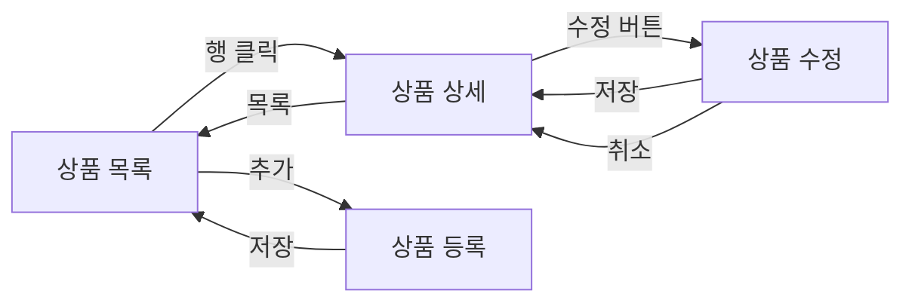

# 화면 네비게이션 및 통합 가이드
> 엔터프라이즈 애플리케이션의 화면 간 연결과 통합 패턴

## 📌 목차
1. [애플리케이션 구조 패턴](#애플리케이션-구조-패턴)
2. [화면 간 네비게이션](#화면-간-네비게이션)
3. [공통 레이아웃 패턴](#공통-레이아웃-패턴)
4. [상태 공유 패턴](#상태-공유-패턴)
5. [복합 화면 시나리오](#복합-화면-시나리오)

---

## 애플리케이션 구조 패턴

### 1. 전체 애플리케이션 레이아웃
```
┌─────────────────────────────────────────────────────┐
│  🏢 기업 로고        메뉴1  메뉴2  메뉴3    👤 사용자 │ ← Header
├──────────┬──────────────────────────────────────────┤
│          │                                          │
│  사이드  │                                          │
│  메뉴    │              메인 컨텐츠 영역              │ ← Main
│          │                                          │
│  - 메뉴1 │                                          │
│  - 메뉴2 │                                          │
│  - 메뉴3 │                                          │
│          │                                          │
├──────────┴──────────────────────────────────────────┤
│  © 2024 Company Name                   v2.5.7       │ ← Footer
└─────────────────────────────────────────────────────┘
```

### 2. Vue3 라우터 구조
```javascript
// router/index.js
const routes = [
  {
    path: '/',
    component: MainLayout,
    children: [
      // 대시보드
      {
        path: 'dashboard',
        name: 'Dashboard',
        component: () => import('@/views/Dashboard.vue'),
        meta: { title: '대시보드', icon: 'dashboard' }
      },
      
      // 상품 관리 (CRUD 패턴)
      {
        path: 'products',
        name: 'ProductList',
        component: () => import('@/views/products/List.vue'),
        meta: { title: '상품 목록' }
      },
      {
        path: 'products/new',
        name: 'ProductCreate',
        component: () => import('@/views/products/Form.vue'),
        meta: { title: '상품 등록', mode: 'create' }
      },
      {
        path: 'products/:id',
        name: 'ProductDetail',
        component: () => import('@/views/products/Detail.vue'),
        meta: { title: '상품 상세' }
      },
      {
        path: 'products/:id/edit',
        name: 'ProductEdit',
        component: () => import('@/views/products/Form.vue'),
        meta: { title: '상품 수정', mode: 'edit' }
      }
    ]
  },
  
  // 인증 화면 (별도 레이아웃)
  {
    path: '/auth',
    component: AuthLayout,
    children: [
      {
        path: 'login',
        name: 'Login',
        component: () => import('@/views/auth/Login.vue')
      }
    ]
  }
];
```

---

## 화면 간 네비게이션

### 1. 목록 → 상세 → 수정 플로우


**구현 예시**
```vue
<!-- ProductList.vue -->
<template>
  <div class="product-list">
    <div class="list-header">
      <h2>상품 목록</h2>
      <BButton @click="goToCreate">상품 추가</BButton>
    </div>
    
    <DxDataGrid 
      :data-source="products"
      @row-click="onRowClick"
    >
      <!-- columns -->
    </DxDataGrid>
  </div>
</template>

<script setup>
import { useRouter } from 'vue-router';

const router = useRouter();

const goToCreate = () => {
  router.push({ name: 'ProductCreate' });
};

const onRowClick = (e) => {
  router.push({ 
    name: 'ProductDetail', 
    params: { id: e.data.id } 
  });
};
</script>
```

### 2. 팝업 네비게이션 패턴
```javascript
// 팝업 관리 컴포저블
export const usePopupNavigation = () => {
  const popupStack = ref([]);
  
  const openPopup = (component, props = {}) => {
    const popup = {
      id: Date.now(),
      component,
      props,
      visible: true
    };
    
    popupStack.value.push(popup);
    return popup.id;
  };
  
  const closePopup = (id) => {
    const index = popupStack.value.findIndex(p => p.id === id);
    if (index > -1) {
      popupStack.value.splice(index, 1);
    }
  };
  
  const closeAllPopups = () => {
    popupStack.value = [];
  };
  
  return { popupStack, openPopup, closePopup, closeAllPopups };
};
```

### 3. 다단계 프로세스 네비게이션
```vue
<!-- OrderWizard.vue -->
<template>
  <div class="order-wizard">
    <!-- 단계 표시 -->
    <div class="steps">
      <div 
        v-for="(step, index) in steps" 
        :key="index"
        :class="{ active: currentStep === index }"
      >
        {{ step.title }}
      </div>
    </div>
    
    <!-- 동적 컴포넌트 -->
    <component 
      :is="currentStepComponent" 
      v-model="orderData"
      @next="nextStep"
      @prev="prevStep"
    />
  </div>
</template>

<script setup>
import { computed } from 'vue';
import CartStep from './steps/CartStep.vue';
import ShippingStep from './steps/ShippingStep.vue';
import PaymentStep from './steps/PaymentStep.vue';
import ConfirmStep from './steps/ConfirmStep.vue';

const steps = [
  { title: '장바구니', component: CartStep },
  { title: '배송정보', component: ShippingStep },
  { title: '결제정보', component: PaymentStep },
  { title: '주문확인', component: ConfirmStep }
];

const currentStep = ref(0);
const currentStepComponent = computed(() => steps[currentStep.value].component);
</script>
```

---

## 공통 레이아웃 패턴

### 1. 메인 레이아웃 컴포넌트
```vue
<!-- layouts/MainLayout.vue -->
<template>
  <div class="main-layout">
    <!-- 헤더 -->
    <header class="main-header">
      <div class="logo">
        
      </div>
      
      <!-- GNB -->
      <nav class="gnb">
        <RouterLink 
          v-for="menu in topMenus" 
          :key="menu.path"
          :to="menu.path"
          :class="{ active: isActive(menu.path) }"
        >
          {{ menu.title }}
        </RouterLink>
      </nav>
      
      <!-- 사용자 정보 -->
      <div class="user-info">
        <OwFormDropdown>
          <template #toggle>
            <span>{{ user.name }}</span>
          </template>
          <template #menu>
            <RouterLink to="/profile">프로필</RouterLink>
            <RouterLink to="/settings">설정</RouterLink>
            <a @click="logout">로그아웃</a>
          </template>
        </OwFormDropdown>
      </div>
    </header>
    
    <div class="main-body">
      <!-- 사이드바 -->
      <aside class="sidebar" v-if="showSidebar">
        <SideMenu :menus="sideMenus" />
      </aside>
      
      <!-- 컨텐츠 영역 -->
      <main class="main-content">
        <!-- 브레드크럼 -->
        <Breadcrumb :items="breadcrumbs" />
        
        <!-- 페이지 컨텐츠 -->
        <RouterView v-slot="{ Component }">
          <Transition name="fade" mode="out-in">
            <component :is="Component" />
          </Transition>
        </RouterView>
      </main>
    </div>
    
    <!-- 전역 컴포넌트 -->
    <GlobalLoading />
    <GlobalToast />
    <GlobalConfirm />
  </div>
</template>

<script setup>
import { computed } from 'vue';
import { useRoute } from 'vue-router';
import { useAuthStore } from '@/stores/auth';
import { useUIStore } from '@/stores/ui';

const route = useRoute();
const authStore = useAuthStore();
const uiStore = useUIStore();

const user = computed(() => authStore.user);
const showSidebar = computed(() => uiStore.showSidebar);

// 브레드크럼 자동 생성
const breadcrumbs = computed(() => {
  const matched = route.matched;
  return matched.map(r => ({
    text: r.meta.title || r.name,
    to: r.path
  }));
});
</script>
```

### 2. 페이지 템플릿 패턴
```vue
<!-- templates/PageTemplate.vue -->
<template>
  <div class="page-template">
    <!-- 페이지 헤더 -->
    <div class="page-header">
      <h1>{{ title }}</h1>
      <div class="page-actions">
        <slot name="actions"></slot>
      </div>
    </div>
    
    <!-- 필터 영역 (옵션) -->
    <div v-if="$slots.filters" class="page-filters">
      <slot name="filters"></slot>
    </div>
    
    <!-- 메인 컨텐츠 -->
    <div class="page-content">
      <slot></slot>
    </div>
    
    <!-- 푸터 액션 (옵션) -->
    <div v-if="$slots.footer" class="page-footer">
      <slot name="footer"></slot>
    </div>
  </div>
</template>

<script setup>
defineProps({
  title: String
});
</script>
```

---

## 상태 공유 패턴

### 1. Pinia Store 구조
```javascript
// stores/modules/product.js
export const useProductStore = defineStore('product', {
  state: () => ({
    products: [],
    currentProduct: null,
    filters: {
      category: '',
      status: [],
      dateRange: { from: '', to: '' }
    },
    loading: false,
    error: null
  }),
  
  getters: {
    filteredProducts: (state) => {
      return state.products.filter(product => {
        // 필터 로직
      });
    },
    
    productById: (state) => (id) => {
      return state.products.find(p => p.id === id);
    }
  },
  
  actions: {
    async fetchProducts() {
      this.loading = true;
      try {
        const response = await api.get('/products', {
          params: this.filters
        });
        this.products = response.data;
      } catch (error) {
        this.error = error.message;
      } finally {
        this.loading = false;
      }
    },
    
    async saveProduct(product) {
      if (product.id) {
        return await this.updateProduct(product);
      } else {
        return await this.createProduct(product);
      }
    }
  }
});
```

### 2. 화면 간 데이터 전달
```javascript
// 방법 1: Route Parameters
router.push({
  name: 'ProductEdit',
  params: { id: productId },
  query: { returnUrl: route.fullPath }
});

// 방법 2: Store를 통한 전달
const productStore = useProductStore();
productStore.setCurrentProduct(product);
router.push({ name: 'ProductEdit' });

// 방법 3: Provide/Inject
// 부모 컴포넌트
provide('sharedData', reactive({
  filters: {},
  selections: []
}));

// 자식 컴포넌트
const sharedData = inject('sharedData');
```

---

## 복합 화면 시나리오

### 1. 대시보드 + 상세 분석
```yaml
시나리오:
  1. 대시보드:
     - KPI 카드 클릭 → 상세 분석 화면
     - 차트 드릴다운 → 필터된 목록
     - 알림 위젯 → 알림 목록
  
  2. 상세 분석:
     - 뒤로가기 → 대시보드 (상태 유지)
     - 데이터 필터 → URL 파라미터 동기화
     - 엑셀 내보내기 → 현재 필터 적용
```

### 2. 검색 → 목록 → 상세 → 수정
```javascript
// 검색 상태 유지
const useSearchPersistence = () => {
  const route = useRoute();
  const router = useRouter();
  
  // URL에서 검색 조건 복원
  const restoreFilters = () => {
    return {
      keyword: route.query.keyword || '',
      category: route.query.category || '',
      status: route.query.status?.split(',') || []
    };
  };
  
  // URL에 검색 조건 저장
  const saveFilters = (filters) => {
    router.push({
      query: {
        ...route.query,
        keyword: filters.keyword,
        category: filters.category,
        status: filters.status.join(',')
      }
    });
  };
  
  return { restoreFilters, saveFilters };
};
```

### 3. 마스터-디테일 + 인라인 편집
```vue
<template>
  <div class="master-detail-edit">
    <!-- 마스터 그리드 -->
    <div class="master-section">
      <DxDataGrid
        :data-source="orders"
        @selection-changed="onSelectionChanged"
      >
        <DxSelection mode="single" />
      </DxDataGrid>
    </div>
    
    <!-- 디테일 편집 폼 -->
    <div class="detail-section">
      <transition name="slide">
        <OrderEditForm
          v-if="selectedOrder"
          :order="selectedOrder"
          @save="handleSave"
          @cancel="handleCancel"
        />
      </transition>
    </div>
  </div>
</template>
```

### 4. 멀티 탭 + 공유 필터
```vue
<template>
  <div class="multi-tab-view">
    <!-- 공통 필터 -->
    <div class="shared-filters">
      <OwBizDatePicker v-model="sharedFilters.dateRange" />
      <OwFormSelect 
        v-model="sharedFilters.department" 
        :options="departments"
      />
    </div>
    
    <!-- 탭 컨텐츠 -->
    <BTabs v-model="activeTab">
      <BTab title="매출 현황">
        <SalesView :filters="sharedFilters" />
      </BTab>
      
      <BTab title="재고 현황">
        <InventoryView :filters="sharedFilters" />
      </BTab>
      
      <BTab title="주문 현황">
        <OrderView :filters="sharedFilters" />
      </BTab>
    </BTabs>
  </div>
</template>

<script setup>
// 공유 필터 상태
const sharedFilters = reactive({
  dateRange: { from: '', to: '' },
  department: ''
});

// 필터 변경 시 모든 탭 데이터 갱신
watch(sharedFilters, () => {
  // 각 탭 컴포넌트에서 watch로 감지
}, { deep: true });
</script>
```

### 5. 위저드 + 임시 저장
```javascript
// 위저드 상태 관리
const useWizardState = () => {
  const STORAGE_KEY = 'wizard_draft';
  
  // 임시 저장
  const saveDraft = (data) => {
    const draft = {
      data,
      timestamp: new Date().toISOString(),
      currentStep: wizardStore.currentStep
    };
    localStorage.setItem(STORAGE_KEY, JSON.stringify(draft));
  };
  
  // 임시 저장 복원
  const loadDraft = () => {
    const saved = localStorage.getItem(STORAGE_KEY);
    if (saved) {
      const draft = JSON.parse(saved);
      if (confirm('임시 저장된 데이터가 있습니다. 이어서 작성하시겠습니까?')) {
        return draft;
      }
    }
    return null;
  };
  
  // 자동 저장
  const { pause, resume } = useIntervalFn(() => {
    saveDraft(wizardStore.formData);
  }, 30000); // 30초마다
  
  return { saveDraft, loadDraft, pause, resume };
};
```

---

## 📋 화면 통합 체크리스트

### 네비게이션 설계
- [ ] 화면 간 이동 경로 정의
- [ ] 뒤로가기 처리 로직
- [ ] 상태 유지 필요 여부
- [ ] URL 파라미터 관리
- [ ] 권한별 접근 제어

### 레이아웃 구성
- [ ] 공통 헤더/푸터 구성
- [ ] 사이드바 메뉴 구조
- [ ] 브레드크럼 자동 생성
- [ ] 반응형 레이아웃
- [ ] 다크모드 지원

### 상태 관리
- [ ] Store 모듈 구조
- [ ] 전역 상태 vs 로컬 상태
- [ ] 캐싱 전략
- [ ] 에러 처리
- [ ] 로딩 상태 관리

### 사용자 경험
- [ ] 페이지 전환 애니메이션
- [ ] 로딩 인디케이터
- [ ] 에러 메시지 표시
- [ ] 성공 피드백
- [ ] 접근성 고려

---

## Spring Boot 통합 고려사항

### API 게이트웨이 패턴
```java
@RestController
@RequestMapping("/api/v1")
public class ApiGatewayController {
    
    @Autowired
    private List<MicroserviceClient> clients;
    
    @PostMapping("/aggregate/{resource}")
    public ResponseEntity<?> aggregateData(
        @PathVariable String resource,
        @RequestBody Map<String, Object> request
    ) {
        // 여러 마이크로서비스에서 데이터 수집
        Map<String, Object> aggregatedData = new HashMap<>();
        
        for (MicroserviceClient client : clients) {
            if (client.supports(resource)) {
                aggregatedData.putAll(client.fetchData(request));
            }
        }
        
        return ResponseEntity.ok(aggregatedData);
    }
}
```

### 세션 관리
```java
@Configuration
@EnableRedisHttpSession
public class SessionConfig {
    
    @Bean
    public HttpSessionIdResolver httpSessionIdResolver() {
        return HeaderHttpSessionIdResolver.xAuthToken();
    }
}
```

### WebSocket 연동
```java
@Configuration
@EnableWebSocketMessageBroker
public class WebSocketConfig implements WebSocketMessageBrokerConfigurer {
    
    @Override
    public void configureMessageBroker(MessageBrokerRegistry config) {
        config.enableSimpleBroker("/topic", "/queue");
        config.setApplicationDestinationPrefixes("/app");
    }
    
    @Override
    public void registerStompEndpoints(StompEndpointRegistry registry) {
        registry.addEndpoint("/ws")
                .setAllowedOriginPatterns("*")
                .withSockJS();
    }
}
```