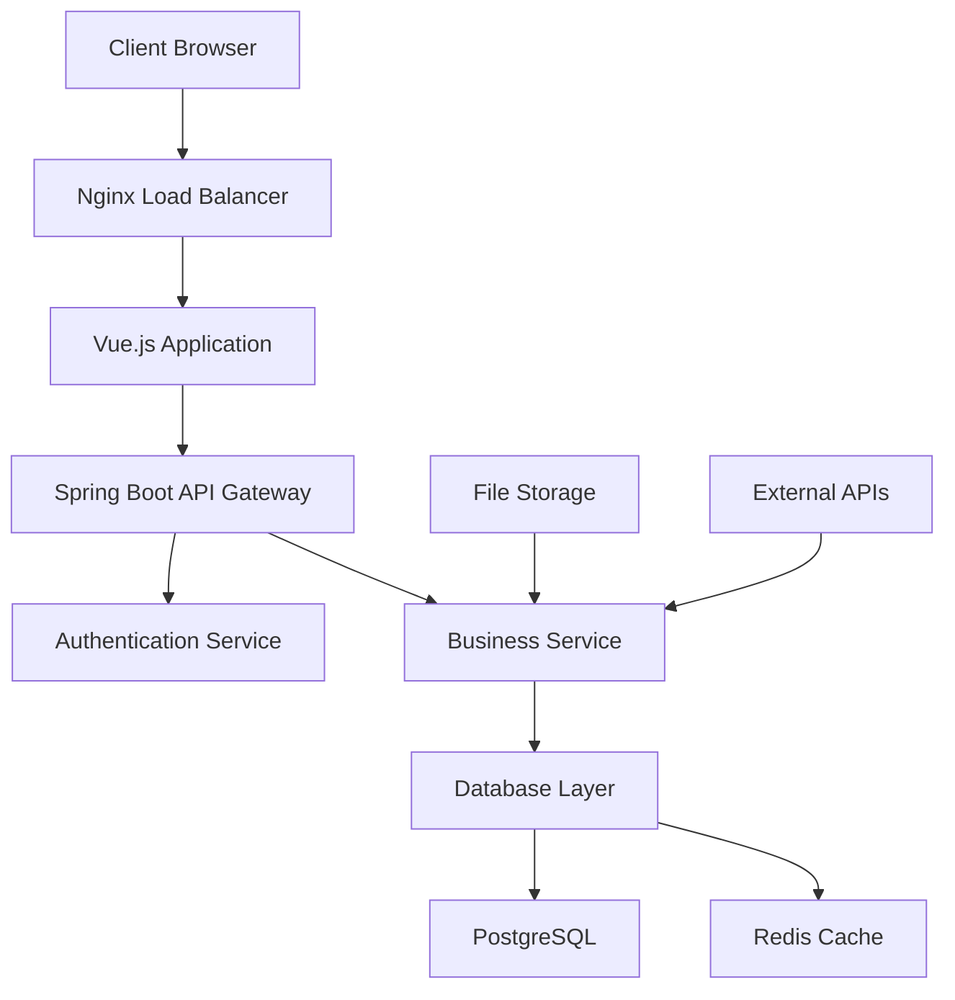
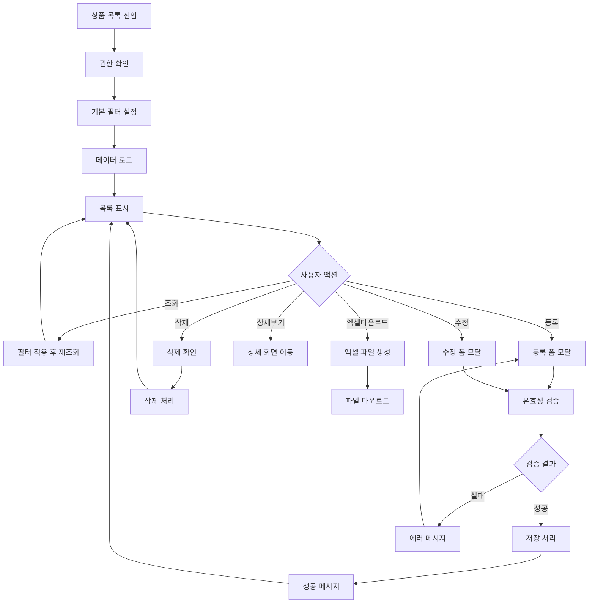
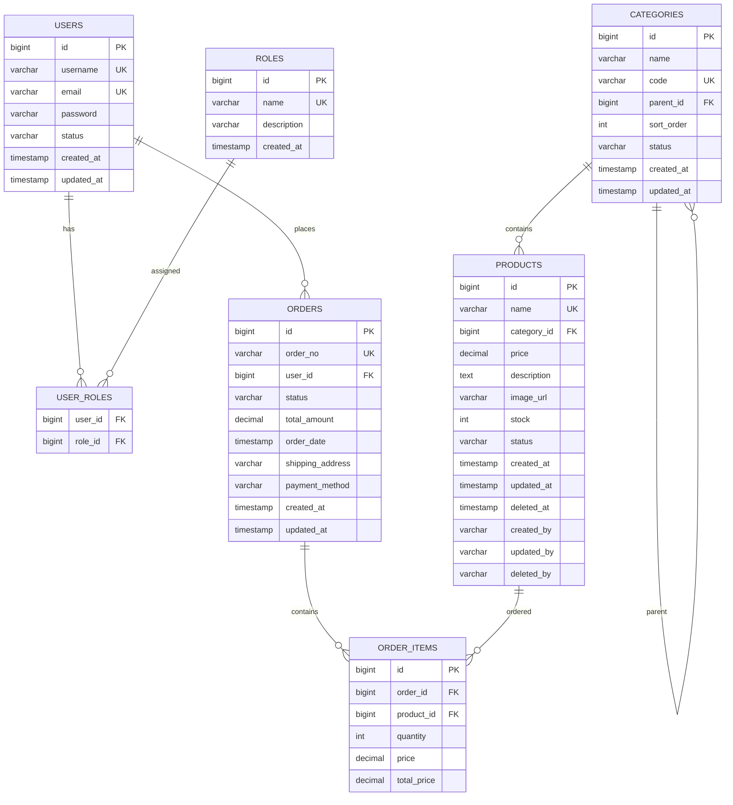
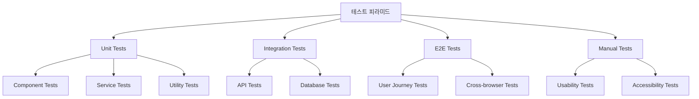
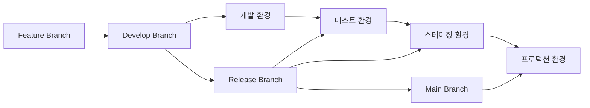

# 프로그램 사양서 작성 템플릿
> AI가 화면 이미지를 분석하여 생성할 프로그램 사양서의 표준 양식

## 📌 사양서 개요

프로그램 사양서는 시스템의 기능적/비기능적 요구사항을 상세히 정의하고, 개발팀이 구현할 수 있도록 명확한 지침을 제공하는 문서입니다.

---

# [시스템명] 프로그램 사양서

## 📋 문서 정보

| 항목 | 내용 |
|------|------|
| **프로젝트명** | {프로젝트명} |
| **시스템명** | {시스템명} |
| **모듈명** | {모듈명} |
| **문서 버전** | v1.0.0 |
| **작성일** | {YYYY-MM-DD} |
| **작성자** | AI Generated |
| **검토자** | {검토자명} |
| **승인자** | {승인자명} |
| **문서 상태** | ⬜ 작성중 ⬜ 검토중 ⬜ 승인 ⬜ 운영반영 |

---

## 1. 시스템 개요

### 1.1 시스템 정보
| 구분 | 내용 |
|------|------|
| **시스템 목적** | {시스템의 주요 목적과 해결하고자 하는 문제} |
| **주요 기능** | {핵심 기능 3-5개 요약} |
| **대상 사용자** | {사용자 그룹별 역할 정의} |
| **서비스 범위** | {시스템이 제공하는 서비스의 범위} |

### 1.2 기술 스택
#### Frontend
| 기술 | 버전 | 용도 |
|------|------|------|
| Vue.js | 3.4.x | Frontend Framework |
| TypeScript | 5.x | 타입 안전성 |
| Vite | 4.x | 빌드 도구 |
| Pinia | 2.x | 상태 관리 |
| Vue Router | 4.x | 라우팅 |
| @ows/ui | 2.5.7 | UI 컴포넌트 라이브러리 |
| Bootstrap Vue Next | 0.x | UI 프레임워크 |
| DevExtreme | 22.2.x | 그리드/차트 컴포넌트 |

#### Backend
| 기술 | 버전 | 용도 |
|------|------|------|
| Spring Boot | 3.x | Backend Framework |
| Spring Security | 6.x | 인증/인가 |
| Spring Data JPA | 3.x | ORM |
| PostgreSQL | 15.x | 메인 데이터베이스 |
| Redis | 7.x | 캐시/세션 저장소 |
| JWT | - | 토큰 기반 인증 |

#### Infrastructure
| 기술 | 버전 | 용도 |
|------|------|------|
| Docker | 24.x | 컨테이너화 |
| Kubernetes | 1.28.x | 오케스트레이션 |
| Nginx | 1.24.x | 웹 서버 |
| Jenkins | 2.x | CI/CD |

### 1.3 시스템 아키텍처


---

## 2. 화면 명세

### 2.1 화면 구성도
```
Application Structure
├── Auth
│   ├── Login (로그인)
│   └── Logout (로그아웃)
├── Dashboard
│   └── Main Dashboard (메인 대시보드)
├── Product Management
│   ├── Product List (상품 목록)
│   ├── Product Detail (상품 상세)
│   ├── Product Form (상품 등록/수정)
│   └── Category Management (카테고리 관리)
├── Order Management
│   ├── Order List (주문 목록)
│   ├── Order Detail (주문 상세)
│   └── Order Processing (주문 처리)
├── System Management
│   ├── User Management (사용자 관리)
│   ├── Role Management (권한 관리)
│   └── System Settings (시스템 설정)
└── Common
    ├── Header (공통 헤더)
    ├── Sidebar (사이드바)
    └── Footer (공통 푸터)
```

### 2.2 화면 목록
| 화면ID | 화면명 | 화면 유형 | URL | 권한 | 상태 |
|--------|--------|----------|-----|------|------|
| AUTH_001 | 로그인 | 인증 | /auth/login | PUBLIC | 구현 |
| DASH_001 | 메인 대시보드 | 대시보드 | /dashboard | USER | 구현 |
| PROD_001 | 상품 목록 | CRUD | /products | USER | 구현 |
| PROD_002 | 상품 상세 | 상세 | /products/:id | USER | 구현 |
| PROD_003 | 상품 등록 | 폼 | /products/new | ADMIN | 구현 |
| PROD_004 | 상품 수정 | 폼 | /products/:id/edit | ADMIN | 구현 |
| PROD_005 | 카테고리 관리 | CRUD | /products/categories | ADMIN | 예정 |
| ORD_001 | 주문 목록 | CRUD | /orders | USER | 구현 |
| ORD_002 | 주문 상세 | 상세 | /orders/:id | USER | 구현 |

---

## 3. 화면별 상세 명세

### 3.1 PROD_001 - 상품 목록 화면

#### 3.1.1 화면 정보
| 항목 | 내용 |
|------|------|
| **화면 목적** | 상품 정보를 조회하고 관리하는 메인 화면 |
| **주요 기능** | 조회, 등록, 수정, 삭제, 엑셀 다운로드 |
| **접근 권한** | USER (조회), ADMIN (등록/수정/삭제) |
| **예상 데이터 규모** | 10,000건 이하 |

#### 3.1.2 기능 상세

**1) 조회 기능**
- **설명**: 다양한 조건으로 상품 목록을 조회
- **입력**: 조회기간, 카테고리, 상태, 검색어
- **출력**: 상품 목록 (페이징 처리)
- **제약사항**: 
  - 조회기간은 최대 1년으로 제한
  - 한 번에 최대 100건까지 표시
- **비즈니스 룰**:
  - 삭제된 상품은 ADMIN만 조회 가능
  - 비활성 상품은 회색으로 표시

**2) 등록 기능**
- **설명**: 새로운 상품을 시스템에 등록
- **필수 입력**: 상품명, 카테고리, 가격
- **선택 입력**: 설명, 이미지, 재고수량
- **유효성 검증**:
  - 상품명: 2-100자, 중복 불가
  - 가격: 0 이상의 숫자
  - 이미지: jpg, png, gif만 허용, 5MB 이하
- **처리 로직**:
  1. 입력값 유효성 검증
  2. 중복 상품명 체크
  3. 이미지 업로드 (있는 경우)
  4. 상품 정보 저장
  5. 알림 메시지 표시

**3) 수정 기능**
- **설명**: 기존 상품 정보를 수정
- **접근 방법**: 목록에서 수정 버튼 클릭 또는 상세 화면에서 수정 버튼
- **수정 가능 필드**: 등록 시와 동일
- **제약사항**: 
  - 주문이 있는 상품은 가격 수정 시 확인 필요
  - 삭제된 상품은 수정 불가

**4) 삭제 기능**
- **설명**: 상품을 논리적으로 삭제 (물리 삭제 아님)
- **삭제 조건**: 
  - 진행 중인 주문이 없어야 함
  - ADMIN 권한 필요
- **처리 로직**:
  1. 삭제 가능 여부 확인
  2. 사용자 확인 메시지
  3. 상태를 'DELETED'로 변경
  4. 삭제일시, 삭제자 정보 기록

**5) 엑셀 다운로드**
- **설명**: 현재 조회 조건의 데이터를 엑셀 파일로 다운로드
- **포함 데이터**: 상품명, 카테고리, 가격, 재고, 상태, 등록일
- **파일명 형식**: `상품목록_YYYYMMDD_HHMMSS.xlsx`
- **제한사항**: 최대 10,000건까지 다운로드 가능

#### 3.1.3 데이터 모델

**Product Entity**
```typescript
interface Product {
  id: number;                    // 상품 ID (PK)
  name: string;                  // 상품명 (필수, 유니크)
  categoryId: number;            // 카테고리 ID (FK)
  categoryName?: string;         // 카테고리명 (조회용)
  price: number;                 // 가격 (필수)
  description?: string;          // 상품 설명
  imageUrl?: string;            // 이미지 URL
  stock: number;                // 재고 수량 (기본값: 0)
  status: ProductStatus;        // 상품 상태
  createdAt: Date;              // 등록일시
  updatedAt: Date;              // 수정일시
  deletedAt?: Date;             // 삭제일시
  createdBy: string;            // 등록자
  updatedBy: string;            // 수정자
  deletedBy?: string;           // 삭제자
}

enum ProductStatus {
  ACTIVE = 'ACTIVE',           // 활성
  INACTIVE = 'INACTIVE',       // 비활성
  DELETED = 'DELETED'          // 삭제
}
```

**필터 조건**
```typescript
interface ProductSearchFilters {
  dateRange?: {
    from: string;               // 조회 시작일 (YYYY-MM-DD)
    to: string;                 // 조회 종료일 (YYYY-MM-DD)
  };
  categoryId?: number;          // 카테고리 ID
  status?: ProductStatus[];     // 상품 상태 (다중 선택)
  keyword?: string;             // 검색어 (상품명, 설명 검색)
  priceRange?: {
    min?: number;               // 최소 가격
    max?: number;               // 최대 가격
  };
}
```

#### 3.1.4 API 명세

**1) 상품 목록 조회**
```http
GET /api/products
```
**Parameters:**
| 파라미터 | 타입 | 필수 | 설명 | 예시 |
|----------|------|------|------|------|
| page | number | N | 페이지 번호 (0부터 시작) | 0 |
| size | number | N | 페이지 크기 | 20 |
| sort | string | N | 정렬 조건 | name,asc |
| startDate | string | N | 조회 시작일 | 2024-01-01 |
| endDate | string | N | 조회 종료일 | 2024-01-31 |
| categoryId | number | N | 카테고리 ID | 1 |
| status | string | N | 상품 상태 (콤마 구분) | ACTIVE,INACTIVE |
| keyword | string | N | 검색어 | 노트북 |

**Response:**
```json
{
  "success": true,
  "data": {
    "content": [
      {
        "id": 1,
        "name": "MacBook Pro 16인치",
        "categoryId": 1,
        "categoryName": "노트북",
        "price": 2500000,
        "description": "Apple M2 Pro 칩 탑재",
        "imageUrl": "https://example.com/images/macbook.jpg",
        "stock": 50,
        "status": "ACTIVE",
        "createdAt": "2024-01-15T09:00:00",
        "updatedAt": "2024-01-15T09:00:00",
        "createdBy": "admin",
        "updatedBy": "admin"
      }
    ],
    "totalElements": 123,
    "totalPages": 7,
    "size": 20,
    "number": 0,
    "first": true,
    "last": false
  },
  "timestamp": "2024-01-15T10:30:00"
}
```

**2) 상품 등록**
```http
POST /api/products
Content-Type: application/json
```
**Request Body:**
```json
{
  "name": "MacBook Pro 16인치",
  "categoryId": 1,
  "price": 2500000,
  "description": "Apple M2 Pro 칩 탑재",
  "imageUrl": "https://example.com/images/macbook.jpg",
  "stock": 50,
  "status": "ACTIVE"
}
```

**Response:**
```json
{
  "success": true,
  "data": {
    "id": 1,
    "name": "MacBook Pro 16인치",
    "categoryId": 1,
    "price": 2500000,
    "description": "Apple M2 Pro 칩 탑재",
    "imageUrl": "https://example.com/images/macbook.jpg",
    "stock": 50,
    "status": "ACTIVE",
    "createdAt": "2024-01-15T09:00:00",
    "createdBy": "admin"
  },
  "message": "상품이 성공적으로 등록되었습니다.",
  "timestamp": "2024-01-15T10:30:00"
}
```

**3) 상품 수정**
```http
PUT /api/products/{id}
Content-Type: application/json
```

**4) 상품 삭제**
```http
DELETE /api/products/{id}
```

**5) 엑셀 다운로드**
```http
POST /api/products/excel/export
Content-Type: application/json
```

#### 3.1.5 화면 흐름도


#### 3.1.6 에러 처리

**에러 코드 정의**
| 코드 | HTTP Status | 메시지 | 처리 방법 |
|------|-------------|--------|----------|
| E001 | 400 | 필수 입력값이 누락되었습니다. | 필드별 에러 표시 |
| E002 | 400 | 중복된 상품명입니다. | 상품명 필드 포커스 |
| E003 | 403 | 접근 권한이 없습니다. | 로그인 페이지 이동 |
| E004 | 404 | 상품을 찾을 수 없습니다. | 목록 페이지로 이동 |
| E005 | 409 | 주문이 있어 삭제할 수 없습니다. | 상태 변경 제안 |
| E006 | 413 | 파일 크기가 너무 큽니다. | 파일 크기 안내 |
| E007 | 422 | 유효하지 않은 파일 형식입니다. | 지원 형식 안내 |
| E500 | 500 | 서버 오류가 발생했습니다. | 재시도 버튼 제공 |

**에러 처리 플로우**
```javascript
// Frontend 에러 처리
const handleApiError = (error) => {
  const { status, data } = error.response;
  
  switch (status) {
    case 400:
      showFieldErrors(data.errors);
      break;
    case 403:
      router.push('/login');
      break;
    case 500:
      showErrorModal('서버 오류가 발생했습니다.', '재시도');
      break;
    default:
      showToast(data.message || '오류가 발생했습니다.', 'error');
  }
};
```

---

## 4. 공통 사항

### 4.1 공통 컴포넌트

#### 4.1.1 레이아웃 컴포넌트
| 컴포넌트명 | 파일 경로 | 설명 | 사용 화면 |
|-----------|----------|------|----------|
| AppLayout | /layouts/AppLayout.vue | 기본 레이아웃 | 모든 인증 후 화면 |
| AuthLayout | /layouts/AuthLayout.vue | 인증 레이아웃 | 로그인, 회원가입 |
| PageHeader | /components/PageHeader.vue | 페이지 헤더 | 목록, 상세 화면 |
| FilterSection | /components/FilterSection.vue | 필터 영역 | 목록 화면 |
| DataSection | /components/DataSection.vue | 데이터 영역 | 목록, 상세 화면 |

#### 4.1.2 폼 컴포넌트
| 컴포넌트명 | OWS 기반 | 설명 | Props |
|-----------|----------|------|-------|
| FormGroup | - | 폼 필드 그룹 | label, required, error |
| FormInput | OwInput | 텍스트 입력 | type, placeholder, rules |
| FormSelect | OwFormSelect | 셀렉트 박스 | options, multiple |
| FormDatePicker | OwBizDatePicker | 날짜 선택 | rangeUnit, format |
| FormFileUpload | OwFileUpload | 파일 업로드 | accept, maxSize |

#### 4.1.3 피드백 컴포넌트
| 컴포넌트명 | 설명 | 사용 시점 |
|-----------|------|----------|
| Toast | 간단한 알림 메시지 | 성공/실패 피드백 |
| Modal | 모달 다이얼로그 | 확인/취소, 폼 입력 |
| Alert | 경고/안내 메시지 | 중요한 안내사항 |
| Loading | 로딩 인디케이터 | API 호출 중 |
| ConfirmDialog | 확인 다이얼로그 | 삭제, 중요한 액션 |

### 4.2 공통 기능

#### 4.2.1 인증/인가
**JWT 토큰 기반 인증**
```typescript
interface AuthTokens {
  accessToken: string;    // 액세스 토큰 (30분)
  refreshToken: string;   // 리프레시 토큰 (7일)
  tokenType: 'Bearer';
  expiresIn: number;
}

interface User {
  id: number;
  username: string;
  email: string;
  roles: string[];
  permissions: string[];
  lastLoginAt: Date;
}
```

**권한 체크 로직**
```javascript
// 라우터 가드
router.beforeEach((to, from, next) => {
  const requiredRole = to.meta.requiresAuth;
  const userRoles = authStore.user?.roles;
  
  if (requiredRole && !hasPermission(userRoles, requiredRole)) {
    next('/login');
  } else {
    next();
  }
});

// 컴포넌트에서 권한 체크
const canEdit = computed(() => 
  authStore.hasRole('ADMIN') || authStore.hasPermission('product:edit')
);
```

#### 4.2.2 에러 처리
**전역 에러 핸들러**
```javascript
// main.js
app.config.errorHandler = (err, instance, info) => {
  console.error('Global error:', err);
  errorLogger.log(err, { component: instance, info });
  
  // 사용자에게 친화적인 메시지 표시
  if (err.name === 'ChunkLoadError') {
    showToast('페이지를 새로고침해주세요.', 'warning');
  } else {
    showToast('예상치 못한 오류가 발생했습니다.', 'error');
  }
};

// API 에러 인터셉터
axios.interceptors.response.use(
  response => response,
  error => {
    const { status, data } = error.response;
    
    // 토큰 만료 처리
    if (status === 401) {
      authStore.logout();
      router.push('/login');
    }
    
    // 공통 에러 처리
    handleApiError(error);
    return Promise.reject(error);
  }
);
```

#### 4.2.3 로깅
**클라이언트 로깅**
```typescript
interface LogEntry {
  level: 'info' | 'warn' | 'error';
  message: string;
  timestamp: Date;
  userId?: string;
  sessionId: string;
  url: string;
  userAgent: string;
  extra?: Record<string, any>;
}

class Logger {
  info(message: string, extra?: any) {
    this.log('info', message, extra);
  }
  
  error(message: string, error?: Error, extra?: any) {
    this.log('error', message, { error: error?.stack, ...extra });
  }
  
  private log(level: string, message: string, extra?: any) {
    const entry: LogEntry = {
      level,
      message,
      timestamp: new Date(),
      userId: authStore.user?.id,
      sessionId: sessionStore.sessionId,
      url: window.location.href,
      userAgent: navigator.userAgent,
      extra
    };
    
    // 로컬 저장
    this.storeLocally(entry);
    
    // 서버 전송 (배치)
    this.sendToServer(entry);
  }
}
```

#### 4.2.4 국제화 (i18n)
```typescript
// messages/ko.json
{
  "common": {
    "save": "저장",
    "cancel": "취소",
    "delete": "삭제",
    "search": "조회",
    "reset": "초기화"
  },
  "product": {
    "name": "상품명",
    "category": "카테고리",
    "price": "가격",
    "status": "상태"
  },
  "message": {
    "saveSuccess": "저장되었습니다.",
    "deleteConfirm": "정말 삭제하시겠습니까?",
    "required": "{field}는 필수 입력 항목입니다."
  }
}

// 사용 방법
const { t } = useI18n();
const message = t('message.saveSuccess');
const requiredMessage = t('message.required', { field: t('product.name') });
```

### 4.3 성능 최적화

#### 4.3.1 번들 최적화
```javascript
// vite.config.js
export default defineConfig({
  build: {
    rollupOptions: {
      output: {
        manualChunks: {
          vendor: ['vue', 'vue-router', 'pinia'],
          ui: ['bootstrap-vue-next', '@ows/ui'],
          devextreme: ['devextreme-vue']
        }
      }
    }
  },
  
  // 코드 스플리팅
  optimizeDeps: {
    include: ['vue', 'vue-router', 'pinia']
  }
});
```

#### 4.3.2 데이터 캐싱
```typescript
// Pinia Store with Cache
export const useProductStore = defineStore('product', {
  state: () => ({
    cache: new Map(),
    cacheExpiry: new Map()
  }),
  
  actions: {
    async fetchProducts(params) {
      const cacheKey = JSON.stringify(params);
      const cached = this.getCachedData(cacheKey);
      
      if (cached) {
        return cached;
      }
      
      const data = await api.getProducts(params);
      this.setCachedData(cacheKey, data, 5 * 60 * 1000); // 5분 캐시
      
      return data;
    },
    
    getCachedData(key) {
      const expiry = this.cacheExpiry.get(key);
      if (expiry && Date.now() < expiry) {
        return this.cache.get(key);
      }
      this.invalidateCache(key);
      return null;
    }
  }
});
```

#### 4.3.3 가상 스크롤링
```vue
<template>
  <!-- 대용량 데이터용 가상 스크롤 -->
  <DxDataGrid
    :data-source="largeDataSet"
    :scrolling="{ mode: 'virtual', rowRenderingMode: 'virtual' }"
    :paging="{ enabled: false }"
  />
  
  <!-- 일반 데이터용 페이징 -->
  <DxDataGrid
    :data-source="normalDataSet"
    :paging="{ pageSize: 20 }"
  />
</template>
```

### 4.4 보안 요구사항

#### 4.4.1 프론트엔드 보안
```typescript
// XSS 방지
const sanitizeHtml = (html: string): string => {
  return DOMPurify.sanitize(html);
};

// CSRF 토큰
axios.defaults.headers.common['X-CSRF-TOKEN'] = 
  document.querySelector('meta[name="csrf-token"]')?.getAttribute('content');

// 민감정보 마스킹
const maskSensitiveData = (data: any): any => {
  if (typeof data === 'string') {
    // 이메일 마스킹: a***@example.com
    return data.replace(/(.{1}).*(@.*)/, '$1***$2');
  }
  return data;
};
```

#### 4.4.2 백엔드 보안
```java
// Security Configuration
@EnableWebSecurity
@EnableMethodSecurity
public class SecurityConfig {
    
    @Bean
    public SecurityFilterChain filterChain(HttpSecurity http) throws Exception {
        return http
            .csrf(csrf -> csrf.disable())
            .sessionManagement(session -> 
                session.sessionCreationPolicy(SessionCreationPolicy.STATELESS))
            .authorizeHttpRequests(auth -> auth
                .requestMatchers("/api/auth/**").permitAll()
                .requestMatchers(HttpMethod.GET, "/api/products/**").hasRole("USER")
                .requestMatchers(HttpMethod.POST, "/api/products/**").hasRole("ADMIN")
                .anyRequest().authenticated())
            .oauth2ResourceServer(oauth2 -> 
                oauth2.jwt(Customizer.withDefaults()))
            .build();
    }
}

// Method Level Security
@Service
public class ProductService {
    
    @PreAuthorize("hasRole('ADMIN') or @productService.isOwner(#id, authentication.name)")
    public void deleteProduct(Long id) {
        // 구현
    }
}
```

---

## 5. 데이터베이스 설계

### 5.1 ERD (Entity Relationship Diagram)


### 5.2 테이블 정의

#### 5.2.1 상품 테이블 (products)
```sql
CREATE TABLE products (
    id BIGSERIAL PRIMARY KEY,
    name VARCHAR(200) NOT NULL UNIQUE,
    category_id BIGINT NOT NULL,
    price DECIMAL(10,2) NOT NULL CHECK (price >= 0),
    description TEXT,
    image_url VARCHAR(500),
    stock INTEGER NOT NULL DEFAULT 0 CHECK (stock >= 0),
    status VARCHAR(20) NOT NULL DEFAULT 'ACTIVE' 
        CHECK (status IN ('ACTIVE', 'INACTIVE', 'DELETED')),
    created_at TIMESTAMP NOT NULL DEFAULT CURRENT_TIMESTAMP,
    updated_at TIMESTAMP NOT NULL DEFAULT CURRENT_TIMESTAMP,
    deleted_at TIMESTAMP,
    created_by VARCHAR(100) NOT NULL,
    updated_by VARCHAR(100) NOT NULL,
    deleted_by VARCHAR(100),
    
    CONSTRAINT fk_products_category 
        FOREIGN KEY (category_id) REFERENCES categories(id),
    
    CONSTRAINT chk_products_deleted 
        CHECK ((status = 'DELETED') = (deleted_at IS NOT NULL))
);

-- 인덱스
CREATE INDEX idx_products_category ON products(category_id);
CREATE INDEX idx_products_status ON products(status);
CREATE INDEX idx_products_created_at ON products(created_at);
CREATE INDEX idx_products_name_text ON products USING gin(to_tsvector('korean', name));
```

#### 5.2.2 카테고리 테이블 (categories)
```sql
CREATE TABLE categories (
    id BIGSERIAL PRIMARY KEY,
    name VARCHAR(100) NOT NULL,
    code VARCHAR(50) NOT NULL UNIQUE,
    parent_id BIGINT,
    sort_order INTEGER NOT NULL DEFAULT 0,
    status VARCHAR(20) NOT NULL DEFAULT 'ACTIVE',
    created_at TIMESTAMP NOT NULL DEFAULT CURRENT_TIMESTAMP,
    updated_at TIMESTAMP NOT NULL DEFAULT CURRENT_TIMESTAMP,
    
    CONSTRAINT fk_categories_parent 
        FOREIGN KEY (parent_id) REFERENCES categories(id)
);

-- 계층형 쿼리를 위한 인덱스
CREATE INDEX idx_categories_parent ON categories(parent_id);
CREATE INDEX idx_categories_code ON categories(code);
```

### 5.3 샘플 데이터
```sql
-- 카테고리 샘플 데이터
INSERT INTO categories (name, code, parent_id, sort_order) VALUES
('전자제품', 'ELECTRONICS', NULL, 1),
('컴퓨터', 'COMPUTER', 1, 1),
('노트북', 'LAPTOP', 2, 1),
('데스크톱', 'DESKTOP', 2, 2),
('모바일', 'MOBILE', 1, 2),
('스마트폰', 'SMARTPHONE', 5, 1),
('태블릿', 'TABLET', 5, 2);

-- 상품 샘플 데이터
INSERT INTO products (name, category_id, price, description, stock, created_by, updated_by) VALUES
('MacBook Pro 16인치', 3, 2500000, 'Apple M2 Pro 칩 탑재', 50, 'admin', 'admin'),
('Dell XPS 13', 3, 1800000, 'Intel i7 프로세서', 30, 'admin', 'admin'),
('iPhone 15 Pro', 6, 1500000, '최신 A17 Pro 칩', 100, 'admin', 'admin'),
('Samsung Galaxy S24', 6, 1200000, 'Android 최신 버전', 80, 'admin', 'admin'),
('iPad Pro 12.9', 7, 1800000, 'M2 칩 탑재 태블릿', 40, 'admin', 'admin');
```

---

## 6. API 명세서

### 6.1 API 설계 원칙
- RESTful API 설계 준수
- HTTP 상태 코드 표준 사용
- 일관된 응답 형식
- 버전 관리 (v1, v2)
- Rate Limiting 적용

### 6.2 공통 응답 형식
```json
{
  "success": true|false,
  "data": {데이터 객체},
  "message": "응답 메시지",
  "errors": [에러 배열],
  "timestamp": "2024-01-15T10:30:00Z",
  "path": "/api/products",
  "method": "GET"
}
```

### 6.3 상품 관리 API

#### 6.3.1 상품 목록 조회
```yaml
GET /api/v1/products
summary: 상품 목록 조회
description: 필터 조건에 따른 상품 목록을 페이징으로 조회

parameters:
  - name: page
    in: query
    schema: { type: integer, minimum: 0, default: 0 }
    description: 페이지 번호 (0부터 시작)
  
  - name: size
    in: query
    schema: { type: integer, minimum: 1, maximum: 100, default: 20 }
    description: 페이지 크기
  
  - name: sort
    in: query
    schema: { type: string, default: "createdAt,desc" }
    description: 정렬 조건 (필드명,방향)
    example: "name,asc"
  
  - name: startDate
    in: query
    schema: { type: string, format: date }
    description: 조회 시작일 (YYYY-MM-DD)
  
  - name: endDate
    in: query
    schema: { type: string, format: date }
    description: 조회 종료일 (YYYY-MM-DD)
  
  - name: categoryId
    in: query
    schema: { type: integer }
    description: 카테고리 ID
  
  - name: status
    in: query
    schema: { type: array, items: { type: string, enum: [ACTIVE, INACTIVE, DELETED] } }
    description: 상품 상태 (다중 선택)
  
  - name: keyword
    in: query
    schema: { type: string, maxLength: 100 }
    description: 검색어 (상품명, 설명)

responses:
  200:
    description: 성공
    content:
      application/json:
        schema:
          type: object
          properties:
            success: { type: boolean, example: true }
            data:
              type: object
              properties:
                content:
                  type: array
                  items: { $ref: '#/components/schemas/Product' }
                totalElements: { type: integer, example: 123 }
                totalPages: { type: integer, example: 7 }
                size: { type: integer, example: 20 }
                number: { type: integer, example: 0 }
                first: { type: boolean, example: true }
                last: { type: boolean, example: false }
            timestamp: { type: string, format: date-time }

  400:
    description: 잘못된 요청
    content:
      application/json:
        schema: { $ref: '#/components/schemas/ErrorResponse' }
        example:
          success: false
          message: "잘못된 파라미터입니다."
          errors: ["page는 0 이상이어야 합니다."]

security:
  - bearerAuth: []
```

#### 6.3.2 상품 등록
```yaml
POST /api/v1/products
summary: 상품 등록
description: 새로운 상품을 시스템에 등록

requestBody:
  required: true
  content:
    application/json:
      schema: { $ref: '#/components/schemas/ProductCreateRequest' }
      example:
        name: "MacBook Pro 16인치"
        categoryId: 1
        price: 2500000
        description: "Apple M2 Pro 칩 탑재"
        imageUrl: "https://example.com/images/macbook.jpg"
        stock: 50
        status: "ACTIVE"

responses:
  201:
    description: 등록 성공
    content:
      application/json:
        schema:
          type: object
          properties:
            success: { type: boolean, example: true }
            data: { $ref: '#/components/schemas/Product' }
            message: { type: string, example: "상품이 성공적으로 등록되었습니다." }
            timestamp: { type: string, format: date-time }

  400:
    description: 유효성 검증 실패
    content:
      application/json:
        schema: { $ref: '#/components/schemas/ValidationErrorResponse' }
        example:
          success: false
          message: "입력값이 올바르지 않습니다."
          errors:
            - field: "name"
              message: "상품명은 필수 입력 항목입니다."
            - field: "price"
              message: "가격은 0 이상이어야 합니다."

  409:
    description: 중복 상품명
    content:
      application/json:
        schema: { $ref: '#/components/schemas/ErrorResponse' }
        example:
          success: false
          message: "이미 존재하는 상품명입니다."

security:
  - bearerAuth: []
```

### 6.4 스키마 정의
```yaml
components:
  schemas:
    Product:
      type: object
      properties:
        id: { type: integer, format: int64, example: 1 }
        name: { type: string, example: "MacBook Pro 16인치" }
        categoryId: { type: integer, format: int64, example: 1 }
        categoryName: { type: string, example: "노트북" }
        price: { type: number, format: decimal, example: 2500000 }
        description: { type: string, example: "Apple M2 Pro 칩 탑재" }
        imageUrl: { type: string, format: uri, example: "https://example.com/images/macbook.jpg" }
        stock: { type: integer, example: 50 }
        status: { type: string, enum: [ACTIVE, INACTIVE, DELETED], example: "ACTIVE" }
        createdAt: { type: string, format: date-time, example: "2024-01-15T09:00:00Z" }
        updatedAt: { type: string, format: date-time, example: "2024-01-15T09:00:00Z" }
        createdBy: { type: string, example: "admin" }
        updatedBy: { type: string, example: "admin" }

    ProductCreateRequest:
      type: object
      required: [name, categoryId, price]
      properties:
        name:
          type: string
          minLength: 2
          maxLength: 200
          example: "MacBook Pro 16인치"
        categoryId:
          type: integer
          format: int64
          minimum: 1
          example: 1
        price:
          type: number
          format: decimal
          minimum: 0
          example: 2500000
        description:
          type: string
          maxLength: 1000
          example: "Apple M2 Pro 칩 탑재"
        imageUrl:
          type: string
          format: uri
          maxLength: 500
          example: "https://example.com/images/macbook.jpg"
        stock:
          type: integer
          minimum: 0
          default: 0
          example: 50
        status:
          type: string
          enum: [ACTIVE, INACTIVE]
          default: "ACTIVE"
          example: "ACTIVE"

    ErrorResponse:
      type: object
      properties:
        success: { type: boolean, example: false }
        message: { type: string, example: "오류가 발생했습니다." }
        errors: { type: array, items: { type: string } }
        timestamp: { type: string, format: date-time }
        path: { type: string, example: "/api/products" }
        method: { type: string, example: "POST" }

    ValidationErrorResponse:
      type: object
      properties:
        success: { type: boolean, example: false }
        message: { type: string, example: "입력값이 올바르지 않습니다." }
        errors:
          type: array
          items:
            type: object
            properties:
              field: { type: string, example: "name" }
              message: { type: string, example: "상품명은 필수 입력 항목입니다." }
        timestamp: { type: string, format: date-time }

  securitySchemes:
    bearerAuth:
      type: http
      scheme: bearer
      bearerFormat: JWT
```

---

## 7. 비기능 요구사항

### 7.1 성능 요구사항
| 항목 | 목표값 | 측정 방법 | 비고 |
|------|--------|----------|------|
| 페이지 로딩 시간 | < 3초 | Lighthouse, WebPageTest | 초기 로딩 |
| API 응답 시간 | < 1초 | 서버 로그, APM | 평균 응답 시간 |
| 데이터베이스 쿼리 | < 500ms | 쿼리 프로파일러 | 복잡 쿼리 제외 |
| 동시 사용자 | 1,000명 | Load Testing | 정상 서비스 기준 |
| 처리량 (TPS) | 500 TPS | 부하 테스트 | 피크 시간 기준 |
| 메모리 사용량 | < 2GB | 모니터링 도구 | JVM 힙 메모리 |

### 7.2 가용성 요구사항
| 항목 | 목표값 | 설명 |
|------|--------|------|
| 시스템 가용성 | 99.9% | 연간 다운타임 8.76시간 이하 |
| 데이터 백업 | 일 1회 | 자동 백업, 30일 보관 |
| 장애 복구 시간 | < 4시간 | RTO (Recovery Time Objective) |
| 데이터 손실 허용 | < 1시간 | RPO (Recovery Point Objective) |
| 모니터링 | 24/7 | 실시간 알림 시스템 |

### 7.3 보안 요구사항
| 구분 | 요구사항 | 구현 방법 |
|------|----------|----------|
| 인증 | 다단계 인증 지원 | JWT + 2FA |
| 인가 | 역할 기반 접근 제어 | RBAC (Role-Based Access Control) |
| 데이터 암호화 | 전송/저장 데이터 암호화 | TLS 1.3, AES-256 |
| 세션 관리 | 안전한 세션 관리 | Redis 기반, 만료 시간 설정 |
| 입력 검증 | 모든 입력 데이터 검증 | Front/Back 이중 검증 |
| 로깅 | 보안 이벤트 로깅 | 접근 시도, 권한 변경 등 |

### 7.4 호환성 요구사항
#### 7.4.1 브라우저 지원
| 브라우저 | 최소 버전 | 지원 기능 |
|----------|----------|----------|
| Chrome | 90+ | 모든 기능 |
| Firefox | 88+ | 모든 기능 |
| Safari | 14+ | 모든 기능 |
| Edge | 90+ | 모든 기능 |
| Internet Explorer | 미지원 | - |

#### 7.4.2 모바일 지원
| 디바이스 | OS 버전 | 브라우저 |
|----------|---------|---------|
| iOS | 14+ | Safari, Chrome |
| Android | 8+ | Chrome, Samsung Internet |

### 7.5 확장성 요구사항
| 항목 | 현재 | 목표 (1년 후) | 확장 방안 |
|------|-----|-------------|----------|
| 사용자 수 | 100명 | 10,000명 | 수평 확장 |
| 데이터 량 | 10만 건 | 1,000만 건 | 파티셔닝, 샤딩 |
| 트래픽 | 100 RPS | 10,000 RPS | 로드 밸런서, CDN |
| 저장 용량 | 100GB | 10TB | 클라우드 스토리지 |

---

## 8. 테스트 계획

### 8.1 테스트 전략


### 8.2 테스트 케이스
#### 8.2.1 기능 테스트
| 테스트 ID | 테스트 시나리오 | 입력 | 기대 결과 | 우선순위 |
|----------|----------------|------|----------|---------|
| TC_PROD_001 | 상품 목록 조회 | 기본 필터 | 전체 상품 목록 표시 | High |
| TC_PROD_002 | 필터 적용 조회 | 카테고리=노트북 | 노트북 상품만 표시 | High |
| TC_PROD_003 | 상품 등록 | 모든 필드 입력 | 상품 등록 성공 | High |
| TC_PROD_004 | 유효성 검증 | 상품명 미입력 | 에러 메시지 표시 | Medium |
| TC_PROD_005 | 권한 검증 | USER 권한으로 삭제 시도 | 접근 거부 | High |

#### 8.2.2 성능 테스트
```javascript
// Jest 성능 테스트 예시
describe('상품 목록 성능 테스트', () => {
  test('1000건 데이터 렌더링 시간', async () => {
    const startTime = performance.now();
    
    const wrapper = mount(ProductList, {
      props: { products: generateMockProducts(1000) }
    });
    
    await wrapper.vm.$nextTick();
    
    const endTime = performance.now();
    const renderTime = endTime - startTime;
    
    expect(renderTime).toBeLessThan(1000); // 1초 이내
  });
});
```

#### 8.2.3 E2E 테스트
```javascript
// Playwright E2E 테스트
test('상품 등록부터 조회까지 전체 플로우', async ({ page }) => {
  // 로그인
  await page.goto('/login');
  await page.fill('[data-testid="username"]', 'admin');
  await page.fill('[data-testid="password"]', 'password');
  await page.click('[data-testid="login-button"]');
  
  // 상품 목록 페이지 이동
  await page.goto('/products');
  await expect(page.locator('h1')).toContainText('상품 관리');
  
  // 상품 등록
  await page.click('[data-testid="add-product-button"]');
  await page.fill('[data-testid="product-name"]', '테스트 상품');
  await page.selectOption('[data-testid="category"]', '1');
  await page.fill('[data-testid="price"]', '100000');
  await page.click('[data-testid="save-button"]');
  
  // 등록 확인
  await expect(page.locator('.toast')).toContainText('등록되었습니다');
  await expect(page.locator('[data-testid="product-grid"]')).toContainText('테스트 상품');
});
```

### 8.3 테스트 자동화
```yaml
# GitHub Actions CI/CD
name: Test and Deploy
on: [push, pull_request]

jobs:
  test:
    runs-on: ubuntu-latest
    steps:
      - uses: actions/checkout@v3
      
      - name: Setup Node.js
        uses: actions/setup-node@v3
        with:
          node-version: '18'
          
      - name: Install dependencies
        run: npm ci
        
      - name: Run unit tests
        run: npm run test:unit
        
      - name: Run integration tests
        run: npm run test:integration
        
      - name: Run E2E tests
        run: npm run test:e2e
        
      - name: Generate coverage report
        run: npm run test:coverage
        
      - name: Upload coverage to Codecov
        uses: codecov/codecov-action@v3
```

---

## 9. 배포 및 운영

### 9.1 배포 전략


### 9.2 환경별 설정
| 환경 | URL | 데이터베이스 | 로그 레벨 | 캐시 |
|------|-----|-------------|----------|------|
| 개발 | localhost:5173 | dev_db | DEBUG | 메모리 |
| 테스트 | test.example.com | test_db | INFO | Redis |
| 스테이징 | staging.example.com | staging_db | WARN | Redis |
| 프로덕션 | app.example.com | prod_db | ERROR | Redis Cluster |

### 9.3 모니터링
```javascript
// 애플리케이션 메트릭
const metrics = {
  performance: {
    pageLoadTime: 'avg_page_load_time',
    apiResponseTime: 'avg_api_response_time',
    errorRate: 'error_rate_percentage'
  },
  
  business: {
    activeUsers: 'active_users_count',
    productViews: 'product_views_count',
    orderSuccess: 'order_success_rate'
  },
  
  infrastructure: {
    cpuUsage: 'cpu_usage_percentage',
    memoryUsage: 'memory_usage_percentage',
    diskUsage: 'disk_usage_percentage'
  }
};

// 알림 규칙
const alertRules = [
  {
    metric: 'error_rate_percentage',
    condition: '> 5',
    severity: 'critical',
    notification: ['email', 'slack']
  },
  {
    metric: 'avg_api_response_time',
    condition: '> 2000',
    severity: 'warning',
    notification: ['slack']
  }
];
```

---

## 10. 유지보수 가이드

### 10.1 코드 리뷰 가이드라인
- [ ] 기능 요구사항 충족
- [ ] 코딩 컨벤션 준수
- [ ] 테스트 코드 작성
- [ ] 성능 영향 검토
- [ ] 보안 취약점 검토
- [ ] 문서 업데이트

### 10.2 버전 관리 전략
```
버전 형식: MAJOR.MINOR.PATCH (e.g., 2.1.3)

MAJOR: 호환성이 깨지는 변경사항
MINOR: 하위 호환성을 유지하는 기능 추가
PATCH: 하위 호환성을 유지하는 버그 수정

릴리스 주기:
- PATCH: 필요시 (긴급 버그 수정)
- MINOR: 월 1회 (새 기능 추가)
- MAJOR: 연 1-2회 (대규모 변경)
```

### 10.3 문서 관리
- **API 문서**: Swagger/OpenAPI 자동 생성
- **사용자 매뉴얼**: 화면별 상세 가이드
- **개발자 가이드**: 코딩 규칙, 아키텍처 설명
- **운영 매뉴얼**: 배포, 모니터링, 장애 대응

---

## 📎 부록

### A. 용어집
| 용어 | 설명 |
|------|------|
| OWS | Ows Starter Templates - 사내 UI 컴포넌트 라이브러리 |
| CRUD | Create, Read, Update, Delete - 기본적인 데이터 조작 |
| JWT | JSON Web Token - 토큰 기반 인증 방식 |
| RBAC | Role-Based Access Control - 역할 기반 접근 제어 |
| SPA | Single Page Application - 단일 페이지 애플리케이션 |
| API | Application Programming Interface - 애플리케이션 프로그래밍 인터페이스 |

### B. 참조 문서
- [Vue.js 공식 문서](https://vuejs.org/)
- [Spring Boot 공식 문서](https://spring.io/projects/spring-boot)
- [DevExtreme Vue 가이드](https://js.devexpress.com/Vue/)
- [OWS UI 컴포넌트 가이드](../README.md)

### C. 변경 이력
| 버전 | 날짜 | 변경 내용 | 작성자 |
|------|------|----------|--------|
| 1.0.0 | 2024-01-15 | 초기 버전 작성 | AI Generated |
| 1.0.1 | 2024-01-16 | API 명세 보완 | 개발팀 |
| 1.1.0 | 2024-01-20 | 보안 요구사항 추가 | 보안팀 |

---

**문서 상태**: ⬜ 작성중 ⬜ 검토중 ⬜ 승인 ⬜ 운영반영  
**다음 검토일**: 2024-02-15  
**문서 버전**: v1.0.0

> 이 사양서는 AI가 자동 생성한 초안입니다. 실제 개발 전 비즈니스 분석가, 아키텍트, 개발팀의 상세 검토가 필요합니다.