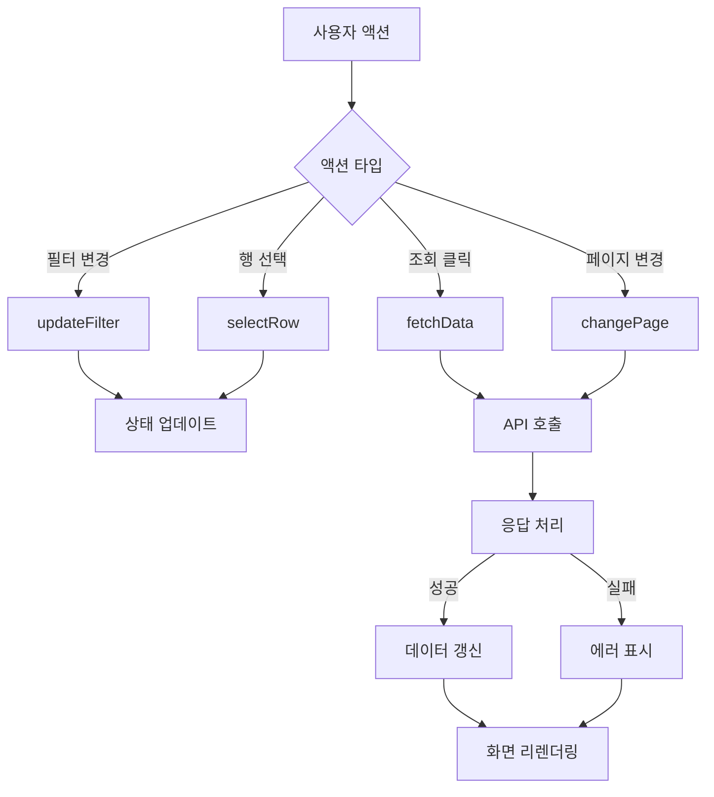
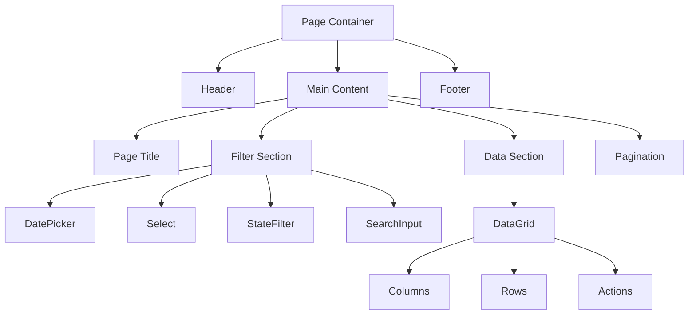

# UI 와이어프레임 작성 템플릿
> AI가 화면 이미지를 분석하여 생성할 UI 와이어프레임의 표준 양식

## 📌 와이어프레임 개요

UI 와이어프레임은 화면의 구조, 레이아웃, 컴포넌트 배치를 시각적으로 표현하는 문서입니다. 이 문서는 개발자가 실제 구현 시 참조할 수 있는 상세한 설계도 역할을 합니다.

---

## 🎯 [화면명] UI 와이어프레임

### 1. 화면 기본 정보

| 항목 | 내용 |
|------|------|
| **화면 ID** | SCRN_{모듈}_{번호} (예: SCRN_PRD_001) |
| **화면명** | {한글 화면명} / {영문 화면명} |
| **화면 유형** | □ 목록조회 □ 상세조회 □ 등록/수정 □ 대시보드 □ 팝업 □ 기타 |
| **화면 경로** | {메뉴 경로} (예: 시스템관리 > 상품관리 > 상품목록) |
| **URL** | {라우터 경로} (예: /products/list) |
| **권한** | {접근 권한} (예: ROLE_USER, ROLE_ADMIN) |
| **디바이스** | □ Desktop □ Tablet □ Mobile |
| **작성일** | {YYYY-MM-DD} |
| **작성자** | AI Generated / {검토자명} |

---

### 2. 화면 레이아웃 구조

#### 2.1 전체 레이아웃
```
┌────────────────────────────────────────────────────────────┐
│                          Header (60px)                      │
│ ┌────────┬─────────────────────────────────┬─────────────┐│
│ │  Logo  │         Navigation Menu         │  User Info  ││
│ └────────┴─────────────────────────────────┴─────────────┘│
├────────────────────────────────────────────────────────────┤
│ ┌────────┬────────────────────────────────────────────────┐│
│ │        │                                                ││
│ │  Side  │              Main Content Area                 ││
│ │  Menu  │                                                ││
│ │ (200px)│                  (Flexible)                    ││
│ │        │                                                ││
│ └────────┴────────────────────────────────────────────────┘│
├────────────────────────────────────────────────────────────┤
│                          Footer (40px)                      │
└────────────────────────────────────────────────────────────┘

Dimensions: 1920px × 1080px (Desktop)
```

#### 2.2 상세 영역 구조
```
Main Content Area 상세
┌────────────────────────────────────────────────────────────┐
│ Page Header Section (80px)                                 │
│ ┌─────────────────────────────┬───────────────────────────┐│
│ │ <Title>                     │         [Action Buttons]  ││
│ │ {화면 제목}                  │    [추가] [다운로드] [인쇄] ││
│ └─────────────────────────────┴───────────────────────────┘│
├────────────────────────────────────────────────────────────┤
│ Filter Section (120px)                                     │
│ ┌───────────────┬───────────────┬────────────┬──────────┐ │
│ │ Date Range    │ Category      │ Status     │ Search   │ │
│ │ [____~____]   │ [Select ▼]    │ □ □ □ □    │ [조회]   │ │
│ └───────────────┴───────────────┴────────────┴──────────┘ │
├────────────────────────────────────────────────────────────┤
│ Data Section (Variable Height)                             │
│ ┌────────────────────────────────────────────────────────┐ │
│ │ Summary Bar                                            │ │
│ │ 총 {n}건 | 선택 {n}건 | 필터 적용중                      │ │
│ ├────────────────────────────────────────────────────────┤ │
│ │ Data Grid                                              │ │
│ │ ┌──┬─────────┬──────────┬──────────┬──────────┬─────┐│ │
│ │ │□ │ Column1 │ Column2  │ Column3  │ Column4  │ Act ││ │
│ │ ├──┼─────────┼──────────┼──────────┼──────────┼─────┤│ │
│ │ │□ │ Data    │ Data     │ Data     │ Data     │[수정]││ │
│ │ │□ │ Data    │ Data     │ Data     │ Data     │[수정]││ │
│ │ └──┴─────────┴──────────┴──────────┴──────────┴─────┘│ │
│ └────────────────────────────────────────────────────────┘ │
├────────────────────────────────────────────────────────────┤
│ Pagination Section (60px)                                  │
│ ┌────────────────────────────────────────────────────────┐ │
│ │  < 1 2 3 4 5 >              10개씩 보기 ▼   총 123건    │ │
│ └────────────────────────────────────────────────────────┘ │
└────────────────────────────────────────────────────────────┘
```

---

### 3. 컴포넌트 상세 명세

#### 3.1 Header 영역 컴포넌트

| ID | 컴포넌트명 | OWS 컴포넌트 | 위치 | Props/속성 | 이벤트 | 설명 |
|----|-----------|-------------|------|-----------|--------|------|
| HD001 | 로고 | `` | 좌측 | src="/logo.png" | @click="goHome" | 홈으로 이동 |
| HD002 | 메인메뉴 | `<BNavbar>` | 중앙 | :items="menuItems" | @select | GNB 메뉴 |
| HD003 | 사용자정보 | `<OwFormDropdown>` | 우측 | :user="currentUser" | @logout | 사용자 메뉴 |

#### 3.2 Filter 영역 컴포넌트 (OWS 공통 컴포넌트 우선 적용)

| ID | 컴포넌트명 | **OWS 컴포넌트** | 위치 | Props/속성 | 이벤트 | 설명 | **OWS 선택 이유** |
|----|-----------|-------------|------|-----------|--------|------|------------------|
| FT001 | 조회기간 | `<OwBizDatePicker>` | 1행 1열 | v-model="filters.dateRange"<br>:range-unit="'day'"<br>:twice="true" | @change | 업무용 날짜 범위 선택 | **일/주/월/년 단위 지원, OWS 표준** |
| FT002 | 카테고리 | `<OwFormSelect>` | 1행 2열 | v-model="filters.category"<br>:options="categories"<br>clearable | @change | 카테고리 선택 | **폼 검증 내장, OWS 스타일** |
| FT003 | 상태필터 | `<OwStateFilter>` | 1행 3열 | v-model="filters.status"<br>:options="statusOptions" | @change | 다중 상태 선택 | **상태 카운트 표시, 체크박스 그룹** |
| FT004 | 검색어 | `<OwInput>` | 2행 1-2열 | v-model="filters.keyword"<br>placeholder="검색어 입력"<br>clearable | @keyup.enter | 키워드 검색 | **OWS 통합 스타일, 클리어 기능** |
| FT005 | 담당자선택 | `<OwFormOrg>` | 1행 4열 | v-model="filters.assignee"<br>type="user"<br>:multiple="false" | @change | 담당자 선택 | **조직도 연동, 사용자 검색** |
| FT006 | 조회버튼 | `<BButton>` | 2행 3열 | variant="primary"<br>:loading="loading" | @click="search" | 조회 실행 | Bootstrap 표준 버튼 |

#### 3.3 Data Grid 영역 컴포넌트 (OWS 표준 적용)

| ID | 컴포넌트명 | **OWS 컴포넌트** | Props/속성 | 기능 | **OWS 선택 이유** |
|----|-----------|-------------|-----------|------|------------------|
| DG001 | 데이터그리드 | `<DxDataGrid>` | :data-source="gridData"<br>:columns="columns"<br>:selection="{mode: 'multiple'}"<br>:paging="{pageSize: 20}" | 정렬, 필터, 선택, 페이징 | **DevExtreme OWS 표준** |
| DG002 | 페이지네이션 | `<OwPagination>` | v-model:current-page="currentPage"<br>v-model:page-size="pageSize"<br>:total-count="totalCount" | 페이지 이동, 사이즈 변경 | **OWS 표준 페이징, 총 건수 표시** |

**Grid Columns 정의**
| 필드명 | 헤더명 | 타입 | 너비 | 정렬 | 포맷 | 템플릿 |
|-------|--------|------|------|------|------|--------|
| selection | □ | checkbox | 50px | center | - | - |
| id | No | number | 80px | center | - | - |
| name | 상품명 | string | 200px | left | - | link |
| category | 카테고리 | string | 150px | center | - | - |
| price | 가격 | number | 120px | right | #,##0 | - |
| status | 상태 | string | 100px | center | - | badge |
| createdDate | 등록일 | date | 150px | center | yyyy-MM-dd | - |
| actions | 관리 | - | 120px | center | - | buttons |

#### 3.4 Action Buttons

| ID | 버튼명 | 타입 | 위치 | 스타일 | 이벤트 | 권한 | 설명 |
|----|--------|------|------|--------|--------|------|------|
| BT001 | 추가 | primary | 헤더 우측 | icon: plus | @click="create" | ADMIN | 신규 등록 |
| BT002 | 엑셀다운로드 | success | 헤더 우측 | icon: excel | @click="export" | USER | 엑셀 내보내기 |
| BT003 | 수정 | outline-primary | 그리드 행 | size: sm | @click="edit(row)" | ADMIN | 행 수정 |
| BT004 | 삭제 | outline-danger | 그리드 행 | size: sm | @click="delete(row)" | ADMIN | 행 삭제 |

---

### 4. OWS 컴포넌트 매핑 규칙

#### 4.1 UI 요소 → OWS 컴포넌트 자동 매핑

| **화면 요소** | **시각적 특징** | **OWS 컴포넌트** | **선택 이유** |
|-------------|----------------|----------------|---------------|
| 조회기간, 검색기간 | 날짜 입력 + 일/주/월/년 버튼 | `<OwBizDatePicker>` | 업무용 날짜 범위 선택 전용 |
| 단순 날짜 입력 | 달력 아이콘만 | `<OwFormDate>` | 단순 날짜 입력 |
| 드롭다운 | ▼ 화살표 + 옵션 10개 이하 | `<OwFormSelect>` | 폼 검증 내장 |
| 검색 가능 드롭다운 | 돋보기 + 옵션 많음 | `<OwFormDropdown>` | 검색 기능 포함 |
| 상태 필터 (체크) | 체크박스 + 카운트 숫자 | `<OwStateFilter>` | 상태별 다중 선택 |
| 상태 필터 (라디오) | 라디오 버튼 나열 | `<OwStateRadio>` | 상태별 단일 선택 |
| 담당자, 결재자 | 조직도 아이콘 + "선택" 버튼 | `<OwFormOrg>` | 조직도 연동 |
| 텍스트 입력 | 일반 입력 필드 | `<OwInput>` | OWS 통합 스타일 |
| 페이지 번호 | 테이블 하단 숫자 나열 | `<OwPagination>` | OWS 표준 페이징 |
| 팝업/모달 | 화면 중앙 모달 | `<OwPopup>` | OWS 표준 팝업 |
| 더보기 필터 | "더보기", "고급" 버튼 | `<OwMorePopup>` | 확장 필터 |

#### 4.2 OWS 컴포넌트 우선 순위 원칙

1. **OWS 전용 컴포넌트 최우선**
   - OwBizDatePicker > 일반 DatePicker
   - OwFormOrg > 일반 Select (조직/사용자 선택 시)
   - OwStateFilter > 일반 CheckboxGroup (상태 필터 시)

2. **OWS Form 계열 우선**
   - OwFormDate > 일반 DatePicker
   - OwFormSelect > HTML select
   - OwInput > HTML input

3. **OWS 통합 컴포넌트 우선**
   - OwPopup > Bootstrap Modal
   - OwPagination > Bootstrap Pagination

#### 4.3 AI 분석 시 필수 확인사항

```yaml
와이어프레임_생성_체크리스트:
  필터_영역:
    - "□ 날짜 필터 → OwBizDatePicker 적용"
    - "□ 상태 필터 → OwStateFilter 적용"
    - "□ 드롭다운 → OwFormSelect 적용"
    - "□ 조직 선택 → OwFormOrg 적용"
  
  데이터_영역:
    - "□ 그리드 → DxDataGrid 적용"
    - "□ 페이징 → OwPagination 적용"
  
  액션_영역:
    - "□ 팝업 → OwPopup 적용"
    - "□ 더보기 → OwMorePopup 적용"
```

---

### 5. 반응형 디자인 명세

#### 4.1 브레이크포인트
| 디바이스 | 크기 | 레이아웃 변경사항 |
|---------|------|-----------------|
| Desktop XL | ≥1920px | 기본 레이아웃 (사이드바 고정) |
| Desktop | 1200-1919px | 사이드바 폭 축소 (200px → 180px) |
| Tablet | 768-1199px | 사이드바 토글, 필터 2행 배치 |
| Mobile | <768px | 사이드바 숨김, 필터 세로 배치, 그리드 가로 스크롤 |

#### 4.2 컴포넌트별 반응형 규칙
```scss
// Desktop (≥1200px)
.filter-section {
  display: grid;
  grid-template-columns: repeat(4, 1fr);
  gap: 16px;
}

// Tablet (768-1199px)
@media (max-width: 1199px) {
  .filter-section {
    grid-template-columns: repeat(2, 1fr);
  }
  .sidebar {
    position: absolute;
    transform: translateX(-100%);
    &.open { transform: translateX(0); }
  }
}

// Mobile (<768px)
@media (max-width: 767px) {
  .filter-section {
    grid-template-columns: 1fr;
  }
  .data-grid {
    overflow-x: auto;
    min-width: 600px;
  }
}
```

---

### 5. 상태 관리 및 데이터 흐름

#### 5.1 화면 상태 정의
```typescript
interface ScreenState {
  // 필터 상태
  filters: {
    dateRange: { from: string; to: string };
    category: string | null;
    status: string[];
    keyword: string;
  };
  
  // 데이터 상태
  data: {
    items: Product[];
    totalCount: number;
    loading: boolean;
    error: string | null;
  };
  
  // UI 상태
  ui: {
    selectedRows: number[];
    currentPage: number;
    pageSize: number;
    sortField: string;
    sortOrder: 'asc' | 'desc';
    showSidebar: boolean;
    showFilterDetails: boolean;
  };
  
  // 모달/팝업 상태
  modals: {
    createModal: boolean;
    editModal: boolean;
    deleteConfirm: boolean;
    currentItem: Product | null;
  };
}
```

#### 5.2 데이터 흐름도


---

### 6. 인터랙션 및 동작 명세

#### 6.1 초기 로드 시퀀스
```
1. 화면 진입
2. 사용자 권한 확인
3. 기본 필터 설정 (최근 7일)
4. 초기 데이터 로드
5. 그리드 렌더링
6. 로딩 완료
```

#### 6.2 주요 인터랙션 시나리오

**시나리오 1: 데이터 조회**
```
Given: 사용자가 필터를 설정한 상태
When: 조회 버튼 클릭
Then: 
  1. 로딩 인디케이터 표시
  2. API 호출 (필터 파라미터 전달)
  3. 응답 데이터로 그리드 갱신
  4. 총 건수 업데이트
  5. 로딩 인디케이터 숨김
```

**시나리오 2: 행 선택 및 일괄 처리**
```
Given: 그리드에 데이터가 표시된 상태
When: 체크박스로 여러 행 선택
Then:
  1. 선택된 행 수 표시
  2. 일괄 처리 버튼 활성화
  3. 선택된 항목 ID 저장
```

**시나리오 3: 상세 보기**
```
Given: 그리드에 데이터가 표시된 상태
When: 특정 행 클릭
Then:
  1. 상세 화면으로 라우팅
  2. 또는 상세 정보 팝업 표시
  3. 선택 항목 데이터 전달
```

#### 6.3 에러 처리
| 에러 유형 | 처리 방법 | 사용자 메시지 |
|----------|----------|--------------|
| 네트워크 오류 | 재시도 버튼 표시 | "네트워크 연결을 확인해주세요." |
| 권한 없음 | 로그인 페이지 이동 | "접근 권한이 없습니다." |
| 유효성 검증 실패 | 필드별 에러 표시 | "{필드명}을(를) 확인해주세요." |
| 서버 오류 | 에러 페이지 표시 | "일시적인 오류가 발생했습니다." |

---

### 7. 접근성 (Accessibility) 명세

#### 7.1 키보드 네비게이션
| 키 | 동작 | 적용 영역 |
|----|------|----------|
| Tab | 다음 요소로 이동 | 전체 |
| Shift + Tab | 이전 요소로 이동 | 전체 |
| Enter | 선택/실행 | 버튼, 링크 |
| Space | 체크박스 토글 | 체크박스 |
| Arrow Keys | 그리드 셀 이동 | 데이터 그리드 |
| Esc | 팝업 닫기 | 모달/팝업 |

#### 7.2 ARIA 속성
```html
<!-- 주요 영역 -->
<nav role="navigation" aria-label="주 메뉴">
<main role="main" aria-label="콘텐츠 영역">
<section role="region" aria-label="필터 영역">

<!-- 인터랙티브 요소 -->
<button aria-label="상품 추가" aria-describedby="add-help">
<input aria-label="검색어 입력" aria-required="false">
<div role="alert" aria-live="polite">검색 결과 123건</div>

<!-- 데이터 그리드 -->
<table role="grid" aria-label="상품 목록">
  <tr role="row">
    <th role="columnheader" aria-sort="ascending">상품명</th>
  </tr>
</table>
```

#### 7.3 컬러 대비
| 요소 | 전경색 | 배경색 | 대비율 | WCAG 레벨 |
|------|--------|--------|--------|-----------|
| 일반 텍스트 | #212529 | #FFFFFF | 16:1 | AAA |
| 링크 | #0066CC | #FFFFFF | 4.5:1 | AA |
| 비활성 텍스트 | #6C757D | #FFFFFF | 4.5:1 | AA |
| 에러 텍스트 | #DC3545 | #FFFFFF | 4.5:1 | AA |

---

### 8. 성능 최적화 가이드

#### 8.1 로딩 최적화
```javascript
// 1. 컴포넌트 레이지 로딩
const DataGrid = () => import('devextreme-vue/data-grid');

// 2. 가상 스크롤링 (대용량 데이터)
<DxDataGrid :scrolling="{ mode: 'virtual' }" />

// 3. 디바운싱 (검색/필터)
const debouncedSearch = debounce(handleSearch, 300);

// 4. 페이지네이션 (서버사이드)
const fetchData = async (page, size) => {
  return await api.get('/products', { 
    params: { page, size, ...filters } 
  });
};
```

#### 8.2 렌더링 최적화
- 불필요한 리렌더링 방지 (computed, memo 활용)
- v-show vs v-if 적절한 사용
- key 속성 올바른 사용
- 이미지 레이지 로딩

---

### 9. 테스트 시나리오

#### 9.1 기능 테스트
| 테스트 ID | 테스트 항목 | 기대 결과 | 우선순위 |
|----------|------------|----------|---------|
| TC001 | 초기 로드 | 기본 필터로 데이터 표시 | High |
| TC002 | 필터 적용 | 필터 조건에 맞는 데이터만 표시 | High |
| TC003 | 정렬 기능 | 선택한 컬럼 기준 정렬 | Medium |
| TC004 | 페이지네이션 | 페이지 이동 시 데이터 갱신 | High |
| TC005 | 엑셀 다운로드 | 현재 필터 적용된 데이터 다운로드 | Medium |

#### 9.2 UI/UX 테스트
- 반응형 레이아웃 테스트 (각 브레이크포인트)
- 키보드 접근성 테스트
- 스크린리더 호환성 테스트
- 크로스 브라우저 테스트

---

### 10. 주석 및 참고사항

#### 10.1 디자인 결정 사항
- **사이드바 토글**: 태블릿 이하에서는 햄버거 메뉴로 전환
- **필터 영역**: 자주 사용하는 필터만 노출, 상세 필터는 "더보기"로 숨김
- **그리드 컬럼**: 중요도에 따라 고정/가변 너비 적용

#### 10.2 개발 시 주의사항
1. **상태 관리**: Pinia Store 사용하여 중앙 집중식 관리
2. **API 호출**: 중복 호출 방지를 위한 요청 취소 처리
3. **에러 바운더리**: 컴포넌트 레벨 에러 처리 구현
4. **메모리 누수**: 컴포넌트 언마운트 시 이벤트 리스너 정리

#### 10.3 추후 개선사항
- [ ] 고급 필터 기능 추가
- [ ] 그리드 컬럼 커스터마이징
- [ ] 다국어 지원
- [ ] 다크 모드 지원

---

## 📎 첨부 자료

### A. 컴포넌트 다이어그램


### B. 색상 팔레트
| 용도 | 색상명 | HEX | RGB |
|------|--------|-----|-----|
| Primary | Blue | #0066CC | 0, 102, 204 |
| Success | Green | #28A745 | 40, 167, 69 |
| Danger | Red | #DC3545 | 220, 53, 69 |
| Warning | Yellow | #FFC107 | 255, 193, 7 |
| Info | Cyan | #17A2B8 | 23, 162, 184 |
| Background | Light Gray | #F8F9FA | 248, 249, 250 |
| Border | Gray | #DEE2E6 | 222, 226, 230 |

### C. 아이콘 라이브러리
- Bootstrap Icons v1.10.0
- 주요 사용 아이콘:
  - 추가: `bi-plus-circle`
  - 수정: `bi-pencil-square`
  - 삭제: `bi-trash`
  - 엑셀: `bi-file-excel`
  - 검색: `bi-search`
  - 필터: `bi-funnel`
  - 닫기: `bi-x`
  - 펼치기/접기: `bi-chevron-down/up`

---

**문서 버전**: 1.0.0  
**템플릿 버전**: 2024.01  
**검토 상태**: ⬜ 초안 ⬜ 검토중 ⬜ 승인

> 이 와이어프레임은 AI가 자동 생성한 초안입니다. 실제 구현 전 UX 디자이너와 개발팀의 검토가 필요합니다.