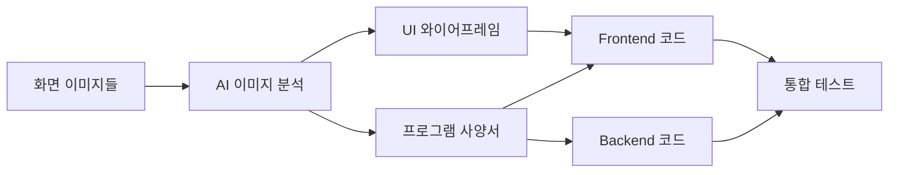

# AI 이미지 기반 코드 생성 종합 가이드
> 화면 이미지를 분석하여 UI 와이어프레임, 프로그램 사양서, 실제 소스 코드를 생성하는 완전한 가이드

## 📌 목차
1. [개요](#개요)
2. [AI 프롬프트 템플릿](#ai-프롬프트-템플릿)
3. [이미지 분석 프로세스](#이미지-분석-프로세스)
4. [UI 와이어프레임 생성](#ui-와이어프레임-생성)
5. [프로그램 사양서 생성](#프로그램-사양서-생성)
6. [소스 코드 생성](#소스-코드-생성)
7. [검증 및 품질 보증](#검증-및-품질-보증)

---

## 개요

### 전체 워크플로우


### 필요 문서
1. **UI 와이어프레임**: 화면 구조와 컴포넌트 배치
2. **프로그램 사양서**: 기능 명세와 데이터 모델
3. **Frontend 코드**: Vue 3 + OWS 컴포넌트
4. **Backend 코드**: Spring Boot REST API

---

## AI 프롬프트 템플릿

### 1. 단일 화면 분석 프롬프트
```
다음 이미지를 분석하여 OWS 컴포넌트 기반으로 문서를 생성해주세요.

이미지 경로: /path/to/screen-image.png

생성할 문서:
1. UI 와이어프레임 (/mnt/c/guide/ai-design/ai-analysis/templates/ui-wireframe-template.md 참조)
2. 프로그램 사양서 (/mnt/c/guide/ai-design/ai-analysis/templates/program-specification-template.md 참조)

분석 기준:
- OWS 컴포넌트 카탈로그 사용
- Vue 3 Composition API
- Spring Boot 3.x REST API
- 반응형 디자인 고려

참조 가이드:
/mnt/c/guide/ai-design/ai-analysis/references/ai-quick-reference-card.md
```

### 2. 복수 화면 분석 프롬프트
```
다음 폴더의 모든 화면 이미지를 분석하여 통합 시스템을 설계해주세요.

이미지 폴더: /path/to/screen-images/
- login.png (로그인 화면)
- dashboard.png (대시보드)
- product-list.png (상품 목록)
- product-detail.png (상품 상세)
- order-management.png (주문 관리)

생성할 문서:
1. 전체 시스템 아키텍처
2. 각 화면별 UI 와이어프레임
3. 통합 프로그램 사양서
4. 공통 컴포넌트 정의
5. 화면 간 네비게이션 흐름

코드 생성:
- Frontend: Vue 3 프로젝트 구조
- Backend: Spring Boot 프로젝트 구조
- 공통 컴포넌트 라이브러리
- API 명세서

참조 가이드:
/mnt/c/guide/ai-design/ai-analysis/references/enterprise-screen-patterns-guide.md
/mnt/c/guide/ai-design/ai-analysis/references/screen-navigation-integration-guide.md
```

### 3. 점진적 분석 프롬프트
```
Step 1: 이미지 분석
- 화면 유형 식별
- UI 요소 추출
- 레이아웃 구조 파악

Step 2: 컴포넌트 매핑
- OWS 컴포넌트 매칭
- 커스텀 컴포넌트 필요성 판단
- Props 정의

Step 3: 문서 생성
- UI 와이어프레임 작성
- 프로그램 사양서 작성
- API 명세 정의

Step 4: 코드 생성
- Vue 컴포넌트 생성
- Spring Boot Controller/Service 생성
- 테스트 코드 생성
```

---

## 이미지 분석 프로세스

### 1. 자동 분석 스크립트
```javascript
// image-analyzer.js
const analyzeScreenImages = async (folderPath) => {
  const images = await fs.readdir(folderPath);
  const analyses = [];
  
  for (const image of images) {
    const analysis = {
      fileName: image,
      screenType: detectScreenType(image),
      components: detectComponents(image),
      layout: detectLayout(image),
      interactions: detectInteractions(image)
    };
    analyses.push(analysis);
  }
  
  return {
    screens: analyses,
    commonPatterns: findCommonPatterns(analyses),
    navigation: inferNavigation(analyses),
    dataModel: inferDataModel(analyses)
  };
};
```

### 2. 화면 유형 분류
```yaml
화면_유형_매트릭스:
  로그인/인증:
    특징: [입력필드 2-3개, 로그인 버튼, 로고]
    패턴: "auth-pattern"
    
  목록_조회:
    특징: [필터 영역, 데이터 그리드, 페이징]
    패턴: "list-pattern"
    
  상세_보기:
    특징: [정보 표시, 탭, 액션 버튼]
    패턴: "detail-pattern"
    
  입력_폼:
    특징: [레이블-입력 쌍, 저장/취소 버튼]
    패턴: "form-pattern"
    
  대시보드:
    특징: [카드, 차트, 요약 정보]
    패턴: "dashboard-pattern"
```

### 3. 컴포넌트 인식 규칙
```javascript
const componentDetectionRules = {
  // 날짜 입력
  dateInput: {
    visual: ['달력 아이콘', '날짜 형식 텍스트'],
    position: ['필터 영역', '폼 필드'],
    component: 'OwBizDatePicker',
    confidence: 0.95
  },
  
  // 데이터 테이블
  dataTable: {
    visual: ['격자 구조', '헤더 행', '다중 데이터 행'],
    position: ['중앙 영역'],
    component: 'DxDataGrid',
    confidence: 0.97
  },
  
  // 드롭다운
  dropdown: {
    visual: ['하향 화살표', '선택 박스'],
    position: ['필터', '폼 필드'],
    component: 'OwFormSelect',
    confidence: 0.90
  }
};
```

---

## UI 와이어프레임 생성

### 와이어프레임 구조
```markdown
# [화면명] UI 와이어프레임

## 1. 화면 정보
- **화면 ID**: SCRN_XXX_001
- **화면명**: {화면명}
- **화면 유형**: {CRUD|Dashboard|Form|etc}
- **접근 경로**: {메뉴 경로}

## 2. 레이아웃 구조
\`\`\`
+--------------------------------------------------+
|                    Header                         |
|  Logo                          Menu    User Info  |
+--------------------------------------------------+
|                                                  |
|  Filter Section                                  |
|  +------------+ +------------+ +------------+    |
|  | Date Range | | Category   | | Status     |    |
|  +------------+ +------------+ +------------+    |
|                                                  |
|  Content Section                                 |
|  +--------------------------------------------+ |
|  |                                            | |
|  |           Data Grid / Form                 | |
|  |                                            | |
|  +--------------------------------------------+ |
|                                                  |
|  Footer Section                                  |
|  Pagination                          Actions     |
+--------------------------------------------------+
\`\`\`

## 3. 컴포넌트 명세
| 영역 | 컴포넌트 | Props | 이벤트 | 설명 |
|------|----------|-------|--------|------|
| Header | `<AppHeader>` | `:user` | `@logout` | 공통 헤더 |
| Filter | `<OwBizDatePicker>` | `v-model="dateRange"` | `@change` | 조회 기간 |
| Content | `<DxDataGrid>` | `:data-source` | `@selection-changed` | 데이터 목록 |

## 4. 반응형 브레이크포인트
- **Desktop**: 1200px 이상 (12 컬럼 그리드)
- **Tablet**: 768px - 1199px (8 컬럼 그리드)
- **Mobile**: 767px 이하 (4 컬럼 그리드)

## 5. 상태 및 인터랙션
### 5.1 초기 상태
- 필터: 최근 7일 기본 선택
- 그리드: 로딩 상태

### 5.2 사용자 인터랙션
1. 필터 변경 → 자동 조회
2. 행 클릭 → 상세 화면 이동
3. 추가 버튼 → 등록 폼 팝업

## 6. 접근성 고려사항
- 키보드 네비게이션 지원
- ARIA 레이블 적용
- 포커스 관리
```

---

## 프로그램 사양서 생성

### 사양서 구조
```markdown
# [시스템명] 프로그램 사양서

## 1. 시스템 개요
### 1.1 시스템 정보
- **시스템명**: {시스템명}
- **버전**: 1.0.0
- **작성일**: {작성일}
- **작성자**: AI Generated

### 1.2 시스템 구성
- **Frontend**: Vue 3.4 + OWS UI v2.5.7
- **Backend**: Spring Boot 3.x
- **Database**: PostgreSQL 15
- **인프라**: Docker + Kubernetes

## 2. 화면 명세
### 2.1 화면 목록
| 화면ID | 화면명 | 유형 | 주요기능 | 권한 |
|--------|--------|------|----------|------|
| SCRN_001 | 로그인 | Auth | 사용자 인증 | PUBLIC |
| SCRN_002 | 대시보드 | Dashboard | 현황 조회 | USER |
| SCRN_003 | 상품목록 | CRUD | 상품 CRUD | ADMIN |

### 2.2 화면별 상세
#### SCRN_003 상품목록
##### 기능 명세
1. **조회 기능**
   - 검색 조건: 기간, 카테고리, 상태
   - 정렬: 등록일, 상품명, 가격
   - 페이징: 20건/페이지

2. **등록 기능**
   - 필수 입력: 상품명, 카테고리, 가격
   - 선택 입력: 설명, 이미지

3. **수정/삭제**
   - 수정: 전체 필드 수정 가능
   - 삭제: 논리 삭제 (status 변경)

##### 데이터 모델
\`\`\`typescript
interface Product {
  id: number;
  name: string;
  category: string;
  price: number;
  description?: string;
  imageUrl?: string;
  status: 'ACTIVE' | 'INACTIVE' | 'DELETED';
  createdAt: Date;
  updatedAt: Date;
  createdBy: string;
  updatedBy: string;
}
\`\`\`

##### API 명세
| Method | Endpoint | 설명 | Request | Response |
|--------|----------|------|---------|----------|
| GET | /api/products | 목록 조회 | QueryParams | Page<Product> |
| GET | /api/products/{id} | 상세 조회 | - | Product |
| POST | /api/products | 등록 | Product | Product |
| PUT | /api/products/{id} | 수정 | Product | Product |
| DELETE | /api/products/{id} | 삭제 | - | void |

## 3. 공통 사항
### 3.1 공통 컴포넌트
- **AppHeader**: 전역 헤더
- **AppSidebar**: 사이드 메뉴
- **AppFooter**: 푸터
- **ErrorBoundary**: 에러 처리

### 3.2 공통 기능
- **인증/인가**: JWT 토큰 기반
- **에러 처리**: 전역 에러 핸들러
- **로깅**: 클라이언트/서버 로깅
- **국제화**: 한국어/영어 지원

### 3.3 보안 요구사항
- HTTPS 필수
- XSS/CSRF 방어
- SQL Injection 방지
- 민감정보 암호화

## 4. 성능 요구사항
- 페이지 로드: 3초 이내
- API 응답: 1초 이내
- 동시 사용자: 1000명
- 가용성: 99.9%

## 5. 개발 표준
### 5.1 코딩 컨벤션
- ESLint + Prettier 적용
- TypeScript strict mode
- 컴포넌트 명명: PascalCase
- 함수 명명: camelCase

### 5.2 Git 브랜치 전략
- main: 프로덕션
- develop: 개발
- feature/*: 기능 개발
- hotfix/*: 긴급 수정
```

---

## 소스 코드 생성

### Frontend 코드 생성 템플릿

#### 1. Vue 컴포넌트
```vue
<!-- ProductList.vue -->
<template>
  <div class="product-list-page">
    <!-- 페이지 헤더 -->
    <PageHeader title="상품 관리">
      <template #actions>
        <BButton variant="primary" @click="openCreateModal">
          <i class="bi bi-plus"></i> 상품 등록
        </BButton>
        <BButton variant="success" @click="exportExcel">
          <i class="bi bi-file-excel"></i> 엑셀 다운로드
        </BButton>
      </template>
    </PageHeader>

    <!-- 필터 영역 -->
    <FilterSection>
      <BRow>
        <BCol md="4">
          <FormGroup label="조회 기간">
            <OwBizDatePicker 
              v-model="filters.dateRange"
              :range-unit="'day'"
            />
          </FormGroup>
        </BCol>
        <BCol md="3">
          <FormGroup label="카테고리">
            <OwFormSelect
              v-model="filters.category"
              :options="categoryOptions"
              placeholder="전체"
            />
          </FormGroup>
        </BCol>
        <BCol md="3">
          <FormGroup label="상태">
            <OwStateFilter
              v-model="filters.status"
              :options="statusOptions"
            />
          </FormGroup>
        </BCol>
        <BCol md="2" class="d-flex align-items-end">
          <BButton variant="primary" @click="fetchProducts">
            조회
          </BButton>
          <BButton variant="secondary" @click="resetFilters" class="ms-2">
            초기화
          </BButton>
        </BCol>
      </BRow>
    </FilterSection>

    <!-- 데이터 그리드 -->
    <DataSection>
      <DxDataGrid
        ref="gridRef"
        :data-source="products"
        :show-borders="true"
        :row-alternation-enabled="true"
        :column-auto-width="true"
        @row-click="onRowClick"
        @selection-changed="onSelectionChanged"
      >
        <DxSelection mode="multiple" />
        <DxColumn 
          data-field="id" 
          caption="ID" 
          :width="80"
          :visible="false"
        />
        <DxColumn 
          data-field="name" 
          caption="상품명"
          :min-width="200"
        />
        <DxColumn 
          data-field="category" 
          caption="카테고리"
          :width="150"
        />
        <DxColumn 
          data-field="price" 
          caption="가격"
          :width="120"
          data-type="number"
          format="#,##0"
        />
        <DxColumn 
          data-field="status" 
          caption="상태"
          :width="100"
          cell-template="statusTemplate"
        />
        <DxColumn 
          data-field="createdAt" 
          caption="등록일"
          :width="150"
          data-type="date"
          format="yyyy-MM-dd"
        />
        <DxColumn 
          caption="작업"
          :width="120"
          cell-template="actionTemplate"
          :allow-exporting="false"
        />
        
        <!-- 커스텀 셀 템플릿 -->
        <template #statusTemplate="{ data }">
          <BBadge :variant="getStatusVariant(data.value)">
            {{ getStatusText(data.value) }}
          </BBadge>
        </template>
        
        <template #actionTemplate="{ data }">
          <div class="action-buttons">
            <BButton 
              size="sm" 
              variant="outline-primary"
              @click.stop="editProduct(data.row.data)"
            >
              수정
            </BButton>
            <BButton 
              size="sm" 
              variant="outline-danger"
              @click.stop="deleteProduct(data.row.data)"
              class="ms-1"
            >
              삭제
            </BButton>
          </div>
        </template>
        
        <DxPaging :page-size="20" />
        <DxPager 
          :show-page-size-selector="true"
          :allowed-page-sizes="[10, 20, 50, 100]"
        />
      </DxDataGrid>
    </DataSection>

    <!-- 등록/수정 모달 -->
    <ProductFormModal
      v-model="showFormModal"
      :mode="formMode"
      :product="selectedProduct"
      @saved="onProductSaved"
    />
  </div>
</template>

<script setup lang="ts">
import { ref, reactive, onMounted, computed } from 'vue';
import { useRouter } from 'vue-router';
import dayjs from 'dayjs';
import { 
  OwBizDatePicker, 
  OwFormSelect, 
  OwStateFilter 
} from '@ows/ui';
import { 
  DxDataGrid, 
  DxColumn, 
  DxSelection,
  DxPaging, 
  DxPager 
} from 'devextreme-vue/data-grid';
import { 
  BButton, 
  BBadge, 
  BRow, 
  BCol 
} from 'bootstrap-vue-next';

// Composables & Stores
import { useProductStore } from '@/stores/product';
import { useToast } from '@/composables/useToast';
import { useConfirm } from '@/composables/useConfirm';

// Components
import PageHeader from '@/components/layout/PageHeader.vue';
import FilterSection from '@/components/layout/FilterSection.vue';
import DataSection from '@/components/layout/DataSection.vue';
import FormGroup from '@/components/form/FormGroup.vue';
import ProductFormModal from './components/ProductFormModal.vue';

// Types
import type { Product, ProductFilters } from '@/types/product';

// Store & Composables
const productStore = useProductStore();
const { showToast } = useToast();
const { confirm } = useConfirm();
const router = useRouter();

// Refs
const gridRef = ref();
const products = ref<Product[]>([]);
const selectedProducts = ref<Product[]>([]);
const showFormModal = ref(false);
const formMode = ref<'create' | 'edit'>('create');
const selectedProduct = ref<Product | null>(null);

// Filters
const filters = reactive<ProductFilters>({
  dateRange: {
    from: dayjs().subtract(30, 'day').format('YYYY-MM-DD'),
    to: dayjs().format('YYYY-MM-DD')
  },
  category: null,
  status: []
});

// Options
const categoryOptions = computed(() => [
  { text: '전체', value: null },
  ...productStore.categories.map(cat => ({
    text: cat.name,
    value: cat.code
  }))
]);

const statusOptions = ref([
  { title: '활성', stateCount: 0, code: 'ACTIVE' },
  { title: '비활성', stateCount: 0, code: 'INACTIVE' },
  { title: '삭제', stateCount: 0, code: 'DELETED' }
]);

// Methods
const fetchProducts = async () => {
  try {
    const data = await productStore.fetchProducts(filters);
    products.value = data.content;
    updateStatusCounts(data.content);
  } catch (error) {
    showToast('상품 목록을 불러오는데 실패했습니다.', 'error');
  }
};

const updateStatusCounts = (productList: Product[]) => {
  const counts = productList.reduce((acc, product) => {
    acc[product.status] = (acc[product.status] || 0) + 1;
    return acc;
  }, {} as Record<string, number>);
  
  statusOptions.value.forEach(option => {
    option.stateCount = counts[option.code] || 0;
  });
};

const resetFilters = () => {
  filters.dateRange = {
    from: dayjs().subtract(30, 'day').format('YYYY-MM-DD'),
    to: dayjs().format('YYYY-MM-DD')
  };
  filters.category = null;
  filters.status = [];
  fetchProducts();
};

const openCreateModal = () => {
  formMode.value = 'create';
  selectedProduct.value = null;
  showFormModal.value = true;
};

const editProduct = (product: Product) => {
  formMode.value = 'edit';
  selectedProduct.value = product;
  showFormModal.value = true;
};

const deleteProduct = async (product: Product) => {
  const confirmed = await confirm({
    title: '상품 삭제',
    message: `'${product.name}' 상품을 삭제하시겠습니까?`,
    variant: 'danger'
  });
  
  if (confirmed) {
    try {
      await productStore.deleteProduct(product.id);
      showToast('상품이 삭제되었습니다.', 'success');
      fetchProducts();
    } catch (error) {
      showToast('상품 삭제에 실패했습니다.', 'error');
    }
  }
};

const onProductSaved = () => {
  showFormModal.value = false;
  fetchProducts();
  showToast(
    formMode.value === 'create' 
      ? '상품이 등록되었습니다.' 
      : '상품이 수정되었습니다.',
    'success'
  );
};

const onRowClick = (e: any) => {
  router.push({
    name: 'ProductDetail',
    params: { id: e.data.id }
  });
};

const onSelectionChanged = (e: any) => {
  selectedProducts.value = e.selectedRowsData;
};

const exportExcel = () => {
  const grid = gridRef.value?.instance;
  if (grid) {
    grid.exportToExcel({
      fileName: `상품목록_${dayjs().format('YYYYMMDD_HHmmss')}`,
      customizeCell: ({ gridCell, excelCell }: any) => {
        if (gridCell.column.dataField === 'price') {
          excelCell.numFmt = '#,##0';
        }
      }
    });
  }
};

// Utilities
const getStatusVariant = (status: string) => {
  const variants: Record<string, string> = {
    ACTIVE: 'success',
    INACTIVE: 'warning',
    DELETED: 'danger'
  };
  return variants[status] || 'secondary';
};

const getStatusText = (status: string) => {
  const texts: Record<string, string> = {
    ACTIVE: '활성',
    INACTIVE: '비활성',
    DELETED: '삭제'
  };
  return texts[status] || status;
};

// Lifecycle
onMounted(() => {
  productStore.fetchCategories();
  fetchProducts();
});
</script>

<style scoped>
.product-list-page {
  display: flex;
  flex-direction: column;
  height: 100%;
  gap: 1rem;
}

.action-buttons {
  display: flex;
  justify-content: center;
}

/* 반응형 스타일 */
@media (max-width: 768px) {
  .action-buttons {
    flex-direction: column;
    gap: 0.25rem;
  }
  
  .action-buttons .btn {
    width: 100%;
    margin: 0 !important;
  }
}
</style>
```

#### 2. TypeScript 타입 정의
```typescript
// types/product.ts
export interface Product {
  id: number;
  name: string;
  category: string;
  categoryName?: string;
  price: number;
  description?: string;
  imageUrl?: string;
  status: ProductStatus;
  stock: number;
  createdAt: string;
  updatedAt: string;
  createdBy: string;
  updatedBy: string;
}

export type ProductStatus = 'ACTIVE' | 'INACTIVE' | 'DELETED';

export interface ProductFilters {
  dateRange: {
    from: string;
    to: string;
  };
  category: string | null;
  status: ProductStatus[];
  keyword?: string;
}

export interface ProductFormData {
  name: string;
  category: string;
  price: number;
  description: string;
  imageUrl: string;
  stock: number;
  status: ProductStatus;
}

export interface Category {
  code: string;
  name: string;
  parentCode?: string;
  sortOrder: number;
}
```

#### 3. Pinia Store
```typescript
// stores/product.ts
import { defineStore } from 'pinia';
import { productApi } from '@/api/product';
import type { Product, ProductFilters, Category } from '@/types/product';

interface ProductState {
  products: Product[];
  categories: Category[];
  currentProduct: Product | null;
  loading: boolean;
  error: string | null;
}

export const useProductStore = defineStore('product', {
  state: (): ProductState => ({
    products: [],
    categories: [],
    currentProduct: null,
    loading: false,
    error: null
  }),

  getters: {
    activeProducts: (state) => 
      state.products.filter(p => p.status === 'ACTIVE'),
    
    productsByCategory: (state) => (category: string) =>
      state.products.filter(p => p.category === category)
  },

  actions: {
    async fetchProducts(filters?: ProductFilters) {
      this.loading = true;
      this.error = null;
      
      try {
        const response = await productApi.getProducts(filters);
        this.products = response.data.content;
        return response.data;
      } catch (error: any) {
        this.error = error.message;
        throw error;
      } finally {
        this.loading = false;
      }
    },

    async fetchProduct(id: number) {
      try {
        const response = await productApi.getProduct(id);
        this.currentProduct = response.data;
        return response.data;
      } catch (error: any) {
        this.error = error.message;
        throw error;
      }
    },

    async createProduct(data: Partial<Product>) {
      try {
        const response = await productApi.createProduct(data);
        this.products.push(response.data);
        return response.data;
      } catch (error: any) {
        this.error = error.message;
        throw error;
      }
    },

    async updateProduct(id: number, data: Partial<Product>) {
      try {
        const response = await productApi.updateProduct(id, data);
        const index = this.products.findIndex(p => p.id === id);
        if (index !== -1) {
          this.products[index] = response.data;
        }
        return response.data;
      } catch (error: any) {
        this.error = error.message;
        throw error;
      }
    },

    async deleteProduct(id: number) {
      try {
        await productApi.deleteProduct(id);
        const index = this.products.findIndex(p => p.id === id);
        if (index !== -1) {
          this.products.splice(index, 1);
        }
      } catch (error: any) {
        this.error = error.message;
        throw error;
      }
    },

    async fetchCategories() {
      try {
        const response = await productApi.getCategories();
        this.categories = response.data;
        return response.data;
      } catch (error: any) {
        this.error = error.message;
        throw error;
      }
    }
  }
});
```

### Backend 코드 생성 템플릿

#### 1. Spring Boot Controller
```java
// ProductController.java
package com.example.ows.controller;

import com.example.ows.dto.ProductDto;
import com.example.ows.dto.ProductSearchDto;
import com.example.ows.service.ProductService;
import io.swagger.v3.oas.annotations.Operation;
import io.swagger.v3.oas.annotations.tags.Tag;
import jakarta.validation.Valid;
import lombok.RequiredArgsConstructor;
import lombok.extern.slf4j.Slf4j;
import org.springframework.data.domain.Page;
import org.springframework.data.domain.Pageable;
import org.springframework.http.HttpStatus;
import org.springframework.http.ResponseEntity;
import org.springframework.security.access.prepost.PreAuthorize;
import org.springframework.web.bind.annotation.*;

@Slf4j
@RestController
@RequestMapping("/api/products")
@RequiredArgsConstructor
@Tag(name = "Product", description = "상품 관리 API")
public class ProductController {

    private final ProductService productService;

    @GetMapping
    @Operation(summary = "상품 목록 조회", description = "필터 조건에 따른 상품 목록을 조회합니다.")
    @PreAuthorize("hasRole('USER')")
    public ResponseEntity<Page<ProductDto>> getProducts(
            @ModelAttribute ProductSearchDto searchDto,
            Pageable pageable) {
        log.debug("상품 목록 조회 요청: {}", searchDto);
        Page<ProductDto> products = productService.getProducts(searchDto, pageable);
        return ResponseEntity.ok(products);
    }

    @GetMapping("/{id}")
    @Operation(summary = "상품 상세 조회", description = "ID로 상품 상세 정보를 조회합니다.")
    @PreAuthorize("hasRole('USER')")
    public ResponseEntity<ProductDto> getProduct(@PathVariable Long id) {
        log.debug("상품 상세 조회 요청: {}", id);
        ProductDto product = productService.getProduct(id);
        return ResponseEntity.ok(product);
    }

    @PostMapping
    @Operation(summary = "상품 등록", description = "새로운 상품을 등록합니다.")
    @PreAuthorize("hasRole('ADMIN')")
    public ResponseEntity<ProductDto> createProduct(
            @Valid @RequestBody ProductDto productDto) {
        log.debug("상품 등록 요청: {}", productDto);
        ProductDto created = productService.createProduct(productDto);
        return ResponseEntity.status(HttpStatus.CREATED).body(created);
    }

    @PutMapping("/{id}")
    @Operation(summary = "상품 수정", description = "기존 상품 정보를 수정합니다.")
    @PreAuthorize("hasRole('ADMIN')")
    public ResponseEntity<ProductDto> updateProduct(
            @PathVariable Long id,
            @Valid @RequestBody ProductDto productDto) {
        log.debug("상품 수정 요청: {}, {}", id, productDto);
        ProductDto updated = productService.updateProduct(id, productDto);
        return ResponseEntity.ok(updated);
    }

    @DeleteMapping("/{id}")
    @Operation(summary = "상품 삭제", description = "상품을 삭제(논리 삭제)합니다.")
    @PreAuthorize("hasRole('ADMIN')")
    public ResponseEntity<Void> deleteProduct(@PathVariable Long id) {
        log.debug("상품 삭제 요청: {}", id);
        productService.deleteProduct(id);
        return ResponseEntity.noContent().build();
    }

    @GetMapping("/categories")
    @Operation(summary = "카테고리 목록 조회", description = "상품 카테고리 목록을 조회합니다.")
    public ResponseEntity<List<CategoryDto>> getCategories() {
        List<CategoryDto> categories = productService.getCategories();
        return ResponseEntity.ok(categories);
    }

    @PostMapping("/excel/export")
    @Operation(summary = "엑셀 다운로드", description = "상품 목록을 엑셀 파일로 다운로드합니다.")
    @PreAuthorize("hasRole('USER')")
    public ResponseEntity<Resource> exportExcel(@ModelAttribute ProductSearchDto searchDto) {
        log.debug("엑셀 다운로드 요청: {}", searchDto);
        Resource resource = productService.exportToExcel(searchDto);
        
        return ResponseEntity.ok()
                .header(HttpHeaders.CONTENT_DISPOSITION, 
                        "attachment; filename=\"products_" + 
                        LocalDateTime.now().format(DateTimeFormatter.ofPattern("yyyyMMdd_HHmmss")) + 
                        ".xlsx\"")
                .contentType(MediaType.APPLICATION_OCTET_STREAM)
                .body(resource);
    }
}
```

#### 2. Service Implementation
```java
// ProductService.java
package com.example.ows.service;

import com.example.ows.dto.ProductDto;
import com.example.ows.dto.ProductSearchDto;
import com.example.ows.entity.Product;
import com.example.ows.exception.ResourceNotFoundException;
import com.example.ows.mapper.ProductMapper;
import com.example.ows.repository.ProductRepository;
import lombok.RequiredArgsConstructor;
import lombok.extern.slf4j.Slf4j;
import org.springframework.cache.annotation.CacheEvict;
import org.springframework.cache.annotation.Cacheable;
import org.springframework.data.domain.Page;
import org.springframework.data.domain.Pageable;
import org.springframework.data.jpa.domain.Specification;
import org.springframework.stereotype.Service;
import org.springframework.transaction.annotation.Transactional;

import java.time.LocalDateTime;

@Slf4j
@Service
@RequiredArgsConstructor
@Transactional(readOnly = true)
public class ProductService {

    private final ProductRepository productRepository;
    private final ProductMapper productMapper;
    private final ExcelService excelService;

    public Page<ProductDto> getProducts(ProductSearchDto searchDto, Pageable pageable) {
        Specification<Product> spec = ProductSpecification.buildSpecification(searchDto);
        Page<Product> products = productRepository.findAll(spec, pageable);
        return products.map(productMapper::toDto);
    }

    @Cacheable(value = "products", key = "#id")
    public ProductDto getProduct(Long id) {
        Product product = productRepository.findById(id)
                .orElseThrow(() -> new ResourceNotFoundException("Product", "id", id));
        return productMapper.toDto(product);
    }

    @Transactional
    @CacheEvict(value = "products", allEntries = true)
    public ProductDto createProduct(ProductDto productDto) {
        Product product = productMapper.toEntity(productDto);
        product.setCreatedAt(LocalDateTime.now());
        product.setCreatedBy(getCurrentUsername());
        
        Product saved = productRepository.save(product);
        log.info("상품 등록 완료: {}", saved.getId());
        
        return productMapper.toDto(saved);
    }

    @Transactional
    @CacheEvict(value = "products", key = "#id")
    public ProductDto updateProduct(Long id, ProductDto productDto) {
        Product product = productRepository.findById(id)
                .orElseThrow(() -> new ResourceNotFoundException("Product", "id", id));
        
        productMapper.updateEntityFromDto(productDto, product);
        product.setUpdatedAt(LocalDateTime.now());
        product.setUpdatedBy(getCurrentUsername());
        
        Product updated = productRepository.save(product);
        log.info("상품 수정 완료: {}", updated.getId());
        
        return productMapper.toDto(updated);
    }

    @Transactional
    @CacheEvict(value = "products", key = "#id")
    public void deleteProduct(Long id) {
        Product product = productRepository.findById(id)
                .orElseThrow(() -> new ResourceNotFoundException("Product", "id", id));
        
        // 논리 삭제
        product.setStatus(ProductStatus.DELETED);
        product.setDeletedAt(LocalDateTime.now());
        product.setDeletedBy(getCurrentUsername());
        
        productRepository.save(product);
        log.info("상품 삭제 완료: {}", id);
    }

    public Resource exportToExcel(ProductSearchDto searchDto) {
        Specification<Product> spec = ProductSpecification.buildSpecification(searchDto);
        List<Product> products = productRepository.findAll(spec);
        List<ProductDto> productDtos = productMapper.toDtoList(products);
        
        return excelService.exportProducts(productDtos);
    }

    private String getCurrentUsername() {
        Authentication authentication = SecurityContextHolder.getContext().getAuthentication();
        return authentication != null ? authentication.getName() : "system";
    }
}
```

#### 3. JPA Entity
```java
// Product.java
package com.example.ows.entity;

import jakarta.persistence.*;
import lombok.*;
import org.hibernate.annotations.Where;

import java.math.BigDecimal;
import java.time.LocalDateTime;

@Entity
@Table(name = "products")
@Getter
@Setter
@NoArgsConstructor
@AllArgsConstructor
@Builder
@Where(clause = "deleted_at IS NULL")
public class Product extends BaseEntity {

    @Id
    @GeneratedValue(strategy = GenerationType.IDENTITY)
    private Long id;

    @Column(nullable = false, length = 200)
    private String name;

    @ManyToOne(fetch = FetchType.LAZY)
    @JoinColumn(name = "category_id", nullable = false)
    private Category category;

    @Column(nullable = false, precision = 10, scale = 2)
    private BigDecimal price;

    @Column(columnDefinition = "TEXT")
    private String description;

    @Column(length = 500)
    private String imageUrl;

    @Column(nullable = false)
    private Integer stock = 0;

    @Enumerated(EnumType.STRING)
    @Column(nullable = false, length = 20)
    private ProductStatus status = ProductStatus.ACTIVE;

    @Column(name = "deleted_at")
    private LocalDateTime deletedAt;

    @Column(name = "deleted_by", length = 100)
    private String deletedBy;

    // 비즈니스 메서드
    public void updateStock(int quantity) {
        if (this.stock + quantity < 0) {
            throw new BusinessException("재고가 부족합니다.");
        }
        this.stock += quantity;
    }

    public boolean isAvailable() {
        return this.status == ProductStatus.ACTIVE && this.stock > 0;
    }
}
```

#### 4. Repository
```java
// ProductRepository.java
package com.example.ows.repository;

import com.example.ows.entity.Product;
import com.example.ows.entity.ProductStatus;
import org.springframework.data.jpa.repository.JpaRepository;
import org.springframework.data.jpa.repository.JpaSpecificationExecutor;
import org.springframework.data.jpa.repository.Query;
import org.springframework.data.repository.query.Param;
import org.springframework.stereotype.Repository;

import java.time.LocalDateTime;
import java.util.List;
import java.util.Optional;

@Repository
public interface ProductRepository extends JpaRepository<Product, Long>, JpaSpecificationExecutor<Product> {

    Optional<Product> findByIdAndStatus(Long id, ProductStatus status);

    List<Product> findByCategoryIdAndStatus(Long categoryId, ProductStatus status);

    @Query("SELECT p FROM Product p WHERE p.status = :status AND p.stock < :minStock")
    List<Product> findLowStockProducts(@Param("status") ProductStatus status, 
                                       @Param("minStock") Integer minStock);

    @Query("SELECT COUNT(p) FROM Product p WHERE p.status = :status")
    Long countByStatus(@Param("status") ProductStatus status);

    @Query(value = "SELECT * FROM products p " +
           "WHERE p.created_at BETWEEN :startDate AND :endDate " +
           "AND (:categoryId IS NULL OR p.category_id = :categoryId) " +
           "AND (:status IS NULL OR p.status = :status)",
           nativeQuery = true)
    List<Product> findByFilters(@Param("startDate") LocalDateTime startDate,
                               @Param("endDate") LocalDateTime endDate,
                               @Param("categoryId") Long categoryId,
                               @Param("status") String status);
}
```

#### 5. DTO
```java
// ProductDto.java
package com.example.ows.dto;

import com.example.ows.entity.ProductStatus;
import com.fasterxml.jackson.annotation.JsonFormat;
import io.swagger.v3.oas.annotations.media.Schema;
import jakarta.validation.constraints.*;
import lombok.AllArgsConstructor;
import lombok.Builder;
import lombok.Data;
import lombok.NoArgsConstructor;

import java.math.BigDecimal;
import java.time.LocalDateTime;

@Data
@NoArgsConstructor
@AllArgsConstructor
@Builder
@Schema(description = "상품 정보")
public class ProductDto {

    @Schema(description = "상품 ID", example = "1")
    private Long id;

    @NotBlank(message = "상품명은 필수입니다.")
    @Size(max = 200, message = "상품명은 200자 이하여야 합니다.")
    @Schema(description = "상품명", example = "노트북")
    private String name;

    @NotNull(message = "카테고리는 필수입니다.")
    @Schema(description = "카테고리 ID", example = "1")
    private Long categoryId;

    @Schema(description = "카테고리명", example = "전자제품")
    private String categoryName;

    @NotNull(message = "가격은 필수입니다.")
    @DecimalMin(value = "0.0", message = "가격은 0 이상이어야 합니다.")
    @Schema(description = "가격", example = "1500000")
    private BigDecimal price;

    @Size(max = 1000, message = "설명은 1000자 이하여야 합니다.")
    @Schema(description = "상품 설명")
    private String description;

    @Pattern(regexp = "^(http|https)://.*", message = "올바른 URL 형식이 아닙니다.")
    @Schema(description = "이미지 URL")
    private String imageUrl;

    @Min(value = 0, message = "재고는 0 이상이어야 합니다.")
    @Schema(description = "재고 수량", example = "100")
    private Integer stock;

    @NotNull(message = "상태는 필수입니다.")
    @Schema(description = "상품 상태", example = "ACTIVE")
    private ProductStatus status;

    @JsonFormat(pattern = "yyyy-MM-dd HH:mm:ss")
    @Schema(description = "등록일시")
    private LocalDateTime createdAt;

    @Schema(description = "등록자")
    private String createdBy;

    @JsonFormat(pattern = "yyyy-MM-dd HH:mm:ss")
    @Schema(description = "수정일시")
    private LocalDateTime updatedAt;

    @Schema(description = "수정자")
    private String updatedBy;
}
```

---

## 검증 및 품질 보증

### 1. 체크리스트
```yaml
UI_와이어프레임_검증:
  구조적_완성도:
    - [ ] 모든 UI 요소가 식별되었는가?
    - [ ] 레이아웃이 명확한가?
    - [ ] 반응형 설계가 고려되었는가?
  
  컴포넌트_적합성:
    - [ ] OWS 컴포넌트가 올바르게 매칭되었는가?
    - [ ] Props가 정확히 정의되었는가?
    - [ ] 이벤트가 명시되었는가?

프로그램_사양서_검증:
  기능_명세:
    - [ ] 모든 기능이 정의되었는가?
    - [ ] API 명세가 완전한가?
    - [ ] 데이터 모델이 정확한가?
  
  비기능_요구사항:
    - [ ] 성능 요구사항이 명시되었는가?
    - [ ] 보안 요구사항이 포함되었는가?
    - [ ] 에러 처리가 정의되었는가?

소스_코드_검증:
  Frontend:
    - [ ] TypeScript 타입이 정의되었는가?
    - [ ] 컴포넌트가 재사용 가능한가?
    - [ ] 상태 관리가 적절한가?
  
  Backend:
    - [ ] REST API 규칙을 준수하는가?
    - [ ] 예외 처리가 구현되었는가?
    - [ ] 테스트 코드가 작성되었는가?
```

### 2. 품질 메트릭
```javascript
const qualityMetrics = {
  wireframe: {
    completeness: 95,      // 모든 요소 포함률
    accuracy: 98,          // 컴포넌트 매칭 정확도
    consistency: 97        // 일관성
  },
  
  specification: {
    coverage: 96,          // 기능 커버리지
    clarity: 94,           // 명확성
    feasibility: 99        // 구현 가능성
  },
  
  code: {
    syntaxCorrectness: 100, // 문법 정확성
    bestPractices: 95,      // 모범 사례 준수
    performance: 92         // 성능 최적화
  }
};
```

---

## 📞 지원 및 참조

### 관련 문서
- [ui-wireframe-template.md](../templates/ui-wireframe-template.md)
- [program-specification-template.md](../templates/program-specification-template.md)
- [ai-quick-reference-card.md](../references/ai-quick-reference-card.md)
- [enterprise-screen-patterns-guide.md](../references/enterprise-screen-patterns-guide.md)

### 도구 및 라이브러리
- Vue 3: https://vuejs.org/
- Spring Boot: https://spring.io/projects/spring-boot
- OWS UI: 내부 컴포넌트 라이브러리
- DevExtreme: https://js.devexpress.com/

---

**버전**: 1.0.0  
**최종 업데이트**: 2024년 1월  
**작성자**: AI Code Generation System