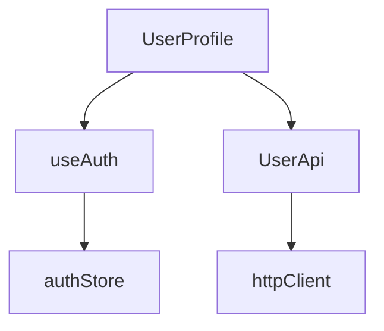

# 🔍 프론트엔드 프로젝트 구조 분석 가이드

## 1. 프로젝트 기본 정보 수집

### 1.1 프레임워크 및 버전 확인
```bash
# package.json 읽기
- React 버전 확인: "react": "^18.x.x"
- Vue 버전 확인: "vue": "^3.x.x"
- Angular 버전 확인: "@angular/core": "^15.x.x"
```

### 1.2 프로젝트 구조 파악
```bash
# 주요 디렉토리 확인
src/
├── components/     # 컴포넌트 위치
├── pages/         # 페이지 컴포넌트
├── views/         # Vue의 경우
├── hooks/         # React 커스텀 훅
├── composables/   # Vue3 컴포저블
├── store/         # 상태 관리
├── services/      # API 통신
├── utils/         # 유틸리티
└── assets/        # 정적 자원
```

### 1.3 의존성 분석
- **상태 관리**: Redux, Zustand, Pinia, Vuex, MobX
- **라우터**: React Router, Vue Router, Angular Router
- **스타일링**: CSS Modules, Styled Components, Emotion, Tailwind
- **HTTP 클라이언트**: Axios, Fetch, Apollo Client
- **폼 관리**: React Hook Form, Formik, VeeValidate
- **UI 라이브러리**: Ant Design, Material UI, Element Plus

## 2. 현재 구조 분석

### 2.1 컴포넌트 스캔
```typescript
// 컴포넌트 파일 검색 패턴
const componentPatterns = [
  "**/*.tsx",      // React TypeScript
  "**/*.jsx",      // React JavaScript
  "**/*.vue",      // Vue
  "**/*.component.ts"  // Angular
];

// 제외 패턴
const excludePatterns = [
  "node_modules/**",
  "**/*.test.*",
  "**/*.spec.*",
  "**/*.stories.*"
];
```

### 2.2 도메인 식별 전략
1. **URL 라우팅 기반**
   - `/user/*` → user 도메인
   - `/product/*` → product 도메인
   - `/order/*` → order 도메인

2. **컴포넌트 명명 기반**
   - `UserProfile`, `UserList` → user 도메인
   - `ProductDetail`, `ProductCard` → product 도메인

3. **디렉토리 구조 기반**
   - `features/user/*` → user 도메인
   - `modules/product/*` → product 도메인

## 3. 분석 실행 단계

### 3.1 컴포넌트 인벤토리 생성
```json
{
  "components": [
    {
      "name": "UserProfile",
      "path": "src/components/UserProfile.tsx",
      "type": "component",
      "dependencies": ["useAuth", "UserApi"],
      "proposedDomain": "user",
      "size": "medium",
      "complexity": "low"
    }
  ]
}
```

### 3.2 의존성 그래프 생성


### 3.3 도메인 매핑 테이블
| 현재 위치 | 컴포넌트명 | 추천 도메인 | 의존성 |
|----------|-----------|------------|--------|
| src/components/UserProfile.tsx | UserProfile | user | useAuth, UserApi |
| src/pages/ProductList.tsx | ProductList | product | useProducts, ProductApi |
| src/components/OrderHistory.tsx | OrderHistory | order | useOrders, OrderApi |

## 4. 상태 관리 분석

### 4.1 Redux/Zustand 분석
```typescript
// Redux Slice 찾기
const slicePatterns = [
  "**/slice.ts",
  "**/reducer.ts",
  "**/store.ts"
];

// Zustand Store 찾기
const storePatterns = [
  "**/store.ts",
  "**/useStore.ts"
];
```

### 4.2 Pinia/Vuex 분석
```typescript
// Pinia Store 찾기
const piniaPatterns = [
  "**/stores/*.ts",
  "**/store/*.ts"
];

// Store 구조 분석
interface StoreAnalysis {
  name: string;
  path: string;
  actions: string[];
  getters: string[];
  relatedDomain: string;
}
```

## 5. 서비스/API 레이어 분석

### 5.1 API 서비스 스캔
```typescript
// API 서비스 패턴
const apiPatterns = [
  "**/api/*.ts",
  "**/services/*.ts",
  "**/*Api.ts",
  "**/*Service.ts"
];

// API 엔드포인트 분석
interface ApiEndpoint {
  service: string;
  method: string;
  endpoint: string;
  domain: string;
}
```

### 5.2 HTTP 요청 패턴 분석
- GET 요청 → Query 서비스
- POST/PUT/DELETE → Command 서비스
- WebSocket → Real-time 서비스

## 6. 라우팅 구조 분석

### 6.1 React Router 분석
```typescript
// Route 컴포넌트 찾기
const routePatterns = [
  "**/routes.tsx",
  "**/router.tsx",
  "**/Routes.tsx"
];

// Route 구조
interface RouteInfo {
  path: string;
  component: string;
  domain: string;
  nested: RouteInfo[];
}
```

### 6.2 Vue Router 분석
```typescript
// Router 설정 파일
const routerPatterns = [
  "**/router/index.ts",
  "**/router.ts"
];
```

## 7. 분석 결과 문서 생성

### 7.1 structure-analysis-result.json
```json
{
  "project": {
    "framework": "React",
    "version": "18.2.0",
    "typescript": true,
    "stateManagement": "Redux Toolkit",
    "router": "React Router v6",
    "styling": "CSS Modules"
  },
  "statistics": {
    "totalComponents": 145,
    "totalServices": 23,
    "totalStores": 8,
    "identifiedDomains": 6
  },
  "domains": [
    {
      "name": "user",
      "components": 24,
      "services": 3,
      "stores": 1
    }
  ],
  "recommendations": {
    "refactoringStrategy": "domain-driven",
    "estimatedEffort": "3-5 days",
    "priority": ["user", "product", "order"]
  }
}
```

### 7.2 도메인 분류 결과
```markdown
## 식별된 도메인

### 1. User 도메인 (24 컴포넌트)
- 주요 기능: 로그인, 프로필, 권한 관리
- 핵심 컴포넌트: UserProfile, LoginForm, UserList
- API 서비스: UserApi, AuthApi
- 상태 관리: userSlice, authStore

### 2. Product 도메인 (31 컴포넌트)
- 주요 기능: 상품 목록, 상세, 검색
- 핵심 컴포넌트: ProductList, ProductDetail, ProductSearch
- API 서비스: ProductApi, CategoryApi
- 상태 관리: productSlice, cartStore

### 3. Order 도메인 (18 컴포넌트)
- 주요 기능: 주문, 결제, 배송 추적
- 핵심 컴포넌트: OrderForm, OrderHistory, PaymentForm
- API 서비스: OrderApi, PaymentApi
- 상태 관리: orderSlice, checkoutStore
```

## 8. 복잡도 평가

### 8.1 컴포넌트 복잡도
- **Low**: 단순 표시 컴포넌트 (< 100 lines)
- **Medium**: 상태 관리 포함 (100-300 lines)
- **High**: 복잡한 로직 포함 (> 300 lines)

### 8.2 리팩토링 난이도
- **Easy**: 독립적 컴포넌트, 의존성 적음
- **Medium**: 일부 공유 의존성
- **Hard**: 복잡한 의존성, 전역 상태 사용

## 9. 다음 단계 준비

### 9.1 수집된 정보 요약
- 총 컴포넌트 수: [count]
- 식별된 도메인: [list]
- 주요 의존성: [dependencies]
- 리팩토링 우선순위: [priority]

### 9.2 체크포인트
- ✅ 프로젝트 구조 스캔 완료
- ✅ 컴포넌트 인벤토리 생성
- ✅ 도메인 매핑 완료
- ✅ 의존성 분석 완료
- ✅ 분석 결과 문서화

## 10. 실행 완료
- 분석 완료 시간: [timestamp]
- 다음 단계: 02-refactoring-plan.md로 이동
- 생성된 파일:
  - structure-analysis-result.json
  - component-inventory.json
  - dependency-graph.json