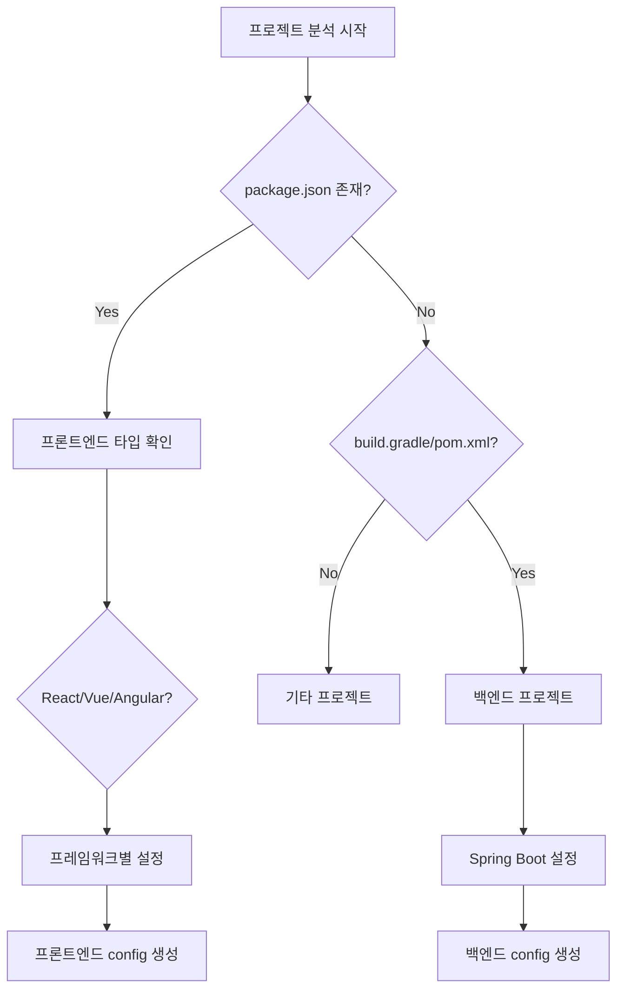

# 🔍 프로젝트 타입 자동 감지 가이드

## 개요
프로젝트 타입(프론트엔드/백엔드)을 자동으로 감지하여 적절한 project-config.md를 생성합니다.

## 프로젝트 타입 감지 규칙

### 1. 백엔드 프로젝트 (Java/Spring)
```bash
# 감지 조건 (하나라도 일치)
- build.gradle 또는 pom.xml 존재
- src/main/java 디렉토리 존재
- @SpringBootApplication 클래스 존재
- application.yml/properties 존재
```

### 2. 프론트엔드 프로젝트 (React/Vue/Angular)
```bash
# React
- package.json에 "react" 의존성
- src/App.js 또는 src/App.tsx
- public/index.html

# Vue
- package.json에 "vue" 의존성
- src/App.vue
- vue.config.js

# Angular
- angular.json 존재
- src/app/app.component.ts
- package.json에 "@angular/core"

# Next.js
- next.config.js
- pages/ 또는 app/ 디렉토리
```

### 3. 풀스택/모노레포
```bash
# 감지 조건
- backend/ 와 frontend/ 디렉토리 동시 존재
- packages/ 디렉토리 (lerna, yarn workspaces)
- apps/ 디렉토리 (turborepo)
```

## 타입별 project-config 구조

### 백엔드 (Java/Spring) project-config.md
```yaml
project:
  name: "backend-project"
  type: "backend"
  framework: "spring-boot"
  language: "java"

paths:
  baseProjectPath: "/path/to/project"
  javaMain: "src/main/java"
  resourceMain: "src/main/resources"
  
packages:
  basePackage: "com.example.api"
  controllerPackage: "${basePackage}.controller"
  servicePackage: "${basePackage}.service"
  mapperPackage: "${basePackage}.mapper"

refactoring:
  strategy: "domain-driven"
  layers: ["controller", "service", "mapper", "xml"]
```

### 프론트엔드 (React) project-config.md
```yaml
project:
  name: "frontend-project"
  type: "frontend"
  framework: "react"
  language: "typescript"

paths:
  baseProjectPath: "/path/to/project"
  srcPath: "src"
  componentsPath: "src/components"
  pagesPath: "src/pages"
  servicesPath: "src/services"
  
structure:
  componentPattern: "PascalCase"
  fileExtension: ".tsx"
  styleExtension: ".module.css"
  
refactoring:
  strategy: "component-based"
  targets:
    - components
    - hooks
    - services
    - utils
```

### 프론트엔드 (Vue) project-config.md
```yaml
project:
  name: "vue-project"
  type: "frontend"
  framework: "vue"
  version: "3"

paths:
  baseProjectPath: "/path/to/project"
  srcPath: "src"
  componentsPath: "src/components"
  viewsPath: "src/views"
  storePath: "src/store"
  
structure:
  componentPattern: "PascalCase"
  fileExtension: ".vue"
  compositionApi: true
  
refactoring:
  strategy: "component-based"
  targets:
    - components
    - composables
    - stores
    - views
```

## 프론트엔드 리팩토링 전략

### 1. 컴포넌트 기반 분리
```
src/
├── components/
│   ├── common/        # 공통 컴포넌트
│   ├── user/          # User 도메인
│   ├── product/       # Product 도메인
│   └── order/         # Order 도메인
├── pages/
│   ├── user/
│   ├── product/
│   └── order/
└── services/
    ├── user/
    ├── product/
    └── order/
```

### 2. Feature 기반 분리
```
src/
├── features/
│   ├── user/
│   │   ├── components/
│   │   ├── hooks/
│   │   ├── services/
│   │   └── utils/
│   ├── product/
│   │   ├── components/
│   │   ├── hooks/
│   │   └── services/
│   └── order/
│       ├── components/
│       ├── hooks/
│       └── services/
```

## 통합 감지 플로우



## AI 실행 시나리오

### 시나리오 1: React 프로젝트
```bash
user: /analyze-project

AI: 프로젝트를 분석 중입니다...
    ✅ 프로젝트 타입: Frontend (React + TypeScript)
    ✅ 주요 디렉토리: components, pages, hooks
    ✅ 상태 관리: Redux Toolkit
    📄 frontend-config.md 생성 완료!
```

### 시나리오 2: Spring Boot 프로젝트
```bash
user: /analyze-project

AI: 프로젝트를 분석 중입니다...
    ✅ 프로젝트 타입: Backend (Spring Boot 3.2)
    ✅ 빌드 도구: Gradle
    ✅ 데이터베이스: MySQL + MyBatis
    📄 backend-config.md 생성 완료!
```

### 시나리오 3: 모노레포
```bash
user: /analyze-project

AI: 모노레포 구조를 감지했습니다!
    
    발견된 프로젝트:
    1. backend/ - Spring Boot API
    2. frontend/ - React App
    3. shared/ - 공통 타입/유틸
    
    어떤 프로젝트를 분석할까요?
    (1/2/3/all)
```

## 프론트엔드 리팩토링 명령어

### 컴포넌트 리팩토링
```bash
/refactor-component UserProfile
# UserProfile 컴포넌트와 관련 로직 분리

/split-component Dashboard
# 대시보드를 작은 컴포넌트로 분해
```

### 도메인 분리
```bash
/domain-split user
# user 관련 모든 코드를 도메인별로 정리
```

## 확장 가능성

### 추가 지원 가능한 프로젝트
- Python (Django/FastAPI)
- Node.js (Express/NestJS)
- Go (Gin/Echo)
- Ruby (Rails)
- PHP (Laravel/Symfony)

각 타입별로 적절한 리팩토링 전략과 설정을 자동 생성할 수 있습니다.